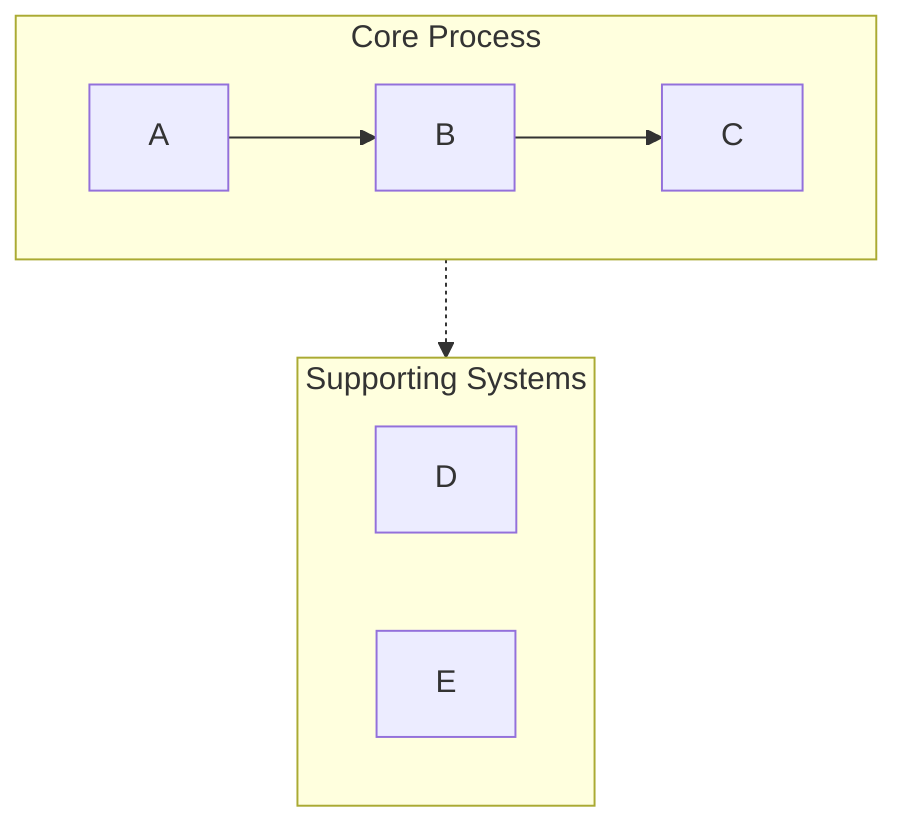
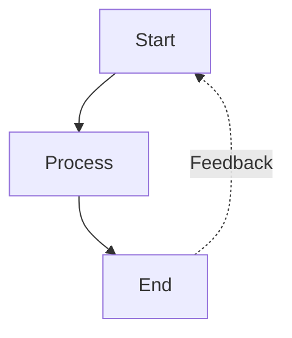
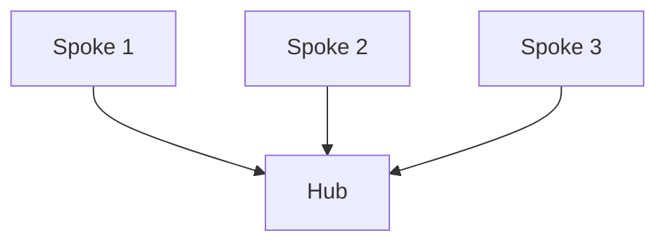

# Mermaid Visualizer

## 概述

将文本内容转换为干净、专业的 Mermaid 图表，针对演示与文档场景优化。自动处理常见语法陷阱（列表语法冲突、subgraph 命名、间距问题），确保图表在 Obsidian、GitHub 及其他兼容 Mermaid 的平台上正确渲染。

**所有 Mermaid 图表自动保存到 `/Users/admin/Workspace/Resources/obsidian/AI-KN-Base/Diagrams`**。

## 何时不使用此技能

- 不要将此技能用于通用内联请求，如 "可视化一下" / "visualize it"
- 不要仅仅因为用户想在聊天中获得一张图表就使用此技能
- 当答案可以留在对话中时，优先使用应用内置的 Mermaid 代码块渲染
- 当用户想要截图式卡片或类似 UI 的视觉摘要时，优先使用 `visual-preview`
- 仅当用户明确想要 Mermaid 代码或将 Mermaid 文件保存到磁盘时，才使用此技能
- 对于深琥珀色 / 复古终端风格的演示，保持节点填充为深色且可读。避免使用粉彩粉、淡紫或其他浅色填充，以免琥珀色文字难以阅读。

## 快速开始

创建 Mermaid 图表时：

1. **分析内容** — 识别关键概念、关系和流程
2. **选择图表类型** — 选择最合适的可视化形式（见下方"图表类型"）
3. **选择配置** — 确定布局、细节层级与样式
4. **生成图表** — 创建语法正确的 Mermaid 代码
5. **以 Markdown 输出** — 用正确的代码围栏包裹，并附简要说明
6. **保存到文件** — 自动保存到 `/Users/admin/Workspace/Resources/obsidian/AI-KN-Base/Diagrams/[filename].md`

**默认假设：**
- 除非要求横向，否则默认纵向布局（TB）
- 中等细节层级（在简洁与信息量之间取得平衡）
- 使用带语义色彩的专业配色
- 兼容 Obsidian/GitHub 的语法

## 图表类型

### 1. 流程（graph TB/LR）
**最佳用途：** 工作流、决策树、顺序流程、AI Agent 架构

**适用场景：** 内容描述步骤、阶段或一系列动作

**核心特性：**
- 通过 subgraph 泳道（Swimlane）对相关步骤分组
- 箭头标签表示转换
- 反馈回路与分支
- 分阶段配色

**配置选项：**
- `layout`：`"vertical"`（TB）、`"horizontal"`（LR）
- `detail`：`"simple"`（仅核心步骤）、`"standard"`（带描述）、`"detailed"`（带注释）
- `style`：`"minimal"`、`"professional"`、`"colorful"`

### 2. 环形流程（带环形布局的 graph TD）
**最佳用途：** 循环流程、持续改进环、Agent 反馈系统

**适用场景：** 内容强调迭代、反馈或循环关系

**核心特性：**
- 中央枢纽 + 放射状元素
- 曲线反馈箭头
- 清晰的循环指示

### 3. 对比图（带并行路径的 graph TB）
**最佳用途：** 前后对比、A 与 B 分析、传统 vs 现代系统

**适用场景：** 内容对比两种或多种方案或系统

**核心特性：**
- 并排布局
- 中央对比节点
- 通过颜色/样式清晰区分

### 4. 思维导图（Mindmap）
**最佳用途：** 层级概念、知识组织、主题拆解

**适用场景：** 内容具有清晰的父子层级关系

**核心特性：**
- 放射树状结构
- 多层嵌套
- 清晰的视觉层级

### 5. 时序图（Sequence Diagram）
**最佳用途：** 组件间交互、API 调用、消息流

**适用场景：** 内容涉及参与者/系统随时间的通信

**核心特性：**
- 基于时间线的布局
- 清晰的参与者隔离
- 进程的激活框（Activation box）

### 6. 状态图（State Diagram）
**最佳用途：** 系统状态、状态转换、生命周期阶段

**适用场景：** 内容描述状态及其之间的转换

**核心特性：**
- 清晰的状态节点
- 带标签的转换
- 开始与结束状态

## 关键语法规则

**始终遵循以下规则以避免解析错误：**

### 规则 1：避免列表语法冲突
```
❌ 错误: [1. Perception]       → 触发 "Unsupported markdown: list"
✅ 正确: [1.Perception]         → 去掉句点后的空格
✅ 正确: [① Perception]         → 使用带圈数字（①②③④⑤⑥⑦⑧⑨⑩）
✅ 正确: [(1) Perception]       → 使用括号
✅ 正确: [Step 1: Perception]   → 使用 "Step" 前缀
```

### 规则 2：Subgraph 命名
```
❌ 错误: subgraph AI Agent Core  → 名称含空格但未加引号
✅ 正确: subgraph agent["AI Agent Core"]  → 使用 ID + 显示名
✅ 正确: subgraph agent          → 仅使用简单 ID
```

### 规则 3：节点引用
```
❌ 错误: Title --> AI Agent Core  → 直接引用显示名
✅ 正确: Title --> agent          → 引用 subgraph ID
```

### 规则 4：节点文本中的特殊字符
```
✅ 含空格的文本使用引号：["Text with spaces"]
✅ 转义或避免：引号 → 改用『』
✅ 转义或避免：括号 → 改用「」
✅ 仅圆形节点支持换行：((Text<br/>Break))
```

### 规则 5：箭头类型
- `-->` 实线箭头
- `-.->` 虚线箭头（用于支撑系统、可选路径）
- `==>` 粗箭头（用于强调）
- `~~~` 隐形链接（仅用于布局）

## 配置选项

所有图表均接受以下参数：

**布局：**
- `direction`：`"vertical"`（TB）、`"horizontal"`（LR）、`"right-to-left"`（RL）、`"bottom-to-top"`（BT）
- `aspect`：`"portrait"`（默认）、`"landscape"`（宽屏）、`"square"`

**细节层级：**
- `simple`：仅核心元素，最少标签
- `standard`：带关键描述的均衡细节（默认）
- `detailed`：完整注释、说明与元数据
- `presentation`：针对幻灯片优化（更大文字、更少细节）

**样式：**
- `minimal`：单色、干净线条
- `professional`：语义配色、清晰层级（默认）
- `colorful`：鲜艳配色、高对比
- `academic`：面向论文/文档的正式样式

**其他选项：**
- `show_legend`：true/false — 包含颜色/符号图例
- `numbered`：true/false — 为步骤添加序号
- `title`：string — 添加图表标题

## 工作流程

1. **理解内容**
   - 识别主要概念、实体与关系
   - 确定层级或顺序
   - 注意对比或对照之处

2. **选择图表类型**
   - 将内容结构与图表类型匹配
   - 考虑用户的演示场景
   - 有歧义时默认使用流程

3. **选择配置**
   - 应用用户指定的选项
   - 未指定的选项使用合理默认值
   - 以可读性为优化目标

4. **生成 Mermaid 代码**
   - 严格遵守所有语法规则
   - 使用语义化命名（描述性 ID）
   - 应用一致的样式
   - 检查常见错误：
     * 节点文本中无 "数字. 空格" 模式
     * 所有 subgraph 使用 ID["display name"] 格式
     * 所有节点引用使用 ID 而非显示名

5. **带上下文输出**
   - 用 ```mermaid 代码围栏包裹
   - 简要说明图表结构
   - 提及渲染兼容性（Obsidian、GitHub 等）
   - 主动提供调整或创建变体

6. **保存到文件**
   - **保存位置**：`/Users/admin/Workspace/Resources/obsidian/AI-KN-Base/Diagrams`
   - **文件格式**：`[topic].mermaid.md` 或 `[topic].md`
   - 确保目录存在，不存在则创建
   - 将完整文件路径告知用户

## 默认配色方案

标准专业调色板：
- 绿色（#d3f9d8/#2f9e44）：输入、感知、起始状态
- 红色（#ffe3e3/#c92a2a）：规划、决策点
- 紫色（#e5dbff/#5f3dc4）：处理、推理
- 橙色（#ffe8cc/#d9480f）：动作、工具使用
- 青色（#c5f6fa/#0c8599）：输出、执行、结果
- 黄色（#fff4e6/#e67700）：存储、记忆、数据
- 粉色（#f3d9fa/#862e9c）：学习、优化
- 蓝色（#e7f5ff/#1971c2）：元数据、定义、标题
- 灰色（#f8f9fa/#868e96）：中性元素、传统系统

## 常见模式

### 泳道模式（分组）


### 反馈回路模式


### 中心辐射模式


## 质量检查清单

输出前请验证：
- [ ] 任何节点文本中无 "数字. 空格" 模式
- [ ] 所有 subgraph 使用正确的 ID 语法
- [ ] 所有箭头使用正确语法（-->、-.->）
- [ ] 颜色应用一致
- [ ] 已指定布局方向
- [ ] 存在样式声明
- [ ] 无歧义的节点引用
- [ ] 兼容 Obsidian/GitHub 渲染器
- [ ] 节点文本中**无 Emoji** — 改用文字标签或颜色编码
- [ ] 文件已保存到 `/Users/admin/Workspace/Resources/obsidian/AI-KN-Base/Diagrams`

## 示例输出格式

生成 Mermaid 图表时，输出应包含：

```markdown
# [图表标题]

[简要说明图表展示的内容]

\`\`\`mermaid
[完整的 Mermaid 代码]
\`\`\`

**保存位置**: `/Users/admin/Workspace/Resources/obsidian/AI-KN-Base/Diagrams/[filename].md`

**使用方法**:
- 在 Obsidian 中打开此文件即可查看图表
- 或在 GitHub/GitLab 等支持 Mermaid 的平台查看
```
