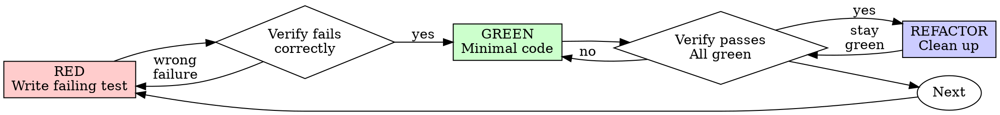

# 测试驱动开发（TDD）

## 概述

先写测试。看着它失败。再写最少的代码让它通过。

**核心原则：** 如果你没有亲眼看到测试失败，你就不知道它测的是不是对的东西。

**违反规则的字面要求，就是违背了规则的本质。**

## 何时使用

**始终使用：**
- 新功能
- Bug 修复
- 重构
- 行为变更

**例外（需要询问你的人类伙伴）：**
- 一次性原型
- 生成的代码
- 配置文件

心里想"就这一次跳过 TDD"？停下来。这就是自我合理化。

## 铁律

```
没有先写失败的测试，就不允许写生产代码
```

先写了代码？删掉。重新开始。

**没有例外：**
- 不要把它留作"参考"
- 不要在写测试时"顺手改一下"
- 不要看它
- 删掉就是删掉

完全从测试出发重新实现。就这样。

## 红绿重构（Red-Green-Refactor）



### 红灯（RED）——写一个会失败的测试

写一个最小测试，说明应该发生什么。

<Good>
```typescript
test('retries failed operations 3 times', async () => {
  let attempts = 0;
  const operation = () => {
    attempts++;
    if (attempts < 3) throw new Error('fail');
    return 'success';
  };

  const result = await retryOperation(operation);

  expect(result).toBe('success');
  expect(attempts).toBe(3);
});
```
命名清晰，测试真实行为，只测一件事
</Good>

<Bad>
```typescript
test('retry works', async () => {
  const mock = jest.fn()
    .mockRejectedValueOnce(new Error())
    .mockRejectedValueOnce(new Error())
    .mockResolvedValueOnce('success');
  await retryOperation(mock);
  expect(mock).toHaveBeenCalledTimes(3);
});
```
命名含糊，测的是 mock 而不是代码
</Bad>

**要求：**
- 只测一种行为
- 命名清晰
- 用真实代码（除非万不得已，否则不用 mock）

### 验证红灯——看它失败

**必须执行。绝不跳过。**

```bash
npm test path/to/test.test.ts
```

确认：
- 测试失败（而不是报错）
- 失败信息符合预期
- 是因为功能缺失而失败（而不是拼写错误）

**测试通过了？** 你在测已有行为。修正测试。

**测试报错了？** 修好错误，重新运行，直到它以正确的方式失败。

### 绿灯（GREEN）——写最少代码

写最少的代码让测试通过。

<Good>
```typescript
async function retryOperation<T>(fn: () => Promise<T>): Promise<T> {
  for (let i = 0; i < 3; i++) {
    try {
      return await fn();
    } catch (e) {
      if (i === 2) throw e;
    }
  }
  throw new Error('unreachable');
}
```
刚好够通过
</Good>

<Bad>
```typescript
async function retryOperation<T>(
  fn: () => Promise<T>,
  options?: {
    maxRetries?: number;
    backoff?: 'linear' | 'exponential';
    onRetry?: (attempt: number) => void;
  }
): Promise<T> {
  // YAGNI
}
```
过度设计
</Bad>

不要添加测试要求之外的功能，不要重构其他代码，不要"改进"超出测试范围的东西。

### 验证绿灯——看它通过

**必须执行。**

```bash
npm test path/to/test.test.ts
```

确认：
- 测试通过
- 其他测试仍然通过
- 输出干净（没有错误、警告）

**测试失败了？** 修代码，不要修测试。

**其他测试失败了？** 立即修复。

### 重构（REFACTOR）——清理

只有在绿灯之后才能做：
- 消除重复
- 改进命名
- 提取辅助函数

保持测试通过。不要添加新行为。

### 重复

为下一个功能写下一个失败的测试。

## 好的测试

| 质量 | 好的 | 差的 |
|---------|------|-----|
| **最小** | 只测一件事。名字里有"和"？拆开。 | `test('validates email and domain and whitespace')` |
| **清晰** | 名字描述行为 | `test('test1')` |
| **体现意图** | 展示期望的 API | 让人看不出代码应该做什么 |

在编写或修改任何测试时，阅读 [writing-good-tests.md](writing-good-tests.md) 了解让测试保持诚实的原则：
- 在写测试之前，先说出会让这个测试失败的生产代码变更
- 断言真实行为，绝不断言 mock 行为
- 测试专用的代码放在测试工具里，不要放进生产类
- 在 mock 一个依赖之前，先理解它的副作用

## 常见自我合理化

| 借口 | 现实 |
|--------|---------|
| "太简单了，不用测" | 简单代码也会出错。写测试只要 30 秒。 |
| "我之后再测" | 后写的测试会立刻通过——这证明不了任何东西。它们可能测错了东西，可能测的是实现而不是行为，也可能漏掉了你忘记的边界情况。你从没看着它失败，就永远无法证明它能抓住这个 Bug。先写测试强制你经历那个失败。 |
| "后写测试能达到同样的目标（重精神不重仪式）" | 后写测试回答的是"这段代码做什么？"；先写测试回答的是"这段代码应该做什么？"。后写的测试会被你已经写好的代码带偏——你验证的是你记得的那些情况，而不是你原本会发现的情况。有覆盖率，但没有证据证明测试本身有效。 |
| "已经手动测过了" | 手动测试是临时性的：没有覆盖记录，代码变更后无法重跑，压力下容易漏掉用例。"我试的时候能跑" ≠ 全面。自动化测试每次都以相同方式运行。 |
| "删掉已经花了 X 小时的东西太浪费" | 这是沉没成本谬误——时间不管怎样都花掉了。真正的选择是：用 TDD 重写（高置信度）vs. 保留它然后事后补测试（低置信度、很可能有 Bug）。保留你无法信任的代码才是浪费。 |
| "留着当参考，先写测试" | 你会去改它。那就成了后写测试。删掉就是删掉。 |
| "需要先探索一下" | 可以。把探索的产物丢掉，用 TDD 重新开始。 |
| "测试难写 = 设计不清晰" | 听测试的话。难测 = 难用。 |
| "TDD 会拖慢我" | TDD 就是务实的路径：在提交前抓住 Bug、防止回归、让你无所畏惧地重构。"务实"的捷径意味着到生产环境里调试——更慢，不是更快。 |
| "手动测试更快" | 手动测试证明不了边界情况。每次改动你都得重新测。 |
| "现有代码没有测试" | 你正在改进它。为现有代码补测试。 |

## 危险信号——停下来，重新开始

- 先写代码再写测试
- 实现之后才写测试
- 测试立刻就通过了
- 说不清测试为什么会失败
- 测试"以后再加"
- 合理化"就这一次"
- "我已经手动测过了"
- "后写测试能达到同样的目的"
- "重精神不重仪式"
- "留着当参考"或"改改现有代码"
- "已经花了 X 小时，删掉太浪费"
- "TDD 太教条，我要务实一点"
- "这次不一样，因为……"

**以上所有情况都意味着：删除代码。用 TDD 重新开始。**

## 示例：修复 Bug

**Bug：** 空邮箱被接受

**红灯（RED）**
```typescript
test('rejects empty email', async () => {
  const result = await submitForm({ email: '' });
  expect(result.error).toBe('Email required');
});
```

**验证红灯**
```bash
$ npm test
FAIL: expected 'Email required', got undefined
```

**绿灯（GREEN）**
```typescript
function submitForm(data: FormData) {
  if (!data.email?.trim()) {
    return { error: 'Email required' };
  }
  // ...
}
```

**验证绿灯**
```bash
$ npm test
PASS
```

**重构（REFACTOR）**
如果需要，把多个字段的校验提取出来。

## 完成检查清单

在标记工作完成之前：

- [ ] 每个新函数/方法都有测试
- [ ] 每个测试在实现之前都亲眼看过它失败
- [ ] 每个测试都因预期原因失败（功能缺失，而非拼写错误）
- [ ] 为通过每个测试写了最少代码
- [ ] 所有测试通过
- [ ] 输出干净（没有错误、警告）
- [ ] 测试使用真实代码（除非万不得已，否则只用 mock）
- [ ] 覆盖了边界情况和错误

不能全部打勾？你跳过了 TDD。重新开始。

## 卡住时

| 问题 | 解决办法 |
|---------|----------|
| 不知道怎么测 | 先写你期望的 API。先写断言。问你的人类伙伴。 |
| 测试太复杂 | 设计太复杂。简化接口。 |
| 什么都要 mock | 代码耦合太紧。使用依赖注入。 |
| 测试搭建太庞大 | 提取辅助函数。还是复杂？简化设计。 |

## 与调试的结合

发现 Bug 了？写一个复现它的失败测试。遵循 TDD 循环。测试证明修复有效，并防止回归。

永远不要在没有测试的情况下修 Bug。

## 最终规则

```
生产代码 → 必须有测试且测试先失败过
否则 → 不是 TDD
```

未经你的人类伙伴允许，没有例外。
