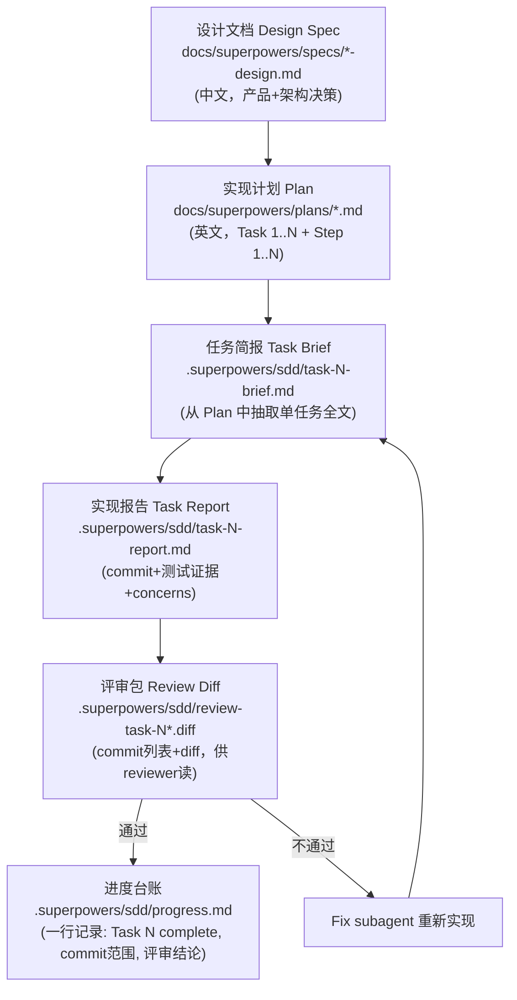
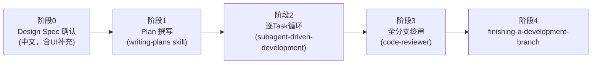
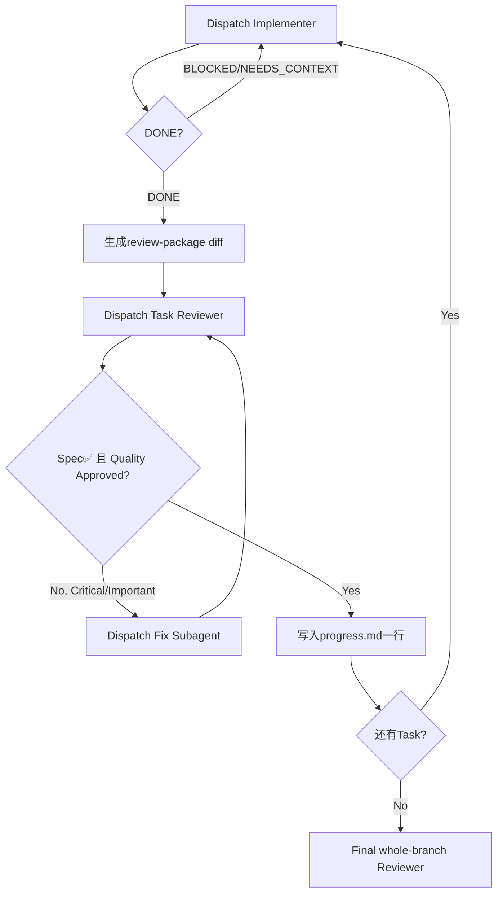

# SDD（Spec-Driven Development）方法论调研报告

日期：2026-07-12
调研目的：为在 LuxAgents（craft-agents 迁移后项目）中设计 Teambition 端到端任务交互功能，复用 craft-agents-max 已验证的 SDD 文档骨架与流程。

---

## 0. 路径纠错说明

用户给出的路径 `/Users/admin/Workspace/ClaudeCode/craft-agents-max/.superpowers/sdd/` **确实存在**，但其内容是**方法论的一次运行产物（progress ledger + 分任务 brief/report/diff）**，不是方法论本身的定义文件。真正相关的内容分布在三处，已全部找到并阅读：

| 类别 | 路径 | 说明 |
|---|---|---|
| SDD 执行痕迹（本次 Teambition 任务） | `craft-agents-max/.superpowers/sdd/` | progress.md + task-N-brief.md + task-N-report.md + review-task-N*.diff |
| 三段式产出物（Plan / Design / UI 补充） | `craft-agents-max/docs/superpowers/{plans,specs}/` | 实际的 requirements→design→tasks 落地文档 |
| 方法论骨架定义 | `~/.codex/plugins/cache/openai-curated-remote/superpowers/6.1.1/skills/{writing-plans,subagent-driven-development}/SKILL.md` | Plan 文档模板、任务颗粒度规则、执行/评审流程 |
| 当前项目（LuxAgents）已有前置代码 | `apps/electron/src/main/lib/teambition-adapter.ts` (+`.test.ts`) | 235 行，MCP/Mock 双适配器骨架，工具名未探测（占位） |

---

## 1. 该 SDD 落地的文档结构（三段式，非 requirements/design/tasks 标准三段，而是 Design → Plan → Task-Brief/Report 四层)

craft-agents-max 采用的是 **superpowers 插件的 "writing-plans + subagent-driven-development"** 变体，实际落地为四层文档，而非纯粹的 spec-kit 风格 `requirements.md / design.md / tasks.md` 三段式：



**没有单独的 `requirements.md`** —— 需求被合并进 Design Spec 的第 1、2 节（目标 + 官方能力结论），设计和技术方案不分离成独立阶段。这是与 spec-kit（`/speckit.specify → /speckit.plan → /speckit.tasks`）三段式的主要区别：spec-kit 分离 PRD/Plan/Tasks 三个独立命令产出；这里合并为 **Design（含需求）→ Plan（含任务）→ Brief/Report（运行时产物）**。

---

## 2. 各文档的模板字段（逐一提炼）

### 2.1 Design Spec 模板字段
（例：`2026-07-12-teambition-craft-agent-integration-design.md`）

```
# {系统A} - {系统B} 集成设计
日期 / 状态（已确认设计，待实现计划）

1. 目标                      — 用户故事式列表，含"第一阶段不做"边界声明
2. 官方能力结论                — 外部平台能力盘点 + 官方文档链接引用
3. 总体架构                   — ASCII/mermaid 架构图 + 分层说明
4. 集成边界                   — 新增模块的文件树 + 宿主侧改动清单（"不做"清单）
5. Gateway 接口                — 核心 TS interface 定义（契约先行）
6. 本地绑定与快照               — 数据模型 type 定义 + 目录结构
7. 领取流程                   — mermaid/文本流程图
8. 同步策略                   — 显式同步规则枚举
9. 凭据安全                   — 存储方式 + 规则列表
10. 分阶段交付                 — 阶段0..N + 每阶段验收标准
11. 错误处理                  — 场景→处理方式映射表
12. 测试策略                  — 测试类型清单（fake gateway/contract/idempotency/conflict/redaction/upstream-safety）
13. 分支与上游同步              — git 分支拓扑 + 规则
14. 第一版明确不做              — 范围排除清单（与目标章节呼应）
15. 设计结论                  — 一段话总结架构取舍
```

补充：还有一份 **UI 映射补充文档**（`-ui-amendment.md`），说明设计文档可以按需拆出"补充规格"（amendment），而不强制塞进主设计文档——这对后续 UI 层设计有参考价值：
```
1. 任务类型（枚举 + 业务语义）
2. 执行范围（type union 建模，附规则列表）
3. 现有 UI 组件映射（树状文本图，标注"不新增看板"等硬约束）
4. 交互界面行为（按分支条件列出 UI 状态）
5. 卡片操作清单
6. 设计结论
```

### 2.2 Plan 文档模板字段（`writing-plans` skill 定义，英文）

```markdown
# [Feature Name] Implementation Plan

> REQUIRED SUB-SKILL 提示行（指向执行方式）

**Goal:** 一句话
**Architecture:** 2-3句话
**Tech Stack:** 关键技术栈

## Global Constraints
[项目级硬约束，逐条，来自spec原文，供每个Task隐式继承]

---

## Task N: [组件名]

**Files:**
- Create: `精确路径`
- Modify: `精确路径:行号范围`
- Test: `精确路径`

**Interfaces:**
- Consumes: [从更早任务继承的精确签名]
- Produces: [后续任务依赖的精确函数名/类型名]

- [ ] Step 1: 写失败测试（含完整代码）
- [ ] Step 2: 运行测试确认失败（含期望输出）
- [ ] Step 3: 写最小实现（含完整代码）
- [ ] Step 4: 运行测试确认通过
- [ ] Step 5: git commit（含确切commit message）
```

**硬性规则（"No Placeholders"）**：禁止 TBD/TODO/"add appropriate error handling"/"similar to Task N"（必须重复完整代码，不能引用）——这是该方法论区别于普通计划文档的核心纪律，值得在 Teambition 方案里遵循。

### 2.3 Task Brief 模板字段
就是从 Plan 中原文抽取的单个 Task 全文（`scripts/task-brief PLAN_FILE N` 自动生成），字段与 Plan 的 Task 结构完全一致，不做任何删减改写——保证 subagent 收到的是"唯一真源"。

### 2.4 Task Report 模板字段（`.superpowers/sdd/task-N-report.md`）

```
Status: DONE / DONE_WITH_CONCERNS / NEEDS_CONTEXT / BLOCKED

Commit:
- <sha> (`<message>`)

Changed files:
- 路径列表

Verification:
- 命令 + 完整输出（红→绿证据，TDD强制留痕）

Notes: 实现细节/取舍
Concerns: 已知问题/后续任务的技术债提示

## Review fix N       （若评审要求修复，追加同结构小节，含红/绿测试证据）
```

### 2.5 Review Diff 模板字段（`review-task-N.diff`）
```
# Review package: {BASE_SHA}..{HEAD_SHA}
## Commits
<单行 commit 列表>
## Files changed
<git diff --stat 输出>
## Diff
<git diff -U10 完整内容>
```
这是纯脚本生成物（`scripts/review-package BASE HEAD`），把"reviewer 需要的一切"打成一个文件，避免 reviewer 用多次工具调用重建上下文。

### 2.6 Progress Ledger 模板字段（`progress.md`）
```
# {Feature} progress
Plan: <plan文件路径>
<空行或"No implementation tasks completed yet.">
Task N: complete (commits <base7>..<head7>, review clean|acceptable with note)
```
一行一个任务，纯追加，用于跨会话/跨压缩恢复进度——`git log` 与本文件互为校验。

---

## 3. 流程阶段总结（非三段式，而是"设计确认 → 计划 → 逐任务红绿灯循环 → 全局评审"四阶段）



阶段2内部是本方法论的核心机制——**每个 Task 一个独立的 implementer subagent + reviewer subagent 双闭环**：


关键纪律（对 Teambition 方案设计有直接借鉴价值）：
- **契约先行**：Plan 里明确"Interfaces: Consumes/Produces"，逐任务传递精确类型签名，禁止后续任务猜测早期任务的接口（对应 Teambition 案例中 `TeambitionGateway`/`ExternalTaskBundle` 等类型贯穿 7 个 Task 从未改名）。
- **TDD留痕强制**：Report 必须贴红测试证据，本案例 Task 1 因缺失该证据被 reviewer 在报告里"如实记录"而非编造，体现方法论对诚实留痕的高要求。
- **上游隔离**：Global Constraints 明确"不改通用 Session 协议""main 只跟 upstream""bun.lock/.cursor 不入 commit"——这是 fork 项目做企业定制的标准防污染动作，LuxAgents 应照抄这条约束到自己的 Plan 里。

---

## 4. 示例 Spec 关键章节摘录（作为参照）

已有的 Teambition Design Spec（`docs/superpowers/specs/2026-07-12-teambition-craft-agent-integration-design.md`）与 LuxAgents 当前的 `teambition-adapter.ts` 高度相关，摘录其架构隔离层设计供直接复用：

**Gateway 接口契约（可直接迁移到 LuxAgents）：**
```ts
interface TeambitionGateway {
  getCurrentUser(): Promise<TeambitionUser>
  listMyTasks(input: ListMyTasksInput): Promise<ExternalTaskSummary[]>
  getTaskBundle(taskId: string): Promise<ExternalTaskBundle>
  addProgress(taskId: string, input: ProgressInput): Promise<SyncResult>
  updateWorkflowStatus(taskId: string, input: WorkflowStatusInput): Promise<SyncResult>
  addComment(taskId: string, content: string): Promise<SyncResult>
  recordWorktime?(taskId: string, input: WorktimeInput): Promise<SyncResult>
}
```

**执行范围建模（Feature/Bug 强绑定项目，Task 可选）：**
```ts
type TeambitionTaskKind = 'feature' | 'bug' | 'task'
type ExecutionScope =
  | { type: 'workspace' }
  | { type: 'project'; projectId: string }
```

**本地绑定唯一键规则**：`workspaceId + taskId`，禁止用任务标题做键；重复领取打开原 session，不建第二个。

**能力探测优先于假设工具名**（与 LuxAgents `teambition-adapter.ts` 现状完全一致的教训）：
> "User MCP 的具体工具集合需要在企业 Token 上进行能力探测，不能假设每个企业 Token 都开放任务、状态、评论和工时工具。"

这与 LuxAgents 现有代码注释**逐字呼应**：
> `teambition-adapter.ts` 注释："TW user-mcp 实际暴露哪些工具名、任务字段长什么样，在本仓库里从未验证过...第一步必须先跑 listTools() 探测真实工具列表再填值"

**7 个 Task 的范围边界**（可作为 LuxAgents 计划的任务拆分参照）：
1. 领域包 + Gateway 契约（纯类型，无运行时依赖）
2. 绑定 + 快照存储（幂等 claim、凭据脱敏落盘）
3. User MCP Gateway + 能力探测（**LuxAgents 当前卡在这一步之前**）
4. RPC 暴露（claim/list/snapshot）
5. Projects/Kanban UI 集成（复用现有看板，不新建）
6. 显式进展/状态回写（冲突检测、指纹去重）
7. 端到端验证 + upstream 安全检查

**第一版明确不做（范围红线，直接可复制）**：
后台轮询、Webhook、自动完成任务、自动创建任务、未确认工时提交、多 Agent 抢占、企业级中间服务、Teambition 字段污染通用 Session 协议。

---

## 5. 可复用的"文档骨架模板"（供 LuxAgents Teambition 方案设计遵循）

综合以上，建议 LuxAgents 后续设计 Teambition 集成方案时，按以下章节结构落地（合并 craft-agents-max 的 Design+Plan 骨架，适配 LuxAgents 已有的 `docs/plans/` 命名习惯 `YYYY-MM-DD-<feature>-{requirements,design}.md`）：

### 5.1 Design Spec 骨架（`docs/plans/YYYY-MM-DD-teambition-design.md`）
```
1. 目标（用户故事 + 明确"第一阶段不做"）
2. 官方能力结论（含官方文档链接引用；标注哪些能力"未在本环境验证")
3. 总体架构（分层图：UI → RPC/IPC → 集成包 → Gateway → MCP/API）
4. 集成边界（新增模块文件树 + 宿主侧最小改动清单）
5. Gateway 接口（TS interface，契约先行）
6. 本地绑定与快照（数据模型 + 目录结构 + 唯一键规则）
7. 领取/交互流程（mermaid 图）
8. 同步策略（显式同步规则，禁止静默覆盖）
9. 凭据安全（Token 存储位置 + 日志脱敏规则）
10. 分阶段交付（阶段0..N + 每阶段验收标准）
11. 错误处理（场景→处理方式映射表）
12. 测试策略（fake gateway/contract/idempotency/conflict/redaction）
13. 分支策略（若涉及fork/upstream同步）
14. 明确不做清单
15. 设计结论
```

### 5.2 Implementation Plan 骨架（`docs/plans/YYYY-MM-DD-teambition-plan.md`）
```
# Header block: Goal / Architecture / Tech Stack / Global Constraints

## Task N: <组件名>
- Files: Create/Modify/Test 精确路径
- Interfaces: Consumes / Produces（精确类型签名，贯穿全Plan一致）
- Step 1..N: 每步含完整代码/命令/期望输出，禁止占位符
```

### 5.3 执行期产物骨架（若采用 subagent-driven-development 执行）
```
.superpowers/sdd/
├── progress.md              — 一行台账
├── task-N-brief.md          — 任务全文（从Plan抽取，不改写）
├── task-N-report.md         — Status/Commit/Verification(红绿证据)/Concerns
└── review-task-N[-rM].diff  — commit列表+diff，供reviewer单文件读取
```

### 5.4 自检清单（撰写 Plan 后必做，来自 `writing-plans` skill）
- [ ] Spec 覆盖检查：spec 每一节都能对应到某个 Task
- [ ] 占位符扫描：无 TBD/TODO/"add appropriate error handling"
- [ ] 类型一致性：跨 Task 的函数名/类型名前后一致

---

## 6. 对 LuxAgents 当前状态的结论

1. LuxAgents 已有的 `teambition-adapter.ts` 正好落在 craft-agents-max 方案的 **Task 3（User MCP Gateway + 能力探测）之前**——尚未做 `listTools()` 探测，工具名是占位接口。这与 craft-agents-max Design Spec 第 2 节的警告完全一致，说明两边对"未验证 TW MCP 真实 schema"的判断一致，可以直接继承这条约束，不必重新调研。
2. craft-agents-max 的 7-Task Plan + Design Spec + UI Amendment 三份文档，可以整体作为 LuxAgents 方案的**结构参照**直接复用骨架（见第5节），但内容需要按 LuxAgents 自己的 Kanban/Project 实现（`docs/plans/2026-06-29-work-mode-kanban.md`）重新映射，因为两个项目的 Kanban/Session 数据模型已经在迁移中出现差异，不能整篇直接照搬。
3. 建议下一步：先补一份 `docs/plans/2026-07-12-teambition-requirements.md`（对齐 LuxAgents 自己的 `-requirements.md` 命名习惯，弥补 craft-agents-max 缺失的独立需求文档），再产出 design + plan，最后决定是否引入 `.superpowers/sdd/` 式的执行留痕机制。

---

## 引用文件清单（全部已实际读取）

- `/Users/admin/Workspace/ClaudeCode/craft-agents-max/.superpowers/sdd/progress.md`
- `/Users/admin/Workspace/ClaudeCode/craft-agents-max/.superpowers/sdd/task-1-brief.md`
- `/Users/admin/Workspace/ClaudeCode/craft-agents-max/.superpowers/sdd/task-2-brief.md`
- `/Users/admin/Workspace/ClaudeCode/craft-agents-max/.superpowers/sdd/task-1-report.md`
- `/Users/admin/Workspace/ClaudeCode/craft-agents-max/.superpowers/sdd/task-2-report.md`
- `/Users/admin/Workspace/ClaudeCode/craft-agents-max/.superpowers/sdd/review-task-1.diff`
- `/Users/admin/Workspace/ClaudeCode/craft-agents-max/.superpowers/sdd/review-task-2.diff`
- `/Users/admin/Workspace/ClaudeCode/craft-agents-max/docs/superpowers/plans/2026-07-12-teambition-craft-agent-integration.md`
- `/Users/admin/Workspace/ClaudeCode/craft-agents-max/docs/superpowers/specs/2026-07-12-teambition-craft-agent-integration-design.md`
- `/Users/admin/Workspace/ClaudeCode/craft-agents-max/docs/superpowers/specs/2026-07-12-teambition-craft-agent-integration-ui-amendment.md`
- `~/.codex/plugins/cache/openai-curated-remote/superpowers/6.1.1/skills/writing-plans/SKILL.md`
- `~/.codex/plugins/cache/openai-curated-remote/superpowers/6.1.1/skills/subagent-driven-development/SKILL.md`
- `/Users/admin/Workspace/ClaudeCode/LuxAgents/apps/electron/src/main/lib/teambition-adapter.ts`（当前项目已有前置代码，作为对照）
- `/Users/admin/Workspace/ClaudeCode/LuxAgents/docs/plans/`（当前项目既有文档命名习惯，作为落地参照）
