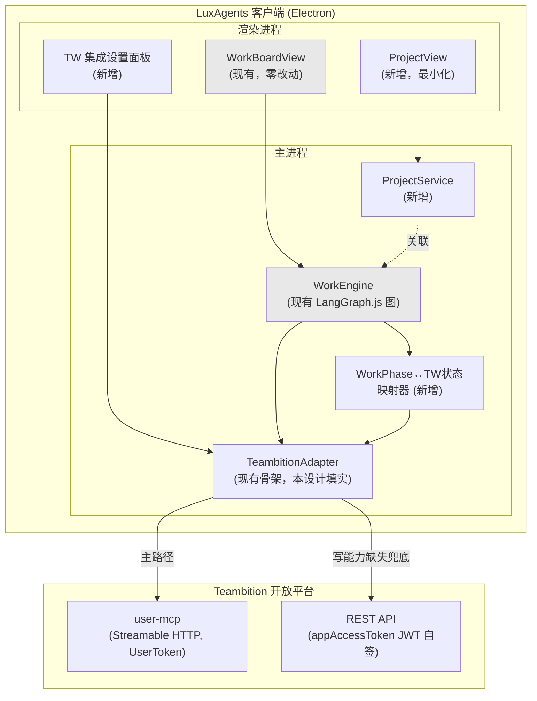
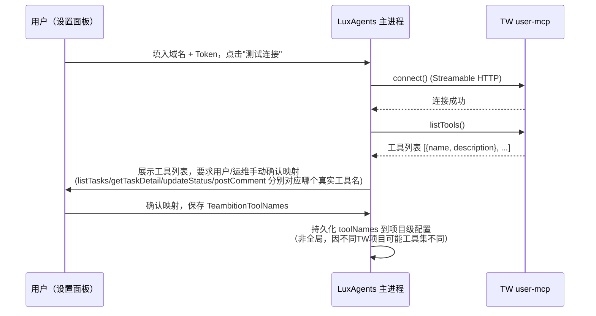
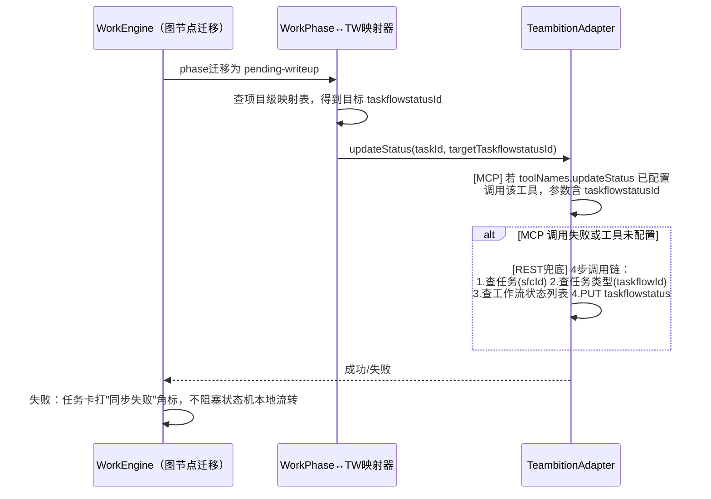
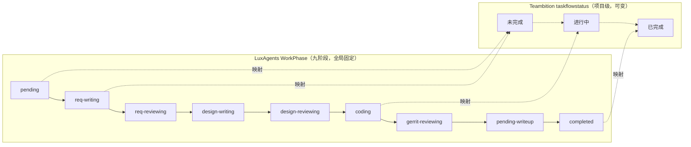
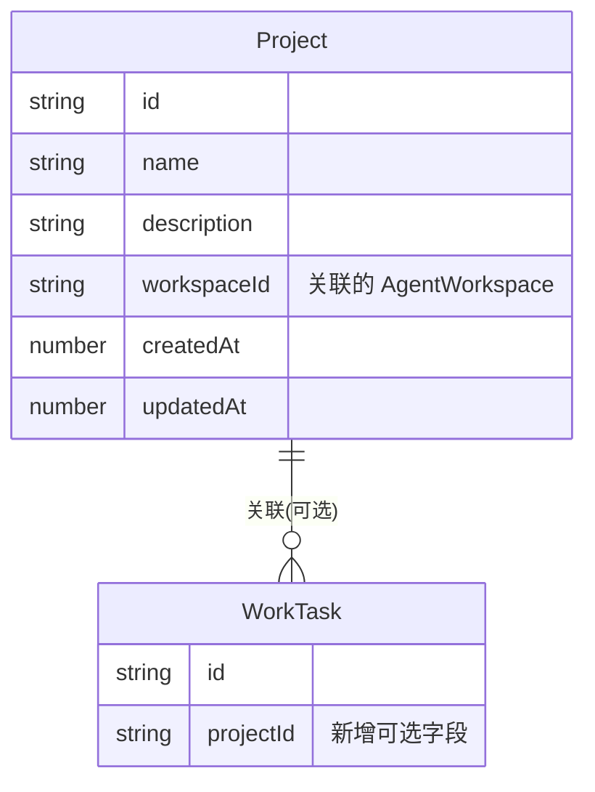

# LuxAgents × Teambition 集成设计文档（Projects & Kanban 能力迁移）

> 版本：v0.1（草案，待评审）
> 日期：2026-07-12
> 文档骨架来源：`docs/plans/2026-07-12-sdd-methodology-research.md` §5（craft-agents-max Design Spec + Plan 骨架）
> 前置调研（三份，均已核对，未编造）：
> 1. `craft-agents-oss` Projects & Kanban 功能调研（会话 `260712-witty-nebula`）
> 2. Teambition 开放平台与 MCP 调研（本会话，内置浏览器实测）
> 3. SDD 方法论调研（`docs/plans/2026-07-12-sdd-methodology-research.md`）
> 关联既有文档：`docs/plans/2026-07-07-work-mode-requirements.md`、`docs/plans/2026-07-07-work-mode-design.md`
> 关联既有代码：`apps/electron/src/main/lib/teambition-adapter.ts`、`work-graph.ts`、`packages/shared/src/types/work.ts`、`apps/electron/src/renderer/components/work/*`

---

## 如何阅读本文档

本文档遵循调研报告 §5 提炼的骨架，分三大部分：**需求（Requirements）→ 设计（Design）→ 任务分解（Tasks）**，对应 craft-agents-max 的 Design Spec + Plan 两层结构合并呈现（本项目暂不引入独立 Plan 文件，待评审通过后再拆分为可执行的 `-plan.md`）。所有"未在本环境验证"的结论已在 §0 和文末"假设与未决问题"中明确标注，不做任何编造性填充。

---

## 0. 关键前提与范围裁决（先于需求陈述）

在写用户故事之前，必须先裁决一个架构分叉——否则需求会自相矛盾：

> **craft-agents-oss 的 Kanban 是"人类可拖拽的看板"（`@dnd-kit` 驱动列变更），而 LuxAgents 现有 Work 模式的 `WorkBoardView` 是"状态机驱动、故意禁止拖拽"的看板**（列变更只能由九阶段状态机迁移触发，人类只有预定义动作按钮）。这不是实现细节差异，是产品哲学冲突：一个把"看板列"当作用户可编辑的自由字段，一个把"看板列"当作状态机的只读投影。

**本文档采纳 oss 调研报告给出的三选项中的方案②（新增独立能力，与 Work 模式并存），并进一步裁决为"部分采纳"**：

| oss 能力 | 本设计的处置 | 理由 |
|---|---|---|
| **Project 实体**（工作区级分组，文件系统持久化，资产+MEMORY注入） | **采纳**，作为新增轻量实体，与 Work 模式解耦 | 与现有"无数据库、纯文件系统"规范（AGENTS.md）完全兼容；对 Work 模式零侵入；可先行落地 |
| **Kanban 拖拽交互**（`@dnd-kit`，列=自由字段） | **不采纳** | 与 Work 模式"状态由 LangGraph 驱动，人只有预定义动作"的设计哲学直接冲突；引入会造成同一产品里两套"看板列语义"并存，用户心智混乱 |
| **Task DAG spec + Conductor 编排引擎** | **不采纳（不重复建设）** | LuxAgents 已有更贴合团队研发闭环场景的等价物：`WorkGraphState`（LangGraph.js）+ 九阶段状态机，功能上是 oss Conductor 的领域特化版本，重新造轮子无收益 |
| **Teambition 作为外部任务源同步进看板** | **采纳，但走现有 `TeambitionAdapter` 插槽，不新建适配层** | `teambition-adapter.ts` 已预留接口（`listTools/fetchTasks/fetchTaskDetail/updateStatus/postComment`），本文档的核心工作是把这个骨架填实，而不是新增另一套集成 |

**因此本文档的实际范围是三件事**：
1. 引入 **Project 实体**（采纳 oss 设计，最小化实现）
2. 把 **`teambition-adapter.ts` 的骨架填实**（探测真实工具名 → 字段映射 → 读写打通）
3. 打通 **WorkPhase 九阶段状态机 ↔ Teambition 任务状态** 的双向映射（现有看板 UI 零改动，只换数据源）

不做：拖拽交互、Conductor DAG 引擎、自定义看板列。

---

## 1. 需求（Requirements）

### 1.1 背景与目标用户

沿用 `2026-07-07-work-mode-requirements.md` §1–§3 的产品定位（Work 模式 = TW → 文档 → 审核 → 编码 → Gerrit → 回写闭环）与角色表，不重复展开。本文档新增的用户故事聚焦在**"看板数据从哪来、Project 分组怎么落地"**这一层。

### 1.2 用户故事

| ID | 角色 | 故事 | 验收标准 |
|---|---|---|---|
| US-1 | SPM | 我在 Teambition 建的任务，应该能在 LuxAgents Work 看板里自动出现，不用手动搬 | 配置好 TW 项目 ID 后，任务列表通过 MCP `fetchTasks` 拉取，落 `work-tasks.json`，`origin:'tw'` 打标；轮询周期可配（默认 5 分钟） |
| US-2 | SE | 我在 LuxAgents 里把任务从"编码中"推进到"待回写"，Teambition 那边的任务状态也要同步变，不然团队其他人在 TW 看到的是假状态 | `updateStatus` 调用成功后，TW 任务的 `taskflowstatus` 实际发生变更（可在 TW 网页端肉眼验证）；调用失败时看板任务卡显示"待回写（同步失败）"角标，不静默吞错 |
| US-3 | SE | 审批驳回/通过的意见，应该能作为评论回写到 TW 任务，团队其他人不用切到 LuxAgents 才能看到审批历史 | `postComment` 在审批 gate 产生 verdict 后调用；调用失败不阻塞状态机继续流转（评论是增强，不是关键路径） |
| PM | 模块带头人 | 我想把不同产品线的任务/会话按 Project 分组管理，而不是所有东西堆在一个列表里 | 新增 Project 实体：可创建/命名/关联工作区目录；Project 详情页展示所属 WorkTask 列表（复用现有 WorkBoardView，加 Project 过滤器）；Project 的资产/说明文档可注入相关会话的系统提示词（复用 MEMORY.md 注入机制） |
| US-5 | SE / 开发 | TW MCP 连不上、Token 过期、工具名对不上时，我要能立刻在 UI 上看到，而不是任务卡片静默卡住 | 三类失败态在看板卡片/详情面板有明确视觉区分：①连接失败（红色，含最近错误摘要）②写能力缺失走 REST 兜底但兜底也失败（橙色）③读写工具名未配置（灰色，提示"待运维完成 listTools 探测"） |
| US-6 | 运维/平台负责人 | 私有化部署的企业域名要能在配置界面里填，不要硬编码在代码里 | 设置面板新增 "Teambition 集成" 表单：企业域名（默认空，私有化部署必填）、Token（安全存储）、项目 ID 列表；域名格式遵循 §4.5 的占位符规则 |

### 1.3 功能需求

| ID | 需求 | 优先级 | 依据 |
|---|---|---|---|
| FR-1 | `McpTeambitionAdapter.listTools()` 必须在首次配置 TW 连接时自动调用一次，结果展示给用户做工具名映射确认 | P0 | Teambition 调研 §3.2："支持的工具列表并非固定文档列表……需要登录后台实际查看" |
| FR-2 | `fetchTasks`/`fetchTaskDetail` 返回的原始负载（`TeambitionTaskRaw`）需经字段映射转换为 `WorkTask` 的一个子集（至少：title/type/priority/projectId/externalLinks），映射逻辑集中在一个函数，不散落 | P0 | 现状代码注释已声明"字段映射留给 Phase 5"；本设计将其提前到 P0 因为是闭环打通的前置条件 |
| FR-3 | `updateStatus` 必须实现官方文档给出的 4 步调用链（查任务→查任务类型→查工作流状态→改状态），而不是猜测一个"改状态"独立接口 | P0 | Teambition 调研 §2.2 官方 4 步案例 |
| FR-4 | 当 MCP `updateStatus`/`postComment` 工具缺失或调用失败时，必须有 REST（`appAccessToken` 自签 JWT）兜底路径，兜底也失败才最终标记失败态 | P1 | Teambition 调研 §1.1/§1.4 结论："MCP 走 UserToken，REST 兜底走 AppSecret 自签 JWT，两者鉴权模型不同" |
| FR-5 | 企业域名、Token 等配置项必须走设置面板 + `safeStorage` 加密存储，不写入代码或 `work-tasks.json` | P0 | AGENTS.md "配置文件优于 localStorage"规范 + Teambition 调研 §1.4 安全提示："该链接代表用户身份，不可外泄" |
| FR-6 | Project 实体最小实现：CRUD + 关联工作区目录 + 关联 WorkTask 列表过滤器；**不实现**自定义看板列、拖拽 | P1 | §0 裁决 |
| FR-7 | WorkPhase ↔ Teambition 工作流状态映射表必须可配置（不同 TW 项目的工作流状态节点 ID 不同），而非硬编码 | P0 | Teambition 调研 §2.1："每个任务类型必须绑定一条工作流"——工作流是项目级配置，非全局常量 |
| FR-8 | 遥测（`work-telemetry.jsonl`）需新增一个事件类型：TW 同步事件（拉取成功/失败、状态回写成功/失败、耗时），复用现有两采集点原则 | P1 | `2026-07-07-work-mode-design.md` §8 "采集点只有两处"原则的自然扩展 |

### 1.4 非功能需求

| ID | 需求 | 说明 |
|---|---|---|
| NFR-1 | TW 相关网络调用超时需 ≤10s，且不阻塞看板 UI 主线程渲染 | 主进程发起，IPC 推送结果，渲染进程永不同步等待 |
| NFR-2 | 单次轮询失败不应导致已同步任务在本地看板"消失"——本地状态是权威缓存，TW 是补充源 | 避免"TW 抖动导致看板闪烁"的用户体验问题 |
| NFR-3 | 所有 TW 相关日志需脱敏：Token、请求头 `Authorization` 字段禁止全文写入日志 | 对齐 Teambition 调研 §1.4 安全提示 |
| NFR-4 | 私有化域名不可用（如 DNS 无法解析）时，功能需优雅降级为"仅本地任务可用"，不崩溃整个 Work 模式 | 对齐本会话调研中 `rd.luxshare.com.cn` DNS 隔离的真实故障场景 |
| NFR-5 | 中文注释/日志规范延续 AGENTS.md 既有约定 | — |

### 1.5 明确不做（本阶段）

1. 不实现看板拖拽交互（§0 已裁决）
2. 不引入独立于 WorkGraphState 的任务编排引擎（DAG/Conductor）
3. 不做图片/文件上传下载的 TW 同步（官方 MCP 明确限制："暂不支持涉及图片或文件上传/下载的相关 API"）
4. 不做 Gerrit/Jenkins/自动化测试节点的 TW 同步（属于 M2 范围，见既有 Work 模式方案文档 §12）
5. 不实现 Teambition 侧的 Webhook 接收（本设计是"LuxAgents 主动轮询/推送"单向发起模型，Webhook 双向实时同步留待后续评估）

---

## 2. 设计（Design）

### 2.1 官方能力结论摘要（含"未验证"标注）

| 结论 | 状态 |
|---|---|
| Teambition 无独立 Kanban API，看板是"任务类型+工作流+工作流状态"的前端视图 | ✅ 已通过官方文档确认（Teambition 调研 §2.1） |
| 状态流转的 4 步调用链（查任务→查类型→查工作流状态→改状态） | ✅ 已通过官方案例确认（§2.2） |
| user-mcp 是 UserToken 鉴权、Streamable HTTP 传输 | ✅ 已通过官方文档确认（§1.4） |
| user-mcp 实际暴露的工具名、参数 schema | ❌ **未验证**——需要登录 Teambition 账号创建 Token 才能在配置页查看，本次调研环境无法登录 |
| 企业私有化域名 `rd.luxshare.com.cn/dev-center/user-mcp` 是否真实可用 | ❌ **未验证**——沙箱网络隔离，DNS 无法解析，与文档规则本身无关 |
| appAccessToken REST 兜底是否需要企业内部审批注册 | ❌ **未验证**——官方文档未提及企业内部审批流程，需用户内部确认 |

### 2.2 总体架构



**分层说明**（延续既有 `2026-07-07-work-mode-design.md` §1 的分层原则，新增两层）：
- **展示层**：`WorkBoardView` 零改动，只是数据源新增 TW 拉取通道；`ProjectView` 是新增的独立轻量视图，通过 `projectId` 过滤 WorkTask 列表
- **编排层**（现有）：`WorkEngine` / LangGraph.js 图，本设计不改动其内部结构，只是让 `coding→gerrit-reviewing→pending-writeup` 等节点的状态迁移多一步"回写 TW"的副作用
- **映射层（新增）**：`WorkPhase ↔ TW taskflowstatus` 双向映射器，项目级配置（因为不同 TW 项目的工作流状态节点 ID 不同）
- **适配层（填实既有骨架）**：`TeambitionAdapter` 保持既有接口不变，`McpTeambitionAdapter` 内部实现按 §2.4 的调用链填实；新增 `RestTeambitionAdapter` 作为写能力兜底

### 2.3 数据模型映射（craft-agents-oss → LuxAgents → Teambition）

| craft-agents-oss 实体/字段 | LuxAgents 实体/字段（本设计） | Teambition 概念 | 采纳状态 |
|---|---|---|---|
| `ProjectConfig`（工作区级项目分组） | **新增** `Project`（`~/.luxagents/projects.json`） | 无直接对应（TW"项目"是团队协作单元，粒度不同，不做 1:1 映射） | 采纳（独立实体，不与 TW 项目强绑定） |
| `ProjectConfig.KanbanColumnDef[]`（自定义列，拖拽） | **不采纳** | 看板展示字段设置（前端视图概念，无独立数据） | 不采纳（§0） |
| `SessionMeta.projectId` | `WorkTask` 新增可选字段 `projectId?: string`（指向新 `Project.id`） | — | 采纳 |
| `SessionMeta.kanbanColumn` | 复用现有 `BOARD_COLUMNS`（3 固定列，`phases[]` 分组，见 `work-constants.ts`） | 无对应 | 不采纳（列由状态机推导，非独立字段） |
| `SessionMeta.taskSlug` / `taskRunId` | 复用现有 `WorkTask.id` / `WorkTask.agentSessionId` | 无对应 | 不采纳（新造字段，已有等价字段） |
| `task.yaml`（DAG spec，节点+依赖+引用插值） | 复用现有 `WorkGraphState`（LangGraph.js StateGraph） | 无对应 | 不采纳（重复建设，见§0） |
| Conductor 引擎（`TaskRunner`，926行） | 复用现有 `WorkEngine`（`main/lib/work-engine.ts`） | 无对应 | 不采纳（重复建设） |
| （oss 无此实体） | `WorkTask.externalLinks[]`（已存在于 `work.ts`） | Teambition 任务 `taskId` + `projectId` | **本设计核心**：把这个已存在但未使用的字段填实 |
| （oss 无此实体） | `WorkTask.phase`（九阶段状态机） | Teambition `taskflowstatusId`（工作流状态节点） | **本设计核心**：新增 §2.5 双向映射表 |
| （oss 无此实体） | `postComment()`（`TeambitionAdapter` 已声明） | Teambition 任务评论 API（`POST /task/comment`） | 填实既有骨架 |

### 2.4 MCP / API 接入方式

#### 2.4.1 连接配置（域名占位符标注）

复用 `teambition-adapter.ts` 中 `McpTeambitionAdapterConfig.server: McpServerEntry`（`type:'http'` + `url` + `headers`），新增设置面板生成该配置：

```
公有云：  https://open.teambition.com/user-mcp        （创建 Token 后拿到含鉴权信息的 MCP Server URL）
私有云：  https://<YOUR_ENTERPRISE_DOMAIN>/dev-center/user-mcp
```

> 说明：`<YOUR_ENTERPRISE_DOMAIN>` 需用户在设置面板填入企业私有化部署的实际域名（如调研中提到但**未验证**的 `rd.luxshare.com.cn`）。本设计不硬编码任何具体域名，占位符替换规则来自 Teambition 调研 §4 官方"服务地址"表格的结构性推断，**不对任何具体域名的可用性做背书**。

#### 2.4.2 工具探测流程（首次配置必经）



此流程直接对应现状代码注释"第一步必须先跑 `listTools()` 探测真实工具列表再填值"——本设计将其从"开发者手动跑一次性脚本"升级为"设置面板里的正式产品交互"，因为工具名可能随 TW 版本或企业配置变化，不应是一次性硬编码。

#### 2.4.3 状态回写调用链（填实 `updateStatus`）

严格对齐 Teambition 官方 4 步调用链（调研 §2.2），通过 MCP 工具（若映射存在）或 REST 兜底实现：



**关键设计取舍**：TW 回写失败**不阻塞**本地状态机继续流转——本地 `WorkTask.phase` 是权威状态，TW 只是"尽力同步"的镜像，避免网络问题拖垂真实研发流程（对齐 NFR-2 "本地状态是权威缓存"）。

### 2.5 WorkPhase ↔ Teambition 工作流状态映射表



因为 Teambition 默认工作流只有 3 个状态（未完成/进行中/已完成），而 LuxAgents 有 9 个阶段，**映射是多对一（LuxAgents 更细，TW 更粗）**。映射表结构：

```ts
/** 项目级配置：一个 TW 项目对应一份映射（不同项目工作流状态节点 ID 不同） */
interface WorkflowStatusMapping {
  twProjectId: string
  /** LuxAgents phase → TW taskflowstatusId 的多对一映射 */
  phaseToTwStatus: Record<WorkPhase, string /* taskflowstatusId */>
  /** 反向：TW 状态变更时（若未来接入轮询/webhook）如何影响本地 phase，
   *  M1 不实现反向同步，仅记录该字段供 M2 评估用 */
  twStatusToPhase?: Record<string, WorkPhase>
}
```

M1 范围**只做单向回写**（LuxAgents → TW），不做 TW → LuxAgents 的状态反向同步（避免双向同步的一致性复杂度，对齐"明确不做"§1.5-5 的单向发起模型判断）。

### 2.6 鉴权与错误处理策略

#### 2.6.1 鉴权分层

| 场景 | 鉴权方式 | 存储 |
|---|---|---|
| MCP 读写调用（主路径） | UserToken（登录后台创建的 Token，内嵌于 MCP Server URL） | `safeStorage` AES-256-GCM 加密，复用 `channel-manager.ts` 模式 |
| REST 兜底调用 | appAccessToken（自签 JWT，`AppId`+`AppSecret` HMAC256，含 `_appId/iat/exp`） | `AppSecret` 同样走 `safeStorage`；Token 本身内存态短期缓存（建议 exp=1h），不落盘 |
| REST 请求头 | `Authorization: <token>` + `X-Tenant-Id` + `X-Tenant-Type: organization`（写操作追加 `X-Operator-Id`） | 运行时拼装，不缓存含 header 的完整请求 |

#### 2.6.2 错误处理场景映射表

| 场景 | 处理方式 | 用户可见反馈 |
|---|---|---|
| 域名 DNS 无法解析 / 网络不可达 | 主进程 catch，标记该次轮询失败，不重试风暴（指数退避，上限 3 次/轮询周期） | 设置面板显示"连接失败：域名无法解析"；看板不受影响（保留上次成功缓存） |
| Token 已过期 | MCP 连接返回鉴权错误 → 标记为"需要重新创建 Token" | 设置面板红色提示 + 引导链接（重新登录 TW 后台创建） |
| `listTools()` 返回的工具列表中缺少必需工具（如无 `updateStatus` 等价物） | 该能力标记为"MCP 不支持"，自动切换到 REST 兜底判断分支 | 设置面板工具映射区该项显示"MCP 缺失，将走 REST 兜底" |
| REST 兜底 4 步调用链任一步失败 | 记录失败步骤（哪一步：查任务/查类型/查状态列表/改状态），整体判定为该次回写失败 | 任务卡"同步失败"角标 + 详情面板显示失败步骤，供人工诊断 |
| 工具名映射错误（用户手动填错，导致调用返回"未知工具"） | 捕获 MCP `isError` 响应，展示原始错误文本（现有 `extractToolPayload` 已实现此逻辑） | 设置面板"测试连接"按钮旁展示具体错误 |
| TW 任务在远端被删除/归档，但本地仍在追踪 | `fetchTaskDetail` 404 → 本地任务标记 `origin:'tw'` 但 `twOrphaned: true` | 任务卡灰显 + 提示"TW 任务已不存在，建议归档" |

### 2.7 Project 实体最小设计



- 持久化：`~/.luxagents/projects.json`（`{ version, projects: Project[] }`，延续既有 JSON 文件规范，不引入数据库）
- UI：新增一个轻量的 `ProjectView`（列表+详情），详情页复用现有 `WorkBoardView` 组件并传入 `projectId` 过滤器 prop——**不新增看板渲染逻辑**，只加一个过滤维度
- 资产/MEMORY 注入：复用现有 `agent-prompt-builder.ts` 的"工作区上下文注入"机制，Project 的 `description` 字段作为额外上下文段落拼入相关会话的系统提示词（技术路径已存在，只是新增一个数据源）

### 2.8 测试策略

| 类型 | 覆盖点 |
|---|---|
| Contract 测试 | `TeambitionAdapter` 接口的 Mock 实现（现有 `MockTeambitionAdapter`）与 `McpTeambitionAdapter` 需通过同一套契约测试，确保未来切换实现不破坏调用方 |
| 幂等性测试 | 同一 `updateStatus` 调用重复触发（如网络超时后重试）不应产生重复评论/重复状态变更副作用 |
| 映射表测试 | `WorkflowStatusMapping` 的 9→3 映射覆盖全部 `WorkPhase` 枚举值，缺项在启动时报错而非静默跳过 |
| 脱敏测试 | 日志断言：任何包含 Token/Authorization 的字符串不出现在 `console.log`/持久化日志文件中 |
| 降级测试 | 模拟 DNS 解析失败，断言看板 UI 不崩溃、本地任务数据不丢失（NFR-4） |
| Golden file | REST 兜底 4 步调用链的请求/响应结构固定样例，防止未来 SDK/API 变更导致静默漂移 |

---

## 3. 任务分解（Tasks）

> 仅产出任务清单，不编写实现代码。每个任务标注依赖的调研结论来源，便于评审时溯源。

| # | 任务 | 依赖的调研结论 | 前置任务 |
|---|---|---|---|
| T1 | **TW user-mcp 工具探测**：在设置面板实现"测试连接"→`listTools()`→展示工具列表→人工确认映射→持久化 `TeambitionToolNames` 的完整交互 | Teambition 调研 §3.2（工具集动态，需登录查看）；现状代码注释（listTools 从未真正跑过） | 无（P0 起点，其余任务均依赖此步产出的真实工具名） |
| T2 | **字段映射函数**：编写 `TeambitionTaskRaw → WorkTask` 的映射函数（`mapTwTaskToWorkTask`），覆盖 title/type/priority/externalLinks 等字段，附单元测试 | Teambition 调研 §2.1（任务类型/工作流/状态关系）；`work.ts` 现有 `WorkTask` 字段定义 | T1（需拿到真实字段样例才能定映射规则，而非猜测 schema） |
| T3 | **WorkflowStatusMapping 实现**：项目级配置的持久化结构 + 启动时校验（9 个 phase 全覆盖）+ 设置面板的映射配置 UI | 本设计 §2.5 | T1 |
| T4 | **`updateStatus` 4步调用链实现**：MCP 优先路径 + REST 兜底路径（含 appAccessToken 自签 JWT 生成逻辑） | Teambition 调研 §2.2（官方4步案例）、§1.1（JWT签名字段） | T1, T3 |
| T5 | **`postComment` 填实**：审批 verdict 产生后回写评论，失败不阻塞状态机 | Teambition 调研 §2.4（评论API）；`2026-07-07-work-mode-design.md` §5（审批 gate 设计） | T1 |
| T6 | **凭据安全存储**：TW UserToken / AppSecret 走 `safeStorage`，复用 `channel-manager.ts` 加密模式；日志脱敏工具函数 | Teambition 调研 §1.4 安全提示；AGENTS.md 加密规范 | 无（可与 T1 并行） |
| T7 | **错误处理与降级 UI**：§2.6.2 错误场景映射表的逐项实现，看板卡片/设置面板的视觉状态 | 本设计 §2.6.2；US-5 | T4, T6 |
| T8 | **遥测事件扩展**：`work-telemetry.jsonl` 新增 TW 同步事件类型（拉取/回写成功失败+耗时） | `2026-07-07-work-mode-design.md` §8 遥测采集点原则 | T4 |
| T9 | **Project 实体最小实现**：`projects.json` 持久化 + CRUD IPC + `ProjectView`（列表/详情，复用 WorkBoardView 加过滤器）+ MEMORY 注入接线 | oss 调研（Project 实体设计）；本设计 §2.7 | 无（可与 T1-T8 并行，架构独立） |
| T10 | **契约测试套件**：Mock/MCP 两实现的共享契约测试 + 幂等性测试 + 映射表覆盖测试 + 脱敏测试 + 降级测试 | 本设计 §2.8 | T1-T9 陆续完成后补齐对应测试 |
| T11 | **文档补齐（待用户输入）**：将用户提到但本次未附上的"验证过的 MCP SOP"内容并入正式操作手册 | 见"假设与未决问题" | 需用户重新上传附件 |

**建议顺序**：T1 → T6（并行）→ T2/T3 → T4/T5 → T7/T8 → T9（随时可并行插入）→ T10 收尾 → T11 视附件到达情况随时插入。

---

## 4. 假设、未决问题与需用户补充项

| # | 事项 | 当前状态 |
|---|---|---|
| A1 | 本设计对"新增能力 vs 改造 Work 模式"的三选一裁决为方案②（部分采纳，见§0） | **需用户确认**——若用户实际期望是方案①（改造 Work 模式吸收拖拽体验）或方案③（只迁移 Project，完全不碰 Kanban 同步），需重新裁决 §0 |
| A2 | TW user-mcp 真实工具名、参数 schema、返回体结构 | **未验证**，全部映射规则（T2/T3/T4）建立在官方文档描述之上，必须先跑 T1 拿到真实探测结果才能定稿实现细节 |
| A3 | 企业私有化域名 `rd.luxshare.com.cn/dev-center/user-mcp` 当前是否真实可达、账号是否已开通 | **未验证**（本环境 DNS 隔离），仅按官方占位符规则做结构性推断，不做可用性背书 |
| A4 | appAccessToken REST 兜底路径是否需要企业内部的应用注册/审批流程 | **未知**，官方文档未描述企业内部审批环节，需用户向内部平台团队确认 |
| A5 | 用户提到的"验证过的 MCP SOP"附件 | **本次会话全程未收到任何附件文件**，T11 任务占位等待补充，补充后需重新评审本文档相关章节（尤其 §2.4、§4 鉴权部分） |
| A6 | TW 项目的默认工作流是否所有项目都恰好是 3 个状态（未完成/进行中/已完成），还是存在自定义工作流（更多状态节点） | 官方文档只展示了默认新建项目的 3 状态，**未验证**自定义工作流场景下 §2.5 映射表结构是否需要扩展为支持任意 N 个状态节点（当前设计已用 `Record<WorkPhase, string>` 兼容任意状态 ID，理论上可覆盖，但未经真实自定义工作流验证） |

---

## 引用文件清单

- `/Users/admin/.craft-agent/workspaces/llm-kb/sessions/260712-witty-nebula/plans/craft-agents-oss-kanban-research.md`
- `/Users/admin/Workspace/ClaudeCode/LuxAgents/docs/plans/2026-07-12-sdd-methodology-research.md`
- `/Users/admin/Workspace/ClaudeCode/LuxAgents/docs/plans/2026-07-07-work-mode-requirements.md`
- `/Users/admin/Workspace/ClaudeCode/LuxAgents/docs/plans/2026-07-07-work-mode-design.md`
- `/Users/admin/Workspace/ClaudeCode/LuxAgents/apps/electron/src/main/lib/teambition-adapter.ts`
- `/Users/admin/Workspace/ClaudeCode/LuxAgents/packages/shared/src/types/work.ts`
- `/Users/admin/Workspace/ClaudeCode/LuxAgents/apps/electron/src/renderer/components/work/work-constants.ts`
- Teambition 官方文档（本会话内置浏览器实测）：`open.teambition.com/docs/documents/66cd468fff36bd665cccf040`、`5db8f7e77baeb50014957fc1`、`5d89d6418acc9d00143ac73b`、`6643021f61edfc5cbf956250`、`68ad49589aca1c12cfa2e9a2`、`68ad4901f7d70fb6fb33f159`、`695b28bcfca732ddb816bd7e`
