# Work 模式迁移 craft-agents-oss 能力设计方案

> 版本：v0.1（草案，待评审）
> 日期：2026-07-12
> 前置文档：
> - `docs/plans/2026-07-07-work-mode-design.md`（Work 模式现有方案，v1.0）
> - `docs/plans/2026-07-07-work-mode-requirements.md`（Work 模式现有需求，v1.0）
> - `2026-07-12-teambition-integration-spec.md`（Teambition 集成合并 spec）
> - 会话调研：`craft-agents-oss-kanban-research.md`（craft-agents-oss Projects & Kanban 架构分析）
> 决策范围：本文档**只回答一个问题**——craft-agents-oss 的 Projects & Kanban Task Board 里，哪些能力值得吸收进 **现有 Work 模式**（而非新建一套并行系统），以及吸收的优先顺序、前后端落点、与现有九阶段状态机/LangGraph 架构的冲突处理方式。

---

## 0. 决策：采纳"方案①改造现有 Work 模式"，而非新建独立看板

前序调研报告给出了三个选项，默认假设是方案②（新增独立 Projects+Kanban，与 Work 模式并存）。**本次用户明确要求"优先迁移到 Work 模式"**，即采纳方案①。原因复核：

| 冲突点 | craft-agents-oss 设计 | Work 模式现状 | 本方案裁决 |
|---|---|---|---|
| 列可否拖拽 | `@dnd-kit` 全套，卡片可跨列拖拽落状态 | `work-constants.ts` 注释明确"列不可拖拽——状态由 LangGraph 状态机驱动" | **不引入拖拽**。Work 模式的列是九阶段状态机的**只读投影**，人类只能通过预定义按钮（批准/驳回/取消）触发迁移，这是产品哲学（TW 审核实操场景需要强流程），不因为抄一个 UI 库而放弃 |
| 列是否可自定义 | `KanbanColumnDef[]` 每项目可配置 | `BOARD_COLUMNS` 固定 3 列（待办/编码中/待回写），映射自 9 个 `WorkPhase` | **暂不做自定义列**。9 阶段状态机是权威状态模型，3 列是它的展示层收敛，不是"自由字段"；P2-1（图模板化，`buildLooperGraph(moduleConfig)`）已经是"模块级配置"的正确扩展点，不需要再叠加一套列配置系统 |
| 任务粒度 | Task = DAG（多节点/多会话编排，Conductor 执行） | WorkTask = 单一状态机任务，1:1 关联 1 个 Code 模式会话 | **不迁移 Conductor DAG 引擎**。Work 模式的"多步骤"已经由 9 阶段状态机 + LangGraph 图承担，是"纵向深流程"而不是"横向多分支任务图"，两者是不同的编排范式，硬套会话架构会显著增加复杂度且无对应需求 |
| 项目分组实体 | 新增 `Project`（workspace 级，含 assets/MEMORY.md/工作目录绑定） | 无对应实体，`WorkTask.workspaceId` 只是弱关联 | **值得吸收**，且与状态机无冲突——见 §2 |
| 列与状态解耦 | `kanbanColumn` 物理列 与 `sessionStatus` 徽章独立双轨 | `WorkPhase` 单轨，列是 phase 的纯函数映射（`work-constants.ts: BOARD_COLUMNS[].phases`） | **部分吸收其设计思路**：不引入独立的"物理列"字段，但借鉴其"卡片可同时展示阶段 + 独立徽章（如'停留超时'/'已失败'）"的信息分层方式——Work 模式已经通过 `failed`/"待我处理聚合带" 部分实现了这个思路，只需要在卡片 UI 上进一步强化，不需要改数据模型 |

**结论**：本次迁移的实际范围收窄为——① **Project 实体**（新增，价值明确，风险最低）；② **看板卡片/详情面板的信息密度与视觉设计**（借鉴 `TaskTile.tsx`/`KanbanColumn.tsx` 的实现细节，不搬架构）；③ **前端状态管理/持久化的组织模式**（借鉴其 Jotai atoms 分层与 push 事件同步机制，这与 Work 模式现有模式高度一致，属于"确认现有做法正确"而非新增）。**不迁移**：自定义列、拖拽、Conductor DAG、`tasks:generate` 自动生成。

---

## 1. 迁移范围与优先级

```mermaid
graph TD
    P0["P0 · Project 实体<br/>(新增，价值最高)"]
    P1["P1 · 看板卡片信息密度增强<br/>(借鉴 TaskTile.tsx 视觉细节)"]
    P2["P2 · Jotai atoms 分层确认<br/>(现状已对齐，仅补文档/单测)"]
    NO1["不迁移 · 自定义列 / @dnd-kit 拖拽"]
    NO2["不迁移 · Conductor DAG 引擎"]
    NO3["不迁移 · tasks:generate 自动生成 YAML"]

    P0 --> P1
    P0 -.提供项目上下文.-> P1

    style NO1 fill:#3a2020,stroke:#663333
    style NO2 fill:#3a2020,stroke:#663333
    style NO3 fill:#3a2020,stroke:#663333
```



| 优先级 | 项 | 收益 | 工作量 |
|---|---|---|---|
| **P0** | Project 实体（config.json + assets + MEMORY.md 注入） | Work 任务按项目分组、项目级上下文自动注入 Spec 生成/编码 prompt，直接提升需求/方案文档质量 | 中（新增类型+存储+IPC+UI 面板，无状态机改动） |
| **P1** | 看板卡片信息密度（活动波形/当前动作行/子阶段徽标） | 已在 v1.0 UI 规格 §7 写过，是"补齐现有设计欠账"而不是抄 oss | 小-中（纯前端，`WorkTaskCard.tsx` 改造） |
| **P2** | Jotai atoms 组织方式确认 | 确认 `work-atoms.ts` 现有分层（列表/派生/聚合）已经是 oss `atoms/kanban.ts` 的等价实践，无需改动，仅需补充单测覆盖 `computeAttentionQueue`/`upsertWorkTask` 等纯函数 | 小 |

---

## 2. P0：Project 实体设计

### 2.1 数据模型（新增）

放在 `packages/shared/src/types/`，与现有 `work.ts` 并列，命名 `project.ts`：

```ts
// packages/shared/src/types/project.ts（新增）
export interface WorkProject {
  id: string                    // proj_<uuid8>，创建后不变
  slug: string                  // 目录名，workspace 内唯一
  name: string
  description?: string
  workingDirectory?: string     // 绑定工作目录；Work 任务/Code 会话新建时继承
  details?: string              // 注入 Spec 生成与 THO context 的自由文本（对齐 craft-agents-oss details 字段）
  colorTheme?: string
  createdAt: number
  updatedAt: number
  archivedAt?: number
}

export interface WorkProjectAsset {
  id: string
  name: string
  path: string                  // 相对 assets/ 的路径
  createdAt: number
}
```

**与 craft-agents-oss 的差异**：不引入 `kanbanColumns?: KanbanColumnDef[]` 字段——§0 已裁决不做自定义列，避免留一个永远用不到的字段。

**`WorkTask` 扩展**（`work.ts` 现有文件，新增 1 个可选字段）：

```ts
export interface WorkTask {
  // ...现有字段不变
  projectId?: string   // 新增：绑定的 Project id，未绑定时保留现有 workspaceId 弱关联行为
}
```

### 2.2 持久化（遵循 Work 模式现有约定，不照搬 oss 的 shared/storage.ts 分层）

craft-agents-oss 把 `projects/storage.ts` 放在 `packages/shared` 是因为它的 server-core 与 shared 边界与本项目不同。LuxAgents 现有约定是"main/lib 直接操作 `~/.luxagents/`"（对照 `work-task-store.ts`/`agent-workspace-manager.ts`），本次遵循现状：

```
~/.luxagents/
  work-projects.json          # 索引：{ version, projects: WorkProject[] }
  work-projects/{id}/
    assets/                   # 资产文件
    MEMORY.md                 # 项目记忆，同级而非 assets/ 内（对齐 oss 的设计意图：避免出现在资产清单里）
```

新增 `apps/electron/src/main/lib/work-project-store.ts`（对照现有 `work-task-store.ts` 的读写模式：JSON 索引 + 原子写 + 内存缓存）。

### 2.3 IPC（对照现有 `WORK_IPC_CHANNELS` 组，新增 `WORK_PROJECT_IPC_CHANNELS`）

```ts
export const WORK_PROJECT_IPC_CHANNELS = {
  LIST_PROJECTS: 'work:list-projects',
  GET_PROJECT: 'work:get-project',
  CREATE_PROJECT: 'work:create-project',
  UPDATE_PROJECT: 'work:update-project',
  ARCHIVE_PROJECT: 'work:archive-project',
  LIST_PROJECT_ASSETS: 'work:list-project-assets',
  UPLOAD_PROJECT_ASSET: 'work:upload-project-asset',
  DELETE_PROJECT_ASSET: 'work:delete-project-asset',
  PROJECTS_CHANGED: 'work:projects-changed',   // main → renderer 推送
} as const
```

Handler 落在 `main/ipc.ts` 现有单文件里新增一组 `ipcMain.handle()`（**不引入 oss 的自建 RPC-over-WS**，四层 IPC 模式不变：常量 → `ipcMain.handle` → preload `contextBridge` → `window.electronAPI.*`）。写操作后复用**现有的**"全局 IPC 监听器永不销毁"广播模式（`main.tsx` 顶层挂载），推送 `PROJECTS_CHANGED`，对齐 oss 的 `broadcastChanged()` 思路但走本项目既有机制，不新发明传输层。

### 2.4 前端（新增 1 个 atoms 文件 + 1 个面板组件 + 卡片/详情联动）

```
apps/electron/src/renderer/atoms/work-project-atoms.ts   (新增)
  - workProjectsAtom: atom<WorkProject[]>([])             （由 PROJECTS_CHANGED 推送刷新）
  - currentWorkProjectFilterAtom: atom<string | 'all'>    （看板顶部项目筛选器，会话内持久，非磁盘——对齐 oss kanbanProjectFilterAtom 用普通 atom 而非 atomWithStorage 的理由：筛选状态属于"当前浏览上下文"而非"外观偏好"）

apps/electron/src/renderer/components/work/WorkProjectPanel.tsx  (新增)
  - 项目列表/创建/归档，UI 走 ShadcnUI（对齐 AGENTS.md 要求），参照现有 CreateWorkTaskDialog.tsx 的 Dialog 模式
```

**联动改造点**（需要修改现有文件）：
- `WorkBoardView.tsx` 头部新增项目筛选下拉（对齐 `KanbanProjectFilter.tsx` 的交互，但直接嵌入现有头部工具条，不新建独立布局层）
- `CreateWorkTaskDialog.tsx` 新增"关联项目"选择器（可选字段），选中后自动带入该项目的 `workingDirectory`
- `WorkTaskCard.tsx` 卡片新增项目色点/缩写角标（若已绑定项目）
- `WorkTaskDetail.tsx` 详情面板顶部展示所属项目（点击可跳转项目面板）

### 2.5 与 Spec 生成 / THO 的接线（Project 的核心价值点）

`work-spec-generator.ts`（`generateRequirementDoc`/`generateDesignDoc`）与 `tho-assembler.ts` 目前只拿 `WorkTask` 自身字段拼 prompt。绑定了 `projectId` 的任务，生成/组装时额外注入项目 `details` 字段（对齐 oss "Project.details 注入系统提示词"的设计）：

```ts
// work-spec-generator.ts / tho-assembler.ts 改造点（伪代码）
const project = task.projectId ? getWorkProject(task.projectId) : undefined
const projectContext = project?.details
  ? `\n\n## 项目背景\n${project.details}`
  : ''
// 拼进 systemPrompt 或 prompt 末尾
```

这是本次迁移里**唯一改动现有生成/编排逻辑**的点，改动量极小（几行），但直接对齐 oss "Live binding + context injection" 的产品意图。

---

## 3. P1：看板卡片信息密度增强（对照 v1.0 UI 规格 §7，借鉴 `TaskTile.tsx` 实现细节）

**现状核实（已 Read `WorkTaskCard.tsx` 全文，66 行）**：编号/类型角标/优先级/负责人头像/子阶段标签/停留时长/失败重试角标均已实现。「实时活动指示」当前是**占位实现**——`isActive`（`phase === 'coding' && !task.failed`）只驱动一个固定呼吸动效小圆点（`animate-pulse`），组件注释里已明确写明“M1 阶段还没有真实的工具调用流可展示，先用一个简单的呼吸动效占位，Phase 5 接入真实 Agent 会话事件后可以升级成实时活动波形”——与 v1.0 方案文档 §7 的目标描述完全对应，现在可以实施升级。

对照 oss `TaskTile.tsx`（539 行）提取可借鉴的实现细节（仅针对这一项未完成能力，其他都已有，不重复列出）：

| 目标能力 | 实现方式 | 落点 |
|---|---|---|
| 实时活动指示（非固定呼吸动效） | 订阅 `agentSessionId` 对应会话的工具调用事件流（复用现有 `AgentMessages` 的事件订阅机制），卡片右上角用调动频率驱动一个小波形/跳动小圆点 | `WorkTaskCard.tsx` |
| 当前动作一行字 | 卡片底部新加一行灰字展示当前节点在做什么（如“正在生成方案文档…”），数据源为最近一条 `WorkTelemetryEntry.node`（若没有则降级为 `PHASE_LABEL[task.phase]`，已在子阶段标签中存在，补充需避免与其重复） | `WorkTaskCard.tsx` |
| Play 按钮/快速批准 | 不迁移——审批必需阅读完整方案文档，卡片上快速按钮会鼓励跳过阅读，与“驳回必填意见”的审核质量设计相冲突，**明确不采纳** | — |

> 与本文档 §0 的裁决一致：不引入拖拽，不迁移子任务进度条（Work 任务无子任务概念）。

---

## 4. P2：状态管理组织方式核对（确认现状，非新增工作）

对照结果：`work-atoms.ts` 已经是——
- 列表 atom（`workTasksAtom`）
- 派生 atom（`currentWorkTaskAtom`/`filteredWorkTasksAtom`/`workAttentionQueueAtom`）
- 纯函数抽出以便单测（`computeAttentionQueue`/`upsertWorkTask`）

三层组织与 oss `atoms/kanban.ts` 的 `kanbanProjectFilterAtom`（普通 atom）+ `kanbanColumnColorsAtom`（`atomWithStorage`，外观偏好）+ 派生视图完全同构。**唯一差距**：`work-atoms.test.ts` 已存在（需确认覆盖率），新增 §2 的 `workProjectsAtom` 时按同一模式补测试即可，不需要架构变更。

---

## 5. 不迁移项的处理方式（避免后续被误解为"遗漏"）

| 能力 | 处理方式 |
|---|---|
| `@dnd-kit` 拖拽 | 不安装该依赖；卡片跨阶段迁移永远走"预定义按钮 + LangGraph resume"，这是产品设计而非技术欠账 |
| `KanbanColumnDef[]` 自定义列 | 若未来确有需求（如某模块想要更细的看板列粒度），走 P2-1 图模板化路线（`WorkModuleConfig` 扩展），不引入独立列配置系统，避免"列"和"状态机阶段"出现两套并行真相源 |
| Conductor DAG（`task.yaml` + `TaskRunner.ts`） | 完全不迁移。Work 模式的"多步骤"需求已被 9 阶段状态机 + THO 单会话模型覆盖；若未来出现"一个 Work 任务需要拆给多个并行 Code 会话"的真实场景，作为独立 RFC 评估，不预先设计 |
| `tasks:generate`（LLM 自动生成任务 DAG） | 不适用（无 DAG 可生成） |

---

## 6. 分阶段任务清单

| 阶段 | 任务 | 产出 | 依赖 |
|---|---|---|---|
| T1 | `packages/shared/src/types/project.ts` 新增 `WorkProject`/`WorkProjectAsset`；`work.ts` 的 `WorkTask` 加 `projectId?` | 类型定义 | — |
| T2 | `main/lib/work-project-store.ts`（JSON 索引 CRUD + assets 目录管理） | 存储层 | T1 |
| T3 | `main/ipc.ts` 新增 `WORK_PROJECT_IPC_CHANNELS` 一组 handler；preload 新增 `window.electronAPI.workProjects.*` | IPC 打通 | T2 |
| T4 | `renderer/atoms/work-project-atoms.ts` + `WorkProjectPanel.tsx`（新建/列表/归档 UI） | 前端面板 | T3 |
| T5 | `WorkBoardView.tsx` 项目筛选器；`CreateWorkTaskDialog.tsx` 关联项目字段；`WorkTaskCard.tsx`/`WorkTaskDetail.tsx` 项目角标 | 联动 UI | T4 |
| T6 | `work-spec-generator.ts`/`tho-assembler.ts` 注入 `project.details` | Prompt 增强 | T1 |
| T7 | `WorkTaskCard.tsx` 将固定呼吸动效升级为基于工具调用频率的真实活动指示；新加“当前动作一行字”展示行（数据源见 §3 表格） | 卡片视觉 | 无（已在 §3 完成现状核实） |
| T8 | 单测：`work-project-store.test.ts`、`work-project-atoms.test.ts`（对齐现有 `work-atoms.test.ts` 风格） | 测试覆盖 | T2, T4 |

**不安排任务**：自定义列、拖拽、Conductor、`tasks:generate`（见 §5，明确不做，不进任务清单占位）。

---

## 7. 待用户确认的开放问题

1. **Project 与 TW 项目的关系**：`WorkProject` 是否需要绑定 TW 的 `projectId`（一对一），使"从 TW 领取任务"时自动归入对应 Project？还是保持 Project 为纯本地分组概念，与 TW 项目解耦？（本文档默认后者，因为 TW 项目结构可能与本地工作区拆分方式不一致）
2. **`WorkTaskCard.tsx` 现状**：已实际 Read 全文并在 §3 完成差距核实，仅“实时活动指示”一项需升级，无需再遇到前置阻塞。
3. **是否需要 Project 级 skills/知识库绑定**（对齐 v1.0 需求文档 P2-1"模块带头人自助配置 Work Bot"）：若近期有需求，可以在 T1 阶段一并把 `WorkProject.skills?: string[]` 设计进去，避免二次改动类型；若无明确需求，本方案倾向不预留（YAGNI，对齐 AGENTS.md"不过渡设计"原则）。
