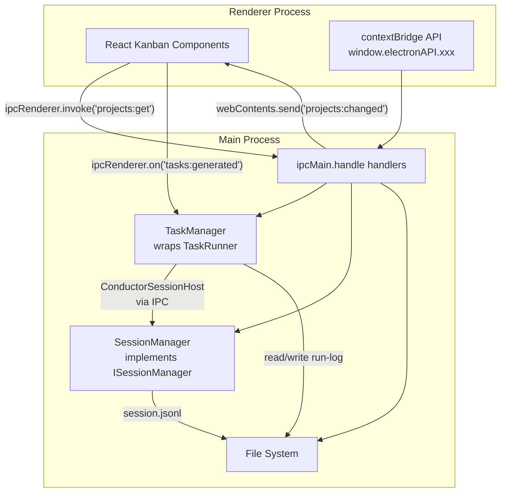

# craft-agents-max v0.11.0 — Projects & Kanban 源码参考文档

> 生成日期: 2026-07-13 | 目标: LuxAgents 迁移参考
> OSS 通信模式: **RPC over WebSocket** | LuxAgents 目标模式: **Electron ipcMain.handle + contextBridge 四层**

---

## 目录

1. [SHARED 层](#shared-层)
   - [projects/types.ts](#1-projectstypests)
   - [projects/storage.ts](#2-projectsstoragets)
   - [projects/index.ts](#3-projectsindexts)
   - [tasks/schema.ts](#4-tasksschemats)
   - [tasks/storage.ts](#5-tasksstoragets)
   - [tasks/refs.ts](#6-tasksrefsts)
   - [tasks/validate.ts](#7-tasksvalidatets)
   - [tasks/generator-prompt.ts](#8-tasksgenerator-promptts)
   - [tasks/index.ts](#9-tasksindexts)
   - [sessions/types.ts](#10-sessionstypests)
   - [protocol/channels.ts](#11-protocolchannelsts)
2. [SERVER-CORE 层](#server-core-层)
   - [handlers/rpc/projects.ts](#12-handlersrpcprojectsts)
   - [handlers/rpc/tasks.ts](#13-handlersrpctasksts)
   - [handlers/session-manager-interface.ts](#14-handlerssession-manager-interfacets)
   - [tasks/TaskRunner.ts](#15-taskstaskrunner)
3. [前端 KANBAN 组件](#前端-kanban-组件)
   - [atoms/kanban.ts](#16-atomskanbants)
   - [kanban/types.ts](#17-kanbantypests)
   - [kanban/KanbanBoardContainer.tsx](#18-kanbankanbanboardcontainertsx)
   - [kanban/KanbanBoard.tsx](#19-kanbankanbanboardtsx)
   - [kanban/KanbanColumn.tsx](#20-kanbankanbancolumntsx)
   - [kanban/TaskTile.tsx](#21-kanbantasktiletsx)
   - [kanban/TaskEditor.tsx](#22-kanbantaskeditorsx)
   - [kanban/status-column.ts](#23-kanbanstatus-columnts)
   - [kanban/subtask-merge.ts](#24-kanbansubtask-mergets)
   - [kanban/task-spec-form.ts](#25-kanbantask-spec-formts)
   - [kanban/SubtaskRow.tsx](#26-kanbansubtaskrowtsx)
   - [kanban/SubtaskProgress.tsx](#27-kanbansubtaskprogresstsx)
   - [kanban/kanban-colors.ts](#28-kanbankanban-colorsts)
   - [kanban/ModelChip.tsx & StatusBadge.tsx](#29-kanbanmodelchiptsx--statusbadgetsx)
   - [kanban/NewTaskComposer.tsx](#30-kanbannewtaskcomposertsx)
   - [kanban/BoardListToggle.tsx](#31-kanbanboardlisttogglestsx)
   - [kanban/KanbanProjectFilter.tsx](#32-kanbankanbanprojectfiltertsx)
   - [kanban/TaskChatPreview.tsx](#33-kanbantaskchatpreviewtsx)
   - [app-shell/ProjectsListPanel.tsx](#34-app-shellprojectslistpaneltsx)
   - [pages/ProjectInfoPage.tsx](#35-pagesprojectinfopagetsx)
   - [playground/demos/kanban/mock-kanban-data.ts](#36-playgrounddemoskanbanmock-kanban-datats)
4. [总结表](#总结表)

---

# SHARED 层

## 1. `projects/types.ts`

**路径**: `packages/shared/src/projects/types.ts`

### 导出类型

```typescript
export interface KanbanColumnDef {
  id: string;           // 稳定 slug，内置种子重用 'todo' | 'in-progress' | 'done'
  name: string;         // 用户自定标签（不 i18n）
  dropStatusId?: string; // 拖放列时自动应用的 status ID
  color?: string;       // 可选头部强调色（hex）
}

export interface ProjectConfig {
  id: string;
  slug: string;
  name: string;
  description?: string;
  workingDirectory?: string;    // 绝对路径，绑定 session 继承
  details?: string;             // 注入 system prompt 的自由文本
  colorTheme?: string;
  color?: string;               // 强调色（hex），显示在 SessionList 中
  createdAt: number;
  updatedAt: number;
  archivedAt?: number;
  kanbanColumns?: KanbanColumnDef[];  // 缺失时 board 使用默认 3 列
}

export interface ProjectAsset {
  filename: string;
  sizeBytes: number;
  mimeType: string;
  uploadedAt: number;
  absolutePath: string;  // 运行时解析，不持久化在 config
}

export interface CreateProjectInput {
  name: string;
  description?: string;
  workingDirectory?: string;
  details?: string;
  colorTheme?: string;
  color?: string;
}

export interface LoadedProject {
  config: ProjectConfig;
  folderPath: string;           // 项目文件夹绝对路径
  assetsPath: string;           // assets 目录绝对路径
  workspaceRootPath: string;    // workspace 根路径
  workspaceId: string;          // basename(workspaceRootPath)
}

export interface ProjectPromptContext {
  name: string;
  description?: string;
  details?: string;
  assetsPath: string;
  assets: { filename: string; mimeType: string; sizeBytes: number }[];
  memoryPath: string;           // MEMORY.md 绝对路径
  memoryContent?: string;       // 已按 token 上限截断
}
```

### LuxAgents 适配要点

- `ProjectConfig` 可直接照搬为 LuxAgents 的 model/interface
- **IPC 差异**: OSS 通过 RPC channel `projects:get/update/delete` 传递这些类型；LuxAgents 需通过 `ipcMain.handle('projects:...')` 暴露
- `workingDirectory` 的 `expandPath`/`toPortablePath` 逻辑需保留（跨平台路径处理）

---

## 2. `projects/storage.ts`

**路径**: `packages/shared/src/projects/storage.ts`

### 目录工具

```typescript
function getWorkspaceProjectsPath(workspaceRootPath: string): string  // → join(root, 'projects')
function getProjectPath(workspaceRootPath: string, projectSlug: string): string
function getProjectAssetsPath(workspaceRootPath: string, projectSlug: string): string
function getProjectMemoryPath(workspaceRootPath: string, projectSlug: string): string
// MEMORY_FILENAME = 'MEMORY.md'
function ensureProjectsDir(workspaceRootPath: string): void
function ensureProjectAssetsDir(workspaceRootPath: string): void
```

### 配置 CRUD

```typescript
function loadProjectConfig(workspaceRootPath: string, projectSlug: string): ProjectConfig | null
function saveProjectConfig(workspaceRootPath: string, config: ProjectConfig): void
// 内部调用 atomicWriteFileSync + toPortablePath(workingDirectory) + bump updatedAt
```

### Memory 操作

```typescript
function loadProjectMemory(
  workspaceRootPath: string,
  projectSlug: string,
  maxTokens = 5000
): string | null
// 容量意识截断：head-truncation（新内容在最前）+ 标记追加
```

### 加载操作

```typescript
function loadProject(workspaceRootPath: string, projectSlug: string): LoadedProject | null
function loadProjectById(workspaceRootPath: string, projectId: string): LoadedProject | null
function loadWorkspaceProjects(workspaceRootPath: string): LoadedProject[]
```

### 创建/更新/删除

```typescript
function generateProjectSlug(workspaceRootPath: string, name: string): string
function createProject(workspaceRootPath: string, input: CreateProjectInput): ProjectConfig
function updateProject(
  workspaceRootPath: string,
  projectSlug: string,
  patch: Partial<Omit<ProjectConfig, 'id' | 'slug' | 'createdAt'>>
): ProjectConfig
function deleteProject(workspaceRootPath: string, projectSlug: string): void
function projectExists(workspaceRootPath: string, projectSlug: string): boolean
```

### 资产操作

```typescript
interface UploadProjectAssetInput {
  filename: string;
  base64?: string;
  text?: string;
  sourcePath?: string;  // 从磁盘复制
}

function sanitizeAssetFilename(filename: string): string
function listProjectAssets(workspaceRootPath: string, projectSlug: string): ProjectAsset[]
function uploadProjectAsset(workspaceRootPath: string, projectSlug: string, input: UploadProjectAssetInput): ProjectAsset
function deleteProjectAsset(workspaceRootPath: string, projectSlug: string, filename: string): void
```

### LuxAgents 适配要点

- `atomicWriteFileSync` 是 OSS 工具函数：LuxAgents 可改用 `fs.writeFileSync` + 异常处理
- **IPC 差异**: 这些纯函数被 RPC handler 调用；LuxAgents 将 RPC handler 替换为 `ipcMain.handle` 回调
- `uploadProjectAsset` 的 base64/ text/ sourcePath 三模式可复用
- `loadProjectMemory` 的 token-aware 截断逻辑需保留（`estimateTokensDensityAware` 来自 `utils/large-response.ts`）

---

## 3. `projects/index.ts`

**路径**: `packages/shared/src/projects/index.ts`

### 导出

重新导出了 `types.ts` 的所有类型接口 + `storage.ts` 的所有函数。

### LuxAgents 适配要点

**照搬** — 直接作为 LuxAgents `shared/` 模块。

---

## 4. `tasks/schema.ts`

**路径**: `packages/shared/src/tasks/schema.ts`

核心：task.yaml 的 Zod schema — 声明式 DAG 规范。

### 关键枚举

```typescript
const NODE_KINDS = ['session', 'orchestrator', 'route', 'parallel', 'map', 'loop', 'approval',
  'synthesize', 'verify', 'judge', 'filter', 'aggregate', 'finally'] as const;
type NodeKind = (typeof NODE_KINDS)[number];

// v1 只执行 'session' 和 'orchestrator'；其余 P4 实现
const PERMISSION_MODES = ['safe', 'ask', 'allow-all'] as const;
const AGGREGATE_MODES = ['concat', 'vote', 'majority', 'filter', 'synthesize'] as const;
const TRIGGER_RULES = ['all_success', 'none_failed_min_one_success', 'one_success', 'all_done'] as const;
const TASK_RUNNERS = ['conduct', 'orchestrate'] as const;
const RETRY_WHEN = ['error', 'empty', 'invalid'] as const;
const CACHE_MODES = ['pure', 'off'] as const;
const OUTPUT_KINDS = ['param', 'artifact'] as const;
const PARAM_TYPES = ['string', 'number', 'boolean', 'enum', 'json', 'text'] as const;
```

### 修复（Repair）上限

```typescript
const DEFAULT_REPAIR_ATTEMPTS = 3;   // 默认修复尝试次数
const MAX_REPAIR_ATTEMPTS_CAP = 10;  // 硬上限
```

### TaskNodeSchema (Zod)

```typescript
const TaskNodeSchema = z.preprocess(/* type → kind 别名兼容 */, z.object({
  id: slug('node id'),
  title: z.string().optional(),       // 默认为 id
  prompt: z.string().optional(),       // session 节点必填
  kind: z.enum(NODE_KINDS).default('session'),
  // Session 原生字段
  model: z.string().optional(),
  llmConnection: z.string().optional(),
  permissionMode: z.enum(PERMISSION_MODES).optional(),
  labels: z.array(z.string()).optional(),
  status: z.string().optional(),
  // 边 + 数据流
  depends_on: z.array(slug('depends_on entry')).optional(),
  inputs: z.record(z.string(), InputRefSchema).optional(),
  outputs: z.array(OutputDeclSchema).optional(),
  // 控制流（P4）
  when: z.string().optional(),
  trigger: z.enum(TRIGGER_RULES).optional(),
  replicas: z.number().int().positive().optional(),
  aggregate: z.enum(AGGREGATE_MODES).optional(),
  loop: LoopSchema.optional(),
  for_each: z.string().optional(),
  max_parallel: z.number().int().positive().optional(),
  retry: RetrySchema.optional(),
  timeout: z.number().positive().optional(),
  cache: z.enum(CACHE_MODES).optional(),
  approval: z.boolean().optional(),
}));
```

### TaskSpecSchema (Zod + superRefine)

```typescript
const TaskSpecSchema = z.object({
  id: slug('task id'),
  title: z.string().min(1),
  goal: z.string().min(1),
  acceptance_criteria: z.string().optional(), // 验证门
  project: z.string().optional(),
  cwd: z.string().optional(),
  runner: z.enum(TASK_RUNNERS).default('conduct'),
  sources: z.array(z.string()).optional(),
  skills: z.array(z.string()).optional(),
  defaults: TaskDefaultsSchema.optional(),
  params: z.array(TaskParamSchema).optional(),
  token_budget: z.number().int().positive().optional(),
  max_parallel: z.number().int().positive().optional(),
  max_iterations: z.number().int().min(0).max(MAX_REPAIR_ATTEMPTS_CAP).optional(),
  nodes: z.array(TaskNodeSchema).min(1),
  outputs: z.record(z.string(), z.string()).optional(),
}).superRefine((spec, ctx) => {
  /* 检查：重复 node id、session 节点需有 prompt */
});
```

### 辅助函数

```typescript
function nodeDeps(node: TaskNode): string[]     // → node.depends_on ?? []
function nodeTitle(node: TaskNode): string       // → node.title ?? node.id
function parseTaskSpec(raw: unknown): SafeParseReturn  // Zod safeParse 包装
```

### 推断类型

```typescript
type InputRef, OutputDecl, Loop, Retry, TaskParam, TaskDefaults, TaskNode, TaskSpec
```

### LuxAgents 适配要点

- **照搬** Zod schema 和类型 — 这是 task.yaml 的规范定义
- `fs` 依赖仅在 `storage.ts`，schema.ts 本身无 Node 依赖，可在 renderer 中直接 `import`
- 注意 `PERMISSION_MODES` 需要与 LuxAgents 的权限模式对齐（可能增加自定义模式）

---

## 5. `tasks/storage.ts`

**路径**: `packages/shared/src/tasks/storage.ts`

### 磁盘布局

```
{workspaceRoot}/tasks/<slug>/
├── task.yaml              — 可编辑的 spec
└── runs/<runId>/
    ├── run-log.jsonl      — 仅追加的运行日志
    ├── spec.json          — 运行时 spec 快照
    └── nodes/<id>.json    — 每个节点的输出
```

### RunLogEntry 类型

```typescript
type NodeRunState = 'pending' | 'running' | 'done' | 'failed' | 'cancelled' | 'skipped';

type RunLogEntry =
  | { t: string; kind: 'run-started'; taskId: string; runId: string; orchestratorSessionId?: string }
  | { t: string; kind: 'node-scheduled'; nodeId: string }
  | { t: string; kind: 'node-spawned'; nodeId: string; sessionId: string }
  | { t: string; kind: 'node-finished'; nodeId: string; sessionId: string; state: NodeRunState; reason?: string }
  | { t: string; kind: 'node-retry'; nodeId: string; attempt: number; reason: string }
  | { t: string; kind: 'run-paused' | 'run-resumed' | 'run-stopped' | 'run-completed' | 'run-failed' | 'run-verifying' }
  | { t: string; kind: 'verdict'; result: 'pass' | 'fail' | 'unparsed'; reason?: string; nodes?: string[] }
  | { t: string; kind: 'budget-breach'; metric: 'tokens' | 'parallel' | 'iterations'; value: number; limit: number };
```

### 路径辅助

```typescript
function tasksRoot(workspaceRoot: string): string
function taskDir(workspaceRoot: string, slug: string): string
function taskYamlPath(workspaceRoot: string, slug: string): string
function runDir(workspaceRoot: string, slug: string, runId: string): string
```

### 主要函数

```typescript
// task.yaml
function parseTaskYaml(yamlText: string): ValidationResult & { spec?: TaskSpec }
function serializeTaskYaml(spec: TaskSpec): string
function loadTaskSpec(workspaceRoot: string, slug: string): (ValidationResult & { spec?: TaskSpec }) | null
function saveTaskSpec(workspaceRoot: string, spec: TaskSpec): void  // 先 validate，再写入
function listTaskSlugs(workspaceRoot: string): string[]

// Run log
function appendRunLog(workspaceRoot: string, slug: string, runId: string, entry: RunLogEntry): void
function readRunLog(workspaceRoot: string, slug: string, runId: string): RunLogEntry[]
function listRunIds(workspaceRoot: string, slug: string): string[]

// Spec 快照（保持运行时的节点标题）
function writeRunSpecSnapshot(workspaceRoot: string, slug: string, runId: string, spec: TaskSpec): void
function readRunSpecSnapshot(workspaceRoot: string, slug: string, runId: string): TaskSpec | null

// 节点输出
function writeNodeOutput(workspaceRoot: string, slug: string, runId: string, nodeId: string, output: NodeOutput): void
function readNodeOutput(workspaceRoot: string, slug: string, runId: string, nodeId: string): NodeOutput | null
```

### LuxAgents 适配要点

- `yaml` 依赖解析：需在 LuxAgents 中引入 `js-yaml` 或 `yaml` 包
- 磁盘布局可照搬；**IPC 模式差异**：这些函数在 OSS 中被 RPC handler 调用；LuxAgents 需要将 `saveTaskSpec` 等暴露为 `ipcMain.handle`
- `readRunLog` 的 JSONL 解析逻辑可复用

---

## 6. `tasks/refs.ts`

**路径**: `packages/shared/src/tasks/refs.ts`

### 引用语法

```
${nodes.<id>.output[.field]}    — 节点输出引用
${params.<name>}                — 参数引用
${inputs.<name>}                — 输入绑定引用
```

### 导出类型

```typescript
interface NodeRef { kind: 'node'; nodeId: string; field?: string; raw: string }
interface ParamRef { kind: 'param'; name: string; raw: string }
type Ref = NodeRef | ParamRef;

interface NodeOutput {
  text: string;
  params?: Record<string, unknown>;
}

interface InterpolationContext {
  nodeOutputs: Record<string, NodeOutput>;  // nodeId → output
  params?: Record<string, unknown>;
}

interface InterpolateOptions {
  onMissing?: (ref: Ref) => string;  // 缺失时回调，默认保留原始 token
}
```

### 函数

```typescript
function extractRefs(text: string): Ref[]
// 从字符串提取所有 ${...} 引用，返回 [{ kind: 'node'|'param', ... }]

function interpolateRefs(
  template: string,
  ctx: InterpolationContext,
  opts?: InterpolateOptions
): string
// 替换所有 ${...} 引用为实际值。未解析的保留原始 token 或调用 onMissing
```

### LuxAgents 适配要点

**照搬** — 纯函数，无外部依赖；是 TaskRunner 调度的核心组件。

---

## 7. `tasks/validate.ts`

**路径**: `packages/shared/src/tasks/validate.ts`

### 上限常量

```typescript
const TASK_CAPS = {
  maxNodes: 64,
  maxDepth: 24,
  maxWidth: 24,
  maxLoopIterations: 50,
} as const;
```

### 主要函数

```typescript
function validateTaskSpec(spec: TaskSpec): ValidationResult
// 图验证：环检测、dangling depends_on、未解析的 ${ref}、unknown model 警告、loop cap

function validateTaskInput(raw: unknown): ValidationResult & { spec?: TaskSpec }
// parseTaskSpec + validateTaskSpec 一步调用

function materializeDeps(spec: TaskSpec): Map<string, Set<string>>
// 构建依赖边：显式 depends_on ∪ prompt/inputs 中的引用
// 被验证器和 Conductor (TaskRunner) 共用

// 内部函数
function findCycle(nodes: TaskNode[], deps: Map<string, Set<string>>): string[] | null
function graphMetrics(nodes: TaskNode[], deps: Map<string, Set<string>>): { depth: number; width: number }
```

### LuxAgents 适配要点

**照搬** — `validateTaskInput` 是纯函数，可渲染器和后端共用（渲染器 import 时注意无 `fs` 依赖可通过提取抽离）。

---

## 8. `tasks/generator-prompt.ts`

**路径**: `packages/shared/src/tasks/generator-prompt.ts`

### 函数

```typescript
function buildGeneratorPrompt(goal: string, title?: string): string
// 生成 prompt：要求 LLM 输出纯 YAML 格式的 task.yaml
// 包含 schema 说明 + 示例 + 规则（最短图、明确依赖、检查引用解析）

function buildRepairPrompt(errors: { path: string; message: string }[]): string
// 修复 prompt：将验证错误返回给 orchestrator，要求修正 YAML
```

### LuxAgents 适配要点

**照搬** — 纯 prompt 模板，无逻辑依赖。

---

## 9. `tasks/index.ts`

**路径**: `packages/shared/src/tasks/index.ts`

### 导出

```typescript
export * from './schema.ts';
export * from './refs.ts';
export * from './validate.ts';
export * from './storage.ts';
export * from './generator-prompt.ts';
```

### LuxAgents 适配要点

**照搬** — 注意 `storage.ts` 引入 `fs`，renderer 端 import 会失败，需要 tree-shake 或条件引用。

---

## 10. `sessions/types.ts`

**路径**: `packages/shared/src/sessions/types.ts`

### Session 持久化字段

`SESSION_PERSISTENT_FIELDS` 常量数组定义了所有持久化字段（~50+ 字段），其中 Projects & Kanban 相关：

```typescript
// --- Project binding ---
'projectId',

// --- Kanban ---
'parentSessionId',    // 子任务指向父 session
'kanbanColumn',       // board 列 id

// --- Tasks Conductor ---
'taskSlug',           // 所属 task spec slug
'taskRunId',          // 所属 run id
'taskNodeId',         // DAG 节点 id
'taskNodeCount',      // DAG 节点总数（board 进度分母）
'taskDraft',          // generate 时的草稿 orchestrator
```

### SessionConfig 接口

关键 Project & Kanban 字段（其他字段详见源码）：

```typescript
interface SessionConfig {
  // ... ~40 个通用字段 ...

  /** Workspace-scoped project id (undefined = unbound). */
  projectId?: string;

  /** Parent session id (undefined = top-level task). */
  parentSessionId?: string;

  /** Kanban board column id ('todo' | 'in-progress' | 'done'). */
  kanbanColumn?: string;

  /** Tasks Conductor: slug of the task spec this session belongs to. */
  taskSlug?: string;
  taskRunId?: string;
  taskNodeId?: string;
  taskNodeCount?: number;

  /** Hidden from board until adopted by createTask. */
  taskDraft?: boolean;
}
```

### SessionHeader/SessionMetadata

与 `SessionConfig` 结构基本相同，包含所有 project/kanban/task 字段，并额外有 `messageCount`、`preview`、`tokenUsage` 等预计算字段。

### LuxAgents 适配要点

- **IPC 模式差异**: OSS 的 `session.jsonl` 读写由 `sessions/storage.ts` 直接处理 JSONL 文件；LuxAgents 需通过 `ipcMain.handle('sessions:...')` + 文件系统实现
- `projectId`、`parentSessionId`、`kanbanColumn`、`taskSlug` 等字段直接照搬
- `SESSION_PERSISTENT_FIELDS` 用于自动序列化/反序列化，LuxAgents 可复用此模式

---

## 11. `protocol/channels.ts`

**路径**: `packages/shared/src/protocol/channels.ts`

### Projects 相关 channel

```typescript
projects: {
  GET: 'projects:get',               // 列出所有项目
  GET_ONE: 'projects:getOne',        // 获取单个项目（id 或 slug）
  CREATE: 'projects:create',         // 创建项目
  UPDATE: 'projects:update',         // 更新项目（partial patch）
  DELETE: 'projects:delete',         // 删除项目
  LIST_ASSETS: 'projects:listAssets',
  UPLOAD_ASSET: 'projects:uploadAsset',
  DELETE_ASSET: 'projects:deleteAsset',
  CHANGED: 'projects:changed',       // 广播：项目列表变更
}
```

### Tasks 相关 channel

```typescript
tasks: {
  GET_OUTPUT: 'tasks:getOutput',     // 遗留：background-task
  VALIDATE: 'tasks:validate',        // 检查 task.yaml
  CREATE: 'tasks:create',            // 写入 task.yaml + 创建 orchestrator session
  GENERATE: 'tasks:generate',        // 异步：orchestrator 自动生成 task.yaml
  GENERATED: 'tasks:generated',      // 推送：生成完成（keyed by orchestratorSessionId）
  RUN: 'tasks:run',                  // 启动运行
  PAUSE: 'tasks:pause',
  RESUME: 'tasks:resume',
  STOP: 'tasks:stop',
  GET: 'tasks:get',                  // 获取 spec + 可选的运行状态快照
  LIST: 'tasks:list',                // 列出所有 task slug
  GET_RESULTS: 'tasks:getResults',   // 持久化存储的运行结果（重启后可用）
}
```

### Teambition 相关 channel

```typescript
teambition: {
  LIST_TASKS: 'teambition:listMyTasks',
  CLAIM_TASK: 'teambition:claimTask',
  GET_BINDING: 'teambition:getBinding',
  CAPABILITIES: 'teambition:capabilities',
  SYNC_PROGRESS: 'teambition:syncProgress',
  UPDATE_STATUS: 'teambition:updateStatus',
  BIND_PROJECT: 'teambition:bindProject',
}
```

### LuxAgents 适配要点

- **IPC 模式核心差异**: OSS 通过 `server.handle(RPC_CHANNELS.xxx, handler)` 注册，通过 `pushTyped(server, RPC_CHANNELS.xxx, ...)` 推送
- LuxAgents 需要用 `ipcMain.handle('channelName', handler)` + `webContents.send('channelName', data)` 替代
- `CHANGED` 推送事件需映射为 LuxAgents 的 `mainWebView.webContents.send()`
- `tasks:generate` + `tasks:generated` 的二步异步模式需要保留（请求→立即返回 ack→推送结果）

---

# SERVER-CORE 层

## 12. `handlers/rpc/projects.ts`

**路径**: `packages/server-core/src/handlers/rpc/projects.ts`

### 处理 channel 列表

```typescript
const HANDLED_CHANNELS = [
  RPC_CHANNELS.projects.GET,
  RPC_CHANNELS.projects.GET_ONE,
  RPC_CHANNELS.projects.CREATE,
  RPC_CHANNELS.projects.UPDATE,
  RPC_CHANNELS.projects.DELETE,
  RPC_CHANNELS.projects.LIST_ASSETS,
  RPC_CHANNELS.projects.UPLOAD_ASSET,
  RPC_CHANNELS.projects.DELETE_ASSET,
] as const;
```

### 核心逻辑摘要

```typescript
function registerProjectsHandlers(server: RpcServer, deps: HandlerDeps): void {
  // 内部：broadcastChanged - pushTyped 发送 projects:changed 事件

  // GET: loadWorkspaceProjects(workspace.rootPath)
  // GET_ONE: loadProject() ?? loadProjectById()   // slug 或 id 二选一
  // CREATE: createProject(workspace.rootPath, input) + broadcastChanged
  // UPDATE: updateProject(workspace.rootPath, slug, patch) + broadcastChanged
  // DELETE: unbindProjectFromSessions() + deleteProject() + broadcastChanged
  // LIST_ASSETS: listProjectAssets(workspace.rootPath, slug)
  // UPLOAD_ASSET: uploadProjectAsset(workspace.rootPath, slug, input) + broadcastChanged
  // DELETE_ASSET: deleteProjectAsset(workspace.rootPath, slug, filename) + broadcastChanged
}
```

### LuxAgents 适配要点

- **IPC 模式差异**: 替换为 `ipcMain.handle('projects:get', async (_, workspaceId) => ...)`
- `getWorkspaceByNameOrId` 在 OSS 中从全局 config 解析；LuxAgents 需要自己的 workspace 注册表
- `pushTyped` 推送替换为 `mainWebView.webContents.send('projects:changed', workspaceId, projects)`
- 动态 import (`await import('@craft-agent/shared/projects')`) 在 OSS 中用于延迟加载；LuxAgents 可直接顶层 import

---

## 13. `handlers/rpc/tasks.ts`

**路径**: `packages/server-core/src/handlers/rpc/tasks.ts`

### 处理 channel

```typescript
const HANDLED_CHANNELS = [
  RPC_CHANNELS.tasks.VALIDATE, CREATE, GENERATE, RUN, PAUSE, RESUME, STOP, GET, LIST, GET_RESULTS
];
```

### 核心逻辑摘要

```typescript
function registerTasksHandlers(server: RpcServer, deps: HandlerDeps): void {
  const runners = new Map<string, TaskRunner>();  // workspaceId → TaskRunner

  // VALIDATE: parseTaskYaml(yaml) → toValidationDto(result)
  // CREATE:
  //   1. parseTaskYaml + saveTaskSpec
  //   2. 三种路径: attachToExistingSession / adoptGeneratedTaskOrchestrator / createSession
  //   3. applyTaskLabel + setSessionSources
  //   4. 返回 { slug, orchestratorSessionId, validation, taskLabelId }
  //
  // GENERATE: 异步 + 推送
  //   1. createSession (hidden taskDraft)
  //   2. sendMessage (buildGeneratorPrompt) → 监听 onSessionComplete
  //   3. 迭代修复 (MAX_GENERATE_ATTEMPTS=2)
  //   4. pushTyped 发送 tasks:generated 事件
  //
  // RUN: runnerFor(ws).run(slug, { runId, orchestratorSessionId, params })
  // PAUSE/RESUME/STOP: 代理到 TaskRunner
  // GET: loadTaskSpec + runner.getRunState
  // LIST: listTaskSlugs
  // GET_RESULTS: 持久化读取（重启后可读）
  //   从 run-log + per-node output + spec snapshot 重建
}
```

### LuxAgents 适配要点

- **核心 IPC 差异**: `deps.sessionManager` 的 `createSession`、`sendMessage`、`onSessionComplete` 在 OSS 中通过 RPC 调用；LuxAgents 需通过 `ipcMain.handle` + Electron 线程间通信
- `TaskRunner` 的 `ConductorSessionHost` 接口需注入为 LuxAgents 的 `SessionManager` 实现
- `pushTyped` 推送替换为 `mainWebView.webContents.send('tasks:generated', ...)`
- `GENERATE_TIMEOUT_MS = 180_000` 的 3 分钟超时需保留

---

## 14. `handlers/session-manager-interface.ts`

**路径**: `packages/server-core/src/handlers/session-manager-interface.ts`

### ISessionManager 接口（完整方法列表）

```typescript
interface ISessionManager {
  // --- 生命周期 ---
  waitForInit(): Promise<void>
  initialize(): Promise<void>
  cleanup(): void
  setEventSink(sink: EventSink): void
  flushAllSessions(): Promise<void>

  // --- CRUD ---
  getSessions(workspaceId?: string): Session[]
  getSession(sessionId: string): Promise<Session | null>
  createSession(workspaceId: string, options?: CreateSessionOptions, internal?: { emitCreatedEvent?: boolean }): Promise<Session>
  getSessionWorkingDirectory(sessionId: string): string | undefined
  deleteSession(sessionId: string): Promise<void>

  // --- 状态管理 ---
  flagSession/unflagSession/archiveSession/unarchiveSession/renameSession
  setSessionStatus/markSessionRead/markSessionUnread/markAllSessionsRead
  setActiveViewingSession/clearActiveViewingSession

  // --- 配置 ---
  setSessionPermissionMode/setSessionThinkingLevel/updateWorkingDirectory
  setSessionSources/setSessionLabels
  applyTaskLabel(sessionId, opts?): Promise<{ labelId: string } | undefined>
  setSessionProjectId(sessionId, projectId): Promise<void>
  setKanbanColumn(sessionId, column): Promise<void>
  setTaskNodeCount(sessionId, count): Promise<void>
  adoptGeneratedTaskOrchestrator(sessionId, taskSlug, reconcile?): Promise<boolean>
  bindExistingSessionToTask(sessionId, taskSlug, reconcile?): Promise<boolean>
  setSessionConnection/updateSessionModel

  // --- 消息 ---
  sendMessage(sessionId, message, attachments?, ...): Promise<void>
  cancelProcessing/killShell/getTaskOutput
  onSessionComplete(listener): () => void     // Tasks Conductor 使用
  getSessionFinalText(sessionId): string | undefined
  addMessageAnnotation/removeMessageAnnotation/updateMessageAnnotation

  // --- 权限 & 凭证 ---
  respondToPermission/respondToCredential/getSessionPermissionModeState

  // --- Plans ---
  setPendingPlanExecution/markPendingPlanExecutionDispatched
  clearPendingPlanExecution/getPendingPlanExecution/markCompactionComplete
  acceptPlan(sessionId, planPath?)

  // --- 分享 ---
  shareToViewer/updateShare/revokeShare

  // --- 导出/导入 ---
  exportSession/exportRemoteSessionTransfer
  importSession/importRemoteSessionTransfer

  // --- 工具 ---
  getSessionPath/refreshTitle/refreshBadge/getUnreadSummary

  // --- Workspace ---
  getWorkspaces/getWorkspacesInfo/setupConfigWatcher/notifyConfigFileChange

  // --- 可观测性 ---
  getActiveSessionCount/getWorkspaceAutomationSummary/getActiveSessionsInfo

  // --- Auth ---
  reinitializeAuth/refreshConnectionRuntime
  completeAuthRequest/executePromptAutomation
  setAutomationBinder?
}

// 额外导出类型
interface ExecutePromptAutomationInput { ... }
```

### Kanban/Tasks 专用接口方法

```typescript
// 任务标签（预留 "Task" 标签）
applyTaskLabel(sessionId: string, opts?: { parentSessionId?: string }): Promise<{ labelId: string } | undefined>

// Kanban 列
setKanbanColumn(sessionId: string, column: string | null): Promise<void>

// 任务节点数（board 进度分母）
setTaskNodeCount(sessionId: string, count: number): Promise<void>

// 生成任务 → 采用（draft → 正式）
adoptGeneratedTaskOrchestrator(
  sessionId: string,
  taskSlug: string,
  reconcile?: { name?: string; projectId?: string; workingDirectory?: string; model?: string; llmConnection?: string; permissionMode?: PermissionMode }
): Promise<boolean>

// 绑定已有 session 到 task
bindExistingSessionToTask(
  sessionId: string,
  taskSlug: string,
  reconcile?: { ... }
): Promise<boolean>

// Conductor 订阅 session 完成事件
onSessionComplete(listener: (evt: SessionCompletionEvent) => void): () => void

// 读取 session 最终文本
getSessionFinalText(sessionId: string): string | undefined

// 获取 session 工作目录
getSessionWorkingDirectory(sessionId: string): string | undefined
```

### LuxAgents 适配要点

- **IPC 模式核心差异**: 这是 OSS 中最大的接口。LuxAgents 需要 `ElectronSessionManager` 实现相同的接口
- `Window` 环境（renderer）：`window.electronAPI.xxx` 通过 contextBridge 暴露
- `Main` 进程：`ipcMain.handle` 处理请求
- 每个方法的类型签名可直接照搬，但通信路径从 `RPC over WebSocket` 改为 `IPC (ipcMain.handle)`
- `applyTaskLabel` 涉及 label 系统，需确保 LuxAgents 有类似的标签机制

---

## 15. `tasks/TaskRunner.ts`

**路径**: `packages/server-core/src/tasks/TaskRunner.ts`

### ConductorSessionHost 接口

```typescript
interface ConductorSessionHost {
  createSession(workspaceId: string, options: CreateSessionOptions): Promise<{ id: string }>;
  sendMessage(sessionId: string, message: string): Promise<void>;
  setSessionStatus(sessionId: string, status: string): Promise<void>;
  setKanbanColumn(sessionId: string, column: string | null): Promise<void>;
  setTaskNodeCount(sessionId: string, count: number): Promise<void>;
  cancelProcessing(sessionId: string, silent?: boolean): Promise<void>;
  onSessionComplete(listener: (evt: SessionCompletionEvent) => void): () => void;
  getSessionFinalText(sessionId: string): string | undefined;
  getSessionWorkingDirectory(sessionId: string): string | undefined;
}
```

### TaskRunnerDeps 与 RunOptions

```typescript
interface TaskRunnerDeps {
  host: ConductorSessionHost;
  workspaceId: string;
  workspaceRoot: string;
  summarize?: (text: string) => Promise<string>;  // 可选 summarizer（call_llm/Haiku）
  defaultMaxParallel?: number;  // 默认 4
  now?: () => string;           // 可注入时钟
  genRunId?: () => string;      // 可注入运行 ID 生成器
}

interface RunOptions {
  orchestratorSessionId?: string;
  params?: Record<string, unknown>;
  runId?: string;
  verifyOnComplete?: boolean;  // 默认 true
}
```

### TaskRunner 类

```typescript
class TaskRunner {
  constructor(private readonly deps: TaskRunnerDeps) {}

  // 加载 + 验证 task.yaml → 创建 ActiveRun → start()
  run(slug: string, opts?: RunOptions): RunSnapshot

  pause(slug: string, runId: string): void
  resume(slug: string, runId: string): void    // 重启后重水化
  stop(slug: string, runId: string): Promise<void>
  getRunState(slug: string, runId: string): RunSnapshot | null
  waitUntilSettled(slug: string, runId: string): Promise<RunSnapshot>

  // 内部：基于 run-log 重水化
  private rehydrate(slug: string, runId: string): RunSnapshot
}
```

### RunSnapshot 与 NodeRunStatus

```typescript
type RunStatus = 'running' | 'paused' | 'verifying' | 'stopped' | 'completed' | 'failed';

interface NodeRunStatus {
  id: string;
  state: NodeRunState;    // 'pending' | 'running' | 'done' | 'failed' | 'cancelled' | 'skipped'
  sessionId?: string;
  attempt: number;
}

interface RunSnapshot {
  slug: string;
  runId: string;
  taskId: string;
  status: RunStatus;
  orchestratorSessionId?: string;
  nodes: NodeRunStatus[];
  tokensUsed: number;
}
```

### ActiveRun 内部状态机

核心 DAG 调度引擎（`class ActiveRun`）：

- **调度循环**: `scheduleReady()` → 遍历 nodes，就绪（dep 完成 + pending）的 dispatch
- **max_parallel** 控制并发上限（默认 4）
- **dispatch()**: `skillsPreamble` + `buildPrompt()` (input 插值 + summarize) → `createSession` → `sendMessage`
- **onSessionComplete()**: 处理子 session 完成：
  - `complete`: 读 finalText，做输出校验（promised outputs 必须非空），写入 NodeOutput
  - `interrupted`: marked cancelled（resume 时重发）
  - `error/timeout`: 根据 `retry` 策略决定重试
- **故障感知重试**: 失败信息作为 `lastFailure` 插入重试 prompt
- **token_budget 检查**: schedule 和 completion 时双检查，超限自动 pause
- **验证门**: 所有节点完成 → `enterVerifying()` → 向 orchestrator 发送验证请求
- **Verdict 解析**: `parseVerdict()` 解析 `VERDICT: PASS | FAIL — [nodes=a,b — ]reason`
  - PASS → `completed`
  - FAIL + 有 repair budget → `repairForVerdict()` 重置 frontier 节点
  - 解析失败 → `reAskVerdict()`（最多 2 次）
- **Repair Frontier**: `computeFrontier()` 计算需重跑的节点集（被命中的节点 + 其所有传递依赖者）
- **水化恢复**: `hydrate()` 从 run-log 重建状态，done 节点复用 output，running/cancelled 回退到 pending

### 调度参数常量

```typescript
const DEFAULT_MAX_PARALLEL = 4;
const AUTONOMOUS_DEFAULT_MODE = 'allow-all';  // 子 session 默认权限模式
const RUNNING_STATUS = 'in-progress';
const DONE_STATUS = 'done';
const FAILED_STATUS = 'needs-review';  // 没有 'failed' session status
const MAX_UNPARSED_REASKS = 2;         // 格式错误 verdict 重试次数
```

### Verdict 解析函数

```typescript
function parseVerdict(text: string): {
  result: 'pass' | 'fail' | 'unparsed';
  reason?: string;
  nodes?: string[];
}
// 容错：取最后一个 VERDICT: PASS|FAIL 行
// 支持 nodes=a,b,c 指定子任务
```

### LuxAgents 适配要点

- **IPC 模式核心差异**: `ConductorSessionHost` 的所有方法在 OSS 中直接调用 `SessionManager` 的方法（同进程）；LuxAgents 需要 host 通过 IPC 调用 main 进程
- `ActiveRun` 是内存状态机，重启后需通过 `hydrate()` 恢复 — LuxAgents 需要保留 run-log 持久化
- `AUTONOMOUS_DEFAULT_MODE = 'allow-all'` 确保子 session 不会因权限模式阻塞
- `skillsPreamble` 函数在 LuxAgents 中需确保 `[skill:slug]` 语法同样生效
- `retryMatches` 中的 `when` 逻辑可复用

---

# 前端 KANBAN 组件

## 16. `atoms/kanban.ts`

**路径**: `apps/electron/src/renderer/atoms/kanban.ts`

### Jotai Atoms

```typescript
// 项目过滤：空数组 = 全部项目
export const kanbanProjectFilterAtom = atom<string[]>([]);

// Task 编辑器覆盖层（null = 关闭）
export const kanbanEditorTargetAtom = atom<TaskEditorTarget | null>(null);

// 列颜色覆盖（persist to localStorage via atomWithStorage）
export const kanbanColumnColorsAtom = atomWithStorage<
  Partial<Record<KanbanColumnId, string>>
>('craft-kanban-column-colors', {});

// 动态脉冲开关（persist to localStorage）
export const kanbanLivePulseAtom = atomWithStorage<boolean>('craft-kanban-live-pulse', true);

// 拖放时自动应用的状态（persist to localStorage）
export const kanbanColumnStatusAtom = atomWithStorage<
  Partial<Record<KanbanColumnId, string>>
>('craft-kanban-column-status', {});
```

### LuxAgents 适配要点

- **照搬** atom 定义
- `atomWithStorage`（localStorage）在 Electron renderer 中可直接工作
- LuxAgents 的等效 Electron 方案中，`window.electronAPI.setKanbanColumnColors` 可替换 localStorage

---

## 17. `kanban/types.ts`

**路径**: `apps/electron/src/renderer/components/app-shell/kanban/types.ts`

### 核心类型

```typescript
type KanbanColumnId = string;
type BuiltInKanbanColumnId = 'todo' | 'in-progress' | 'done';
type SubtaskRunState = 'done' | 'running' | 'pending' | 'failed';

type TaskEditorTarget =
  | { mode: 'create'; initialProjectId?: string }
  | { mode: 'edit'; sessionId: string; taskSlug?: string; initialTitle?: string };

interface TeambitionViewFields {
  taskId: string;
  kind: TeambitionTaskKind;
  syncState: 'synced' | 'pending' | 'conflict' | 'stale';
  projectName?: string;
}

interface KanbanSubtask {
  id: string;
  sessionId?: string;    // 合成行（spec node 未运行）无 sessionId
  title: string;
  runState: SubtaskRunState;
  model: string;
}

interface KanbanTask {
  id: string;
  title: string;
  column: KanbanColumnId;       // 物理 board 列，与 statusId 独立
  statusId: string;              // session status，显示在 badge 上
  model: string;                 // orchestrator 模型
  projectId?: string;
  taskSlug?: string;             // task.yaml slug（Conductor 任务）
  subtasks: KanbanSubtask[];
  subtaskTotal?: number;         // Conductor run 的总数（lazy spawn 时稳定分母）
  isFlagged?: boolean;
  isProcessing?: boolean;
  createdAt?: number;
  lastMessageAt?: number;
  messageCount?: number;
  costUsd?: number;
  teambition?: TeambitionViewFields;
}

interface KanbanProject {
  id: string;
  name: string;
  color: string;  // hex
}

interface KanbanColumnMeta {
  id: KanbanColumnId;
  labelKey?: string;    // 内置列：i18n key
  name?: string;         // 自定义列：文字标签
  color?: string;        // header 强调色
  dropStatusId?: string;
}

interface KanbanModelOption { id: string; name: string }
interface KanbanModelProviderGroup {
  provider: string;        // 品牌图标 key
  label: string;           // 分组标题
  models: KanbanModelOption[];
}
```

### LuxAgents 适配要点

**照搬** — 类型定义可直接复用，无 Electron 或 IPC 依赖。

---

## 18. `kanban/KanbanBoardContainer.tsx`

**路径**: `apps/electron/src/renderer/components/app-shell/kanban/KanbanBoardContainer.tsx`

### Props

无显式 Props — 从 Context/Jotai atoms 读取。

### 渲染结构

```
<KanbanBoardContainer>
├── <TaskEditor /> (when editorTarget != null)
└── <div> (board)
    ├── 头部: "All Tasks" title | <KanbanProjectFilter /> | "New Task" button | "Claim from TW" button | <BoardListToggle />
    └── <KanbanBoard />
```

### 关键逻辑

```typescript
// deriveRunState: 从 child SessionMeta 派生 SubtaskRunState
//   closed status → 'done'
//   needs-review → 'failed'
//   isProcessing → 'running'
//   messageCount > 0 → 'done'
//   else → 'pending'

// buildModelCatalog: 从 LlmConnections 构建模型选择器
//   → { groups: KanbanModelProviderGroup[], modelToConnection: Map<string, string> }

// handleCreateTask: 创建顶层 task tile
// handleMoveTask: 拖放 → optimistic 更新 + RPC persist
// handleRunSubtasks: Conductor 任务 → tasks:run；普通任务 → 逐条 dispatch
// handleAddSubtask: 创建子 session（parentSessionId + name + model）
// handleChangeStatus: optimistic 更新 + RPC persist
// handleEditTask: 打开 TaskEditor（edit mode）
// handleTeambitionClaimed: Teambition 任务认领

// 项目过滤：activeColumns 解析
//   projectFilter.length === 1 → 使用该项目的自定义列；否则使用默认 3 列
//   editingProject = projectFilter.length === 1 ? projects.find(p => p.config.id === projectFilter[0]) : undefined

// Spec Nodes 合并：specNodesBySlug 从 GET task 获取
//   useEffect 监听 specSlugsKey → fetchTask 更新 specNodesBySlug
//   mergeSubtaskRows(specNodes, children, model) 产生 KanbanSubtask[]
```

### IPC 调用

```typescript
window.electronAPI.getTask(workspaceId, slug)         // 加载 spec
window.electronAPI.generateTask(...)                   // AI 生成 spec
window.electronAPI.createTask(...)                     // 保存并创建 orchestrator
window.electronAPI.runTask(...)                        // 启动运行
window.electronAPI.sessionCommand(sessionId, cmd)      // setKanbanColumn, setSessionStatus
window.electronAPI.updateProject(workspaceId, slug, patch)  // 更新项目列
window.electronAPI.onProjectsChanged(callback)          // 监听项目变更
```

### LuxAgents 适配要点

- **IPC 模式差异**: `window.electronAPI.xxx` 由 contextBridge 暴露；LuxAgents 的等效实现应由 `contextBridge.exposeInMainWorld('electronAPI', { ... })` 暴露
- `useAppShellContext()` 提供 `activeWorkspaceId`、`llmConnections`、`sessionStatuses`、`onCreateSession`、`onSendMessage`、`onJumpToTaskSessions` — LuxAgents 需提供等效 Context
- **包名差异**: `@craft-agent/shared/projects/types` → `@luxagents/shared/...`；`@config/models` → `@luxagents/config/models`
- `mergeSubtaskRows` 是核心组合逻辑（spec node + child session → tile subtask rows），需要仔细复现

---

## 19. `kanban/KanbanBoard.tsx`

**路径**: `apps/electron/src/renderer/components/app-shell/kanban/KanbanBoard.tsx`

### Props 接口

```typescript
interface KanbanBoardProps {
  columns: readonly KanbanColumnMeta[];
  tasks: KanbanTask[];
  projectsById: Map<string, KanbanProject>;
  statusesById: Map<string, SessionStatus>;
  statuses?: SessionStatus[];
  onChangeStatus?: (taskId: string, statusId: string) => void;
  treatment?: ProjectColorTreatment;
  expandedTaskIds: Set<string>;
  onTaskClick?: (taskId: string) => void;
  onEditTask?: (taskId: string) => void;
  onToggleSubtasks?: (taskId: string) => void;
  onSubtaskClick?: (taskId: string, subtaskId: string) => void;
  onAddSubtask?: (taskId: string, title: string, model: string) => void;
  onRunSubtasks?: (taskId: string) => void;
  subtaskModelGroups?: KanbanModelProviderGroup[];
  defaultSubtaskModel?: string;
  onCreateTask?: (title: string) => void;
  onMoveTask?: (taskId: string, toColumn: KanbanColumnId) => void;
  columnDropStatus?: Partial<Record<KanbanColumnId, string>>;
  onSelectDropStatus?: (column: KanbanColumnId, statusId: string) => void;
  onUpdateColumn?: (columnId: string, patch: Partial<KanbanColumnDef>) => void;
  onRemoveColumn?: (columnId: string) => void;
  onAddColumn?: () => void;
  workspaceId?: string;
}
```

### 渲染结构

```
<KanbanBoard>
├── <DndContext> (@dnd-kit)
│   ├── <KanbanColumn /> x N
│   ├── "Add Column" button (when onAddColumn)
│   └── <DragOverlay /> — 拖拽时的浮层克隆
└── </DndContext>
```

### 关键逻辑

- `tasksByColumn`: 按 `column` 字段分桶，未知 id 回退到第一列
- 每列内部按 `createdAt`（最新在上）排序
- `SmartPointerSensor`: 5px 拖拽阈值以避免点击触发拖拽
- `handleDragEnd`: 跨列移动 → `onMoveTask?.(taskId, toColumn)`
- `DragOverlay`: scale(1.025) 的 TaskTile 克隆，避免被 `overflow-y-auto` 裁剪

### LuxAgents 适配要点

- **照搬** React 组件结构
- `@dnd-kit` core + `SmartPointerSensor` 组件可直接复用（npm 依赖）
- `useKanbanColumnColors` hook 需有等效实现（读取 `kanbanColumnColorsAtom` + `DEFAULT_KANBAN_COLUMN_COLORS`）

---

## 20. `kanban/KanbanColumn.tsx`

**路径**: `apps/electron/src/renderer/components/app-shell/kanban/KanbanColumn.tsx`

### Props

```typescript
interface KanbanColumnProps {
  column: KanbanColumnMeta;
  color?: KanbanColumnColor;
  tasks: KanbanTask[];
  projectsById: Map<string, KanbanProject>;
  statusesById: Map<string, SessionStatus>;
  statuses?: SessionStatus[];
  onChangeStatus?: (taskId: string, statusId: string) => void;
  treatment: ProjectColorTreatment;
  expandedTaskIds: Set<string>;
  onTaskClick?: (taskId: string) => void;
  onEditTask?: (taskId: string) => void;
  onToggleSubtasks?: (taskId: string) => void;
  onSubtaskClick?: (taskId: string, subtaskId: string) => void;
  onAddSubtask?: (taskId: string, title: string, model: string) => void;
  onRunSubtasks?: (taskId: string) => void;
  subtaskModelGroups?: KanbanModelProviderGroup[];
  defaultSubtaskModel?: string;
  workspaceId?: string;
  onCreateTask?: (title: string) => void;
  dropStatusId?: string;
  onSelectDropStatus?: (statusId: string) => void;
  onRename?: (name: string) => void;
  onSetColor?: (color: string) => void;
  onRemove?: () => void;
}
```

### 渲染结构

```
<KanbanColumn>
├── <ColumnHeader /> — 彩色 pills，含三种模式（plain / drop-status / editable）
└── <div ref={setNodeRef}>(drop target, tinted bg)
    ├── <NewTaskComposer /> (when onCreateTask, 仅第一列)
    └── <DraggableTile> x N
        └── <TaskTile />
```

### ColumnHeader 三种模式

1. **Plain**: 无 handlers — 纯展示（playground）
2. **Drop-status**: `onSelectDropStatus` — 弹出状态选择器
3. **Editable**: `onRename` + `onSetColor` + `onRemove` — 全编辑（重命名、彩色、drop-status、删除列）

### DraggableTile

```typescript
function DraggableTile({ taskId, children }) {
  // 只 spread listeners（不 spread attributes，避免与 TaskTile 的 button role 冲突）
  const { setNodeRef, listeners, isDragging } = useDraggable({ id: taskId });
  // isDragging 时设置为 opacity: 0（DragOverlay 跟随光标）
}
```

### LuxAgents 适配要点

**照搬** — React 组件结构无 Electron 特定依赖。

---

## 21. `kanban/TaskTile.tsx`

**路径**: `apps/electron/src/renderer/components/app-shell/kanban/TaskTile.tsx`

### Props

```typescript
interface TaskTileProps {
  task: KanbanTask;
  project?: KanbanProject;
  status?: SessionStatus;
  statuses?: SessionStatus[];
  onStatusChange?: (statusId: string) => void;
  treatment: ProjectColorTreatment;
  expanded: boolean;
  onClick?: () => void;
  onEdit?: () => void;
  onToggleSubtasks?: () => void;
  onSubtaskClick?: (subtaskId: string) => void;
  onAddSubtask?: (title: string, model: string) => void;
  onRunSubtasks?: () => void;
  subtaskModelGroups?: KanbanModelProviderGroup[];
  defaultSubtaskModel?: string;
  workspaceId?: string;
}
```

### 渲染结构

```
<TaskTile>
├── 项目颜色条纹（3px 左边框 + 可选 ~6% tint）
├── 编辑按钮（hover 显示 Pencil 图标）
├── 卡片内容
│   ├── 项目名称 + Flag + Teambition Badge
│   ├── 标题（closed status → 划线 + 浅色）
│   ├── StatusBadge / StatusPicker
│   ├── 子任务区域
│   │   ├── SubtaskProgress（进度条 + done/total）
│   │   ├── Play 按钮（pending subtasks 时显示）
│   │   ├── SubtaskRow x N（展开时）
│   │   └── AddSubtask（内联创建器）
│   └── 底部栏
│       ├── ModelChip + TeambitionTaskActions
│       └── 相对时间 + 消息计数 + 费用
└── <ContextMenu>（onEdit 时）
```

### 关键逻辑

- `deriveRunState`: 已在 `KanbanBoardContainer` 中完成
- `handleRunSubtasks`: spec-backed 任务 → `taskSlug` 存在的 → `tasks:run`；普通任务 → 逐条 dispatch
- `isLive`: `livePulseEnabled && isProcessing && column === 'in-progress'` → card glow
- `AddSubtask`: 内联的 `textarea` + model 选择器 + Add 按钮；创建后 landing 为 pending row

### LuxAgents 适配要点

- **照搬** React 组件
- `TeambitionTaskBadge` 和 `TeambitionTaskActions` 是 OSS 特有的 Teambition 集成— LuxAgents 可能需要对应的 `LuxAgentTaskBadge`
- `getProviderIcon` 是 renderer 工具函数 — LuxAgents 需要或移除 Teambition 引用

---

## 22. `kanban/TaskEditor.tsx`

**路径**: `apps/electron/src/renderer/components/app-shell/kanban/TaskEditor.tsx`

> 注：由于文件较大（~12KB），此处摘要关键设计。

### Props（从分析推导）

```typescript
interface TaskEditorProps {
  workspaceId: string;
  target: TaskEditorTarget;   // { mode: 'create' | 'edit'; sessionId?, taskSlug?, initialTitle?, initialProjectId? }
  onClose: () => void;
  onOpenSession?: (sessionId: string) => void;
  onOpenChildSession?: (sessionId: string) => void;
  onCreated: ({ sessionId: string; taskLabelId?: string; projectId?: string }) => void;
  modelGroups: KanbanModelProviderGroup[];
  modelToConnection: Map<string, string>;
  defaultModel: string;
}
```

### 核心设计

- **两种模式**: Manual（手工编写 DAG）和 Generate（AI 自动生成）
- **两个 Tab**: Definition（编写 spec）和 Results（运行结果，仅 edit 模式）
- **关键表单字段**: Title, Goal, Acceptance Criteria, Max Repairs (0-5, default 3), Project, Model+Connection, Permission Mode, CWD, Sources, Skills, Subtasks List
- **Generate 流程**: `buildGeneratorPrompt(goal, title)` → `window.electronAPI.generateTask(workspaceId, req)` → 监听从 `onTaskGenerated` 事件（最长等 200s）→ 填充 spec 字段 → 切换到 manual 模式允许编辑
- **Submit 流程**: `buildSpec()` → 序列化 YAML → `window.electronAPI.createTask(workspaceId, { yaml, ... })` → 可选 `window.electronAPI.runTask()`
- **Results Tab**: `window.electronAPI.getTaskResults()` 懒加载 → 显示 run outcomes

### 内部组件

- `Btn`: 小型按钮
- `SelectButton`: 下拉选择
- `ModelSelect`: 模型选择器
- `SourcesField`: 源选择
- `SkillsField`: 技能选择
- `FolderField`: 目录选择
- `SubtaskCard`: 单个子任务卡片（标题 + prompt + dep 选择器 + model 选择）

### LuxAgents 适配要点

- **IPC 模式差异**: 所有 `window.electronAPI.xxx` 调用需替换为 LuxAgents 的 contextBridge API
- **异步 Generate 流程**: `generateTask` → 立即返回 `ackWithSessionId` → 等待 `onTaskGenerated` 事件 → 更新 UI
- 文件较大，LuxAgents 迁移可考虑拆分: `TaskEditor.tsx`, `TaskEditorForm.tsx`, `TaskEditorResults.tsx`, `SubtaskCard.tsx`

---

## 23. `kanban/status-column.ts`

**路径**: `apps/electron/src/renderer/components/app-shell/kanban/status-column.ts`

### 导出

```typescript
export const KANBAN_COLUMNS: readonly (KanbanColumnMeta & {
  id: BuiltInKanbanColumnId;
  labelKey: string;
})[] = [
  { id: 'todo', labelKey: 'kanban.column.todo' },
  { id: 'in-progress', labelKey: 'kanban.column.inProgress' },
  { id: 'done', labelKey: 'kanban.column.done' },
] as const;

export function statusToColumn(statusId: string): KanbanColumnId {
  switch (statusId) {
    case 'in-progress':
    case 'needs-review':
      return 'in-progress';
    case 'done':
    case 'cancelled':
      return 'done';
    case 'todo':
    default:
      return 'todo';
  }
}
```

### LuxAgents 适配要点

**照搬** — 纯数据+函数，无依赖。

---

## 24. `kanban/subtask-merge.ts`

**路径**: `apps/electron/src/renderer/components/app-shell/kanban/subtask-merge.ts`

### 导出类型和函数

```typescript
interface SpecNodeSummary {
  id: string;
  title: string;
  model?: string;
}

interface SubtaskChildRow {
  id: string;
  title: string;
  runState: SubtaskRunState;
  model: string;
  taskNodeId?: string;
  createdAt?: number;
}

function mergeSubtaskRows(
  specNodes: readonly SpecNodeSummary[] | undefined,
  children: readonly SubtaskChildRow[],
  fallbackModel: string
): KanbanSubtask[]
```

### 合并逻辑

1. 无 specNodes → 直接映射 children 为 rows
2. 有 specNodes：
   - 对每个 spec node，找到最新的 child session（`taskNodeId` match，`createdAt` 最晚）
   - 或找到已采用的 quick-add session（`quickAddSessionId(node.id)`)
   - 无对应 child → 创建合成 pending row (`node:<nodeId>`)
   - 被覆盖的 child（较早的 run）→ 不生成独立 row
   - 未匹配的 child（非 spec node 的）→ 按创建时间追加

### LuxAgents 适配要点

**照搬** — 纯函数，组合 spec node 与 child session。是 tile 显示正确的核心逻辑。

---

## 25. `kanban/task-spec-form.ts`

**路径**: `apps/electron/src/renderer/components/app-shell/kanban/task-spec-form.ts`

### 核心类型

```typescript
interface EditorSubtask {
  uid: string;                        // 本地 monotonic ID（非 node id）
  nodeId?: string;                     // 保留的原始 node id（生成/加载的 spec）
  title: string;
  prompt: string;
  model?: string;                      // undefined = 继承 orchestrator 默认
  llmConnection?: string;             // 服侍该 model 的连接
  dependsOn: string[];                 // 依赖的 uid 数组
}

interface SpecForm {
  title: string;
  goal: string;
  acceptanceCriteria?: string;
  maxRepairs?: number;
  projectId: string;
  orchModel: string;
  orchConnection?: string;
  permissionMode?: TaskPermissionMode;
  boundProjectId?: string;             // edit 模式保留的绑定
  subtasks: EditorSubtask[];
  cwd?: string;
  sourceSlugs?: string[];
  skillSlugs?: string[];
  fixedId?: string;                    // edit 模式固定的 task id
}

interface SpecNode {
  id: string;
  title?: string;
  prompt?: string;
  model?: string;
  llmConnection?: string;
  depends_on?: string[];
}

type TaskPermissionMode = 'safe' | 'ask' | 'allow-all';
```

### 关键函数

```typescript
function buildSpec(form: SpecForm, modelToConnection: Map<string, string>): Record<string, unknown>
// phase 1: 保留生成 spec 的 node id（保证 ${nodes.X.output} 引用有效）
// phase 2: 手动添加的 subtask 从 title 派生 id
// 依赖计算: 解析 uid → node id，去重，自引用过滤
// 构建最终 spec 对象（包含 defaults、project、cwd、sources、skills 等）

function specToSubtasks(nodes: SpecNode[], _fallbackModel?: string): EditorSubtask[]
// 从 TaskSpec 解析为 EditorSubtask 数组
// 保留模型/连接为 optional（继承 rule）

function canDependOn(
  subtasks: EditorSubtask[],
  dependentUid: string,
  candidateUid: string
): boolean
// 环检测：BFS 遍历 candidate 依赖路径，看是否会到达 dependent

function quickAddChildToSubtask(child: { sessionId: string; title: string; model?: string; llmConnection?: string }): EditorSubtask

const QUICK_ADD_NODE_PREFIX = 'qa-';
function quickAddNodeId(sessionId: string): string
function quickAddSessionId(nodeId: string): string | undefined

const slugify = (s: string): string
```

### LuxAgents 适配要点

**照搬** — 纯函数，无 React/Electron 依赖。`buildSpec` 是 editor→yaml 的核心转换，需要完全保留。

---

## 26. `kanban/SubtaskRow.tsx`

**路径**: `apps/electron/src/renderer/components/app-shell/kanban/SubtaskRow.tsx`

### Props

```typescript
interface SubtaskRowProps {
  subtask: KanbanSubtask;
  className?: string;
  onClick?: () => void;  // 设置后变为可点击的行
}
```

### 渲染

```
<SubtaskRow>
├── RunStateIcon: done=CheckCircle2, running=Spinner, failed=XCircle, pending=Circle
├── Title (done → line-through + muted)
└── ModelChip (w-20 shrink-0)
```

### LuxAgents 适配要点

**照搬** — 纯 UI 组件。

---

## 27. `kanban/SubtaskProgress.tsx`

**路径**: `apps/electron/src/renderer/components/app-shell/kanban/SubtaskProgress.tsx`

### Props

```typescript
interface SubtaskProgressProps {
  subtasks: KanbanSubtask[];
  total?: number;  // 预期总数（default = subtasks.length），Conductor run 通过此参数保持稳定
  accent?: string;
  className?: string;
}
```

### 渲染

`<SubtaskProgress>`：水平进度条（每段一个圆角矩形） + "done/total" 计数。

- done → accent 色填充
- running → accent 色 + animate-pulse
- failed → red-500
- pending → 12% 透明度
- unrevealed → 填充 pending 占位

### LuxAgents 适配要点

**照搬** — 纯展示组件。

---

## 28. `kanban/kanban-colors.ts`

**路径**: `apps/electron/src/renderer/components/app-shell/kanban/kanban-colors.ts`

```typescript
export const DEFAULT_KANBAN_COLUMN_COLORS: Record<BuiltInKanbanColumnId, string> = {
  todo: '#6366f1',        // indigo
  'in-progress': '#f59e0b', // amber
  done: '#10b981',        // emerald
};
```

### LuxAgents 适配要点

**照搬** — 纯颜色常量。

---

## 29. `kanban/ModelChip.tsx` & `StatusBadge.tsx`

### ModelChip

```typescript
interface ModelChipProps {
  model: string;           // 模型 id，如 'claude-opus-4-7'
  short?: boolean;         // 显示短名（"Haiku"）而非全名
  className?: string;
}
// 渲染: provider icon + model name
// 使用 getModelProvider() / getProviderIcon() / getModelShortName()
```

### StatusBadge

```typescript
interface StatusBadgeProps {
  status: SessionStatus;
  live?: boolean;   // 动态脉冲圆点
  className?: string;
}
// 渲染: 彩色 dot (optional ping animation) + label
// 背景色: color-mix(in srgb, color 12%, transparent)
```

### LuxAgents 适配要点

**照搬** — 需确认 `SessionStatus` 接口在 LuxAgents 中一致。
- `getModelProvider`/`getModelShortName` 需要 LuxAgents 的 model registry

---

## 30. `kanban/NewTaskComposer.tsx`

### Props

```typescript
interface NewTaskComposerProps {
  onCreate: (title: string) => void;
  className?: string;
}
```

### 行为

折叠状态：虚线 "+ New Task" 按钮 → 展开为单行 textarea → Enter 创建（保持展开可连续创建）→ Escape 取消。

### LuxAgents 适配要点

**照搬** — 无 IPC 依赖。

---

## 31. `kanban/BoardListToggle.tsx`

**路径**: `apps/electron/src/renderer/components/app-shell/kanban/BoardListToggle.tsx`

```typescript
type BoardListValue = 'list' | 'board';

interface BoardListToggleProps {
  value: BoardListValue;
  onChange: (value: BoardListValue) => void;
  className?: string;
}
// 渲染: List | Board 切换按钮组
```

### LuxAgents 适配要点

**照搬**。

---

## 32. `kanban/KanbanProjectFilter.tsx`

（未完整读取，基于导入推断）

```typescript
interface KanbanProjectFilterOption {
  id: string;
  name: string;
  color?: string;
}

interface KanbanProjectFilterProps {
  projects: KanbanProjectFilterOption[];
  value: string[];           // 选中项目 ID 列表
  onChange: (ids: string[]) => void;
}
```

### LuxAgents 适配要点

**照搬**。

---

## 33. `kanban/TaskChatPreview.tsx`

**路径**: `apps/electron/src/renderer/components/app-shell/kanban/TaskChatPreview.tsx`

### Props

```typescript
interface TaskChatPreviewProps {
  title: string;
  project?: KanbanProject;
  status?: SessionStatus;
  model: string;
  userMessage: string;
  assistantIntro: string;
  subtasks: KanbanSubtask[];
  assistantFollowUp?: string;
}
```

### 渲染结构

```
<TaskChatPreview>
├── 标题栏: project dot + title + StatusBadge
├── 对话区域
│   ├── 用户消息气泡
│   ├── Task mode 标签 + ModelChip
│   ├── 助手介绍文本
│   ├── "Spawned subtasks" 面板（SubtaskRow 列表）
│   └── 后续文本
└── 输入栏（presentational，不可用）
```

### LuxAgents 适配要点

**照搬** — 纯展示组件，用于 playground 预览。

---

## 34. `app-shell/ProjectsListPanel.tsx`

**路径**: `apps/electron/src/renderer/components/app-shell/ProjectsListPanel.tsx`

### Props

```typescript
interface ProjectsListPanelProps {
  projects: LoadedProject[];
  workspaceId: string;
  onProjectClick: (slug: string) => void;
  onAddProject?: () => void;
  onJumpToSessions?: (projectId: string) => void;
  selectedProjectSlug?: string | null;
  className?: string;
}
```

### 渲染结构

```
<ProjectsListPanel>
├── 空状态: <EntityListEmptyScreen> (when projects.length === 0)
└── <ScrollArea>
    └── <ProjectRow> x N
        ├── <EntityRow>: icon + name + description
        └── <ContextMenu>: delete + jump to sessions
```

### IPC 调用

```typescript
window.electronAPI.deleteProject(workspaceId, projectSlug)
```

### LuxAgents 适配要点

- **IPC 模式差异**: `deleteProject` 替换为 `ipcRenderer.invoke('projects:delete', ...)`
- `<EntityRow>`、`<EntityListEmptyScreen>`、`<ScrollArea>`、`<ContextMenu>` 等 UI 组件需在 LuxAgents 中存在等效实现
- `onJumpToSessions` 需要导航到 session 列表并带有项目过滤

---

## 35. `pages/ProjectInfoPage.tsx`

**路径**: `apps/electron/src/renderer/pages/ProjectInfoPage.tsx`

### Props

```typescript
interface ProjectInfoPageProps {
  projectSlug: string;
}
```

### 渲染结构

```
<ProjectInfoPage>
├── 加载状态 / 错误状态
├── Tab: Sessions | Assets | Settings
├── Sessions Tab: 绑定到此项目的 session 列表
├── Assets Tab:
│   ├── 上传按钮
│   └── 资产列表（文件名、大小、类型、上传时间、删除按钮）
└── Settings Tab:
    ├── 项目名称 Input
    ├── 描述 Input
    ├── 工作目录 Input
    ├── Details Textarea（system prompt 注入内容）
    ├── 颜色选择器（PROJECT_COLOR_PALETTE）
    └── 删除项目按钮
```

### IPC 调用

```typescript
window.electronAPI.getProject(workspaceId, slug)     // 加载项目
window.electronAPI.updateProject(workspaceId, slug, patch)  // 更新配置
window.electronAPI.deleteProject(workspaceId, slug)  // 删除项目
window.electronAPI.uploadProjectAsset(workspaceId, slug, input)  // 上传资产
window.electronAPI.deleteProjectAsset(workspaceId, slug, filename)  // 删除资产
window.electronAPI.onProjectsChanged(callback)  // 监听变更
window.electronAPI.getFileIcon(path)  // 获取文件图标
```

### LuxAgents 适配要点

- **IPC 模式差异**: 替换为 LuxAgents 的 `ipcRenderer.invoke`
- 三 tab 设计可直接复用
- `PROJECT_COLOR_PALETTE` 颜色选择器 UI 可保留
- `INLINE_COLOR_PICKER` 等子组件需要等效实现

---

## 36. `playground/demos/kanban/mock-kanban-data.ts`

**路径**: `apps/electron/src/renderer/playground/demos/kanban/mock-kanban-data.ts`

### 导出内容

```typescript
// 静态 mock 数据:
export const mockStatuses: SessionStatus[]       // 5 个状态
export const mockProjects: KanbanProject[]       // 3 个项目
export const mockStatusesById: Map<string, SessionStatus>
export const mockProjectsById: Map<string, KanbanProject>
export const mockTasks: KanbanTask[]             // 7 个任务（跨 3 列）
export const DEFAULT_EXPANDED_TASK_IDS: Set<string>
export const ANATOMY_SUBTASKS: KanbanSubtask[]
export const mockTaskWindow: { ... }
```

### 模型引用

```typescript
const OPUS = 'claude-opus-4-7';
const SONNET = 'claude-sonnet-4-6';
const HAIKU = 'claude-haiku-4-5-20251001';
```

### LuxAgents 适配要点

**照搬** — 但模型 ID 需替换为 LuxAgents 实际可用的模型 ID。

---

# 总结表

| 序号 | 文件路径（OSS） | LuxAgents 目标位置建议 | 迁移方式 | 说明 |
|------|-----------------|----------------------|---------|------|
| 1 | `shared/src/projects/types.ts` | `shared/projects/types.ts` | **照搬** | 类型定义无依赖 |
| 2 | `shared/src/projects/storage.ts` | `shared/projects/storage.ts` | **照搬** | 文件操作函数，替换 path 工具 |
| 3 | `shared/src/projects/index.ts` | `shared/projects/index.ts` | **照搬** | barrel 导出 |
| 4 | `shared/src/tasks/schema.ts` | `shared/tasks/schema.ts` | **照搬** | Zod schema，renderer 可直接 import |
| 5 | `shared/src/tasks/storage.ts` | `shared/tasks/storage.ts` | **改写** | yaml/jsonl 操作需替换包引用 |
| 6 | `shared/src/tasks/refs.ts` | `shared/tasks/refs.ts` | **照搬** | 纯引用解析 |
| 7 | `shared/src/tasks/validate.ts` | `shared/tasks/validate.ts` | **照搬** | 图验证纯函数 |
| 8 | `shared/src/tasks/generator-prompt.ts` | `shared/tasks/generator-prompt.ts` | **照搬** | Prompt 模板 |
| 9 | `shared/src/tasks/index.ts` | `shared/tasks/index.ts` | **改写** | 需排除 fs 依赖 |
| 10 | `shared/src/sessions/types.ts` | `shared/sessions/types.ts` | **照搬** | 类型定义 |
| 11 | `shared/src/protocol/channels.ts` | `shared/protocol/channels.ts` | **改写** | channel 常量替换为 IPC 名 |
| 12 | `server-core/src/handlers/rpc/projects.ts` | `main/handlers/projects.ts` | **改写** | RPC → ipcMain.handle |
| 13 | `server-core/src/handlers/rpc/tasks.ts` | `main/handlers/tasks.ts` | **改写** | RPC + pushTyped → ipcMain.handle + webContents.send |
| 14 | `server-core/src/handlers/session-manager-interface.ts` | `main/session/ISessionManager.ts` | **照搬** | 接口定义可复用 |
| 15 | `server-core/src/tasks/TaskRunner.ts` | `main/tasks/TaskRunner.ts` | **改写** | ConductorSessionHost 需通过 IPC 通信 |
| 16 | `renderer/atoms/kanban.ts` | `renderer/atoms/kanban.ts` | **照搬** | Jotai atoms |
| 17 | `renderer/kanban/types.ts` | `renderer/kanban/types.ts` | **照搬** | UI 类型 |
| 18 | `renderer/kanban/KanbanBoardContainer.tsx` | `renderer/kanban/KanbanBoardContainer.tsx` | **改写** | electronAPI 调用替换 |
| 19 | `renderer/kanban/KanbanBoard.tsx` | `renderer/kanban/KanbanBoard.tsx` | **照搬** | React 组件 |
| 20 | `renderer/kanban/KanbanColumn.tsx` | `renderer/kanban/KanbanColumn.tsx` | **照搬** | React 组件 |
| 21 | `renderer/kanban/TaskTile.tsx` | `renderer/kanban/TaskTile.tsx` | **照搬** | React 组件，移除 Teambition 引用 |
| 22 | `renderer/kanban/TaskEditor.tsx` | `renderer/kanban/TaskEditor.tsx` | **改写** | 大量 IPC 调用需替换 |
| 23 | `renderer/kanban/status-column.ts` | `renderer/kanban/status-column.ts` | **照搬** | 常量+函数 |
| 24 | `renderer/kanban/subtask-merge.ts` | `renderer/kanban/subtask-merge.ts` | **照搬** | 纯函数 |
| 25 | `renderer/kanban/task-spec-form.ts` | `renderer/kanban/task-spec-form.ts` | **照搬** | 纯函数 |
| 26 | `renderer/kanban/SubtaskRow.tsx` | `renderer/kanban/SubtaskRow.tsx` | **照搬** | React 组件 |
| 27 | `renderer/kanban/SubtaskProgress.tsx` | `renderer/kanban/SubtaskProgress.tsx` | **照搬** | React 组件 |
| 28 | `renderer/kanban/kanban-colors.ts` | `renderer/kanban/kanban-colors.ts` | **照搬** | 颜色常量 |
| 29 | `renderer/kanban/ModelChip.tsx` | `renderer/kanban/ModelChip.tsx` | **改写** | 替换 provider 图标路径 |
| 30 | `renderer/kanban/StatusBadge.tsx` | `renderer/kanban/StatusBadge.tsx` | **照搬** | React 组件 |
| 31 | `renderer/kanban/NewTaskComposer.tsx` | `renderer/kanban/NewTaskComposer.tsx` | **照搬** | React 组件 |
| 32 | `renderer/kanban/BoardListToggle.tsx` | `renderer/kanban/BoardListToggle.tsx` | **照搬** | React 组件 |
| 33 | `renderer/kanban/KanbanProjectFilter.tsx` | `renderer/kanban/KanbanProjectFilter.tsx` | **照搬** | React 组件 |
| 34 | `renderer/kanban/TaskChatPreview.tsx` | `renderer/kanban/TaskChatPreview.tsx` | **照搬** | 展示组件 |
| 35 | `renderer/app-shell/ProjectsListPanel.tsx` | `renderer/ProjectsListPanel.tsx` | **改写** | IPC 调用替换 |
| 36 | `renderer/pages/ProjectInfoPage.tsx` | `renderer/pages/ProjectInfoPage.tsx` | **改写** | IPC 调用替换 |
| 37 | `renderer/playground/demos/kanban/mock-kanban-data.ts` | `dev/mock-kanban-data.ts` | **改写** | 模型 ID 替换 |

### 迁移统计

| 迁移方式 | 文件数 | 占比 |
|---------|-------|------|
| **照搬**（纯类型/纯函数/纯 UI） | 25 | 68% |
| **改写**（IPC 模式差异/包名替换） | 12 | 32% |
| **不迁移** | 0 | 0% |

### 核心 IPC 模式差异总结

| 维度 | OSS（WebSocket RPC） | LuxAgents（Electron IPC） |
|------|---------------------|--------------------------|
| 请求 | `server.handle(CHANNEL, handler)` | `ipcMain.handle('channel', handler)` |
| 响应 | handler 返回值 | handler return |
| 推送 | `pushTyped(server, CHANNEL, {to:'workspace', workspaceId}, ...) ` | `mainWebView.webContents.send('channel', ...)` |
| 渲染器调用 | `window.electronAPI.xxx()` | `ipcRenderer.invoke('xxx')` |
| 渲染器监听 | `window.electronAPI.onXxx(callback)` | `ipcRenderer.on('xxx', callback)` |
| 包名 | `@craft-agent/shared/...` | `@luxagents/shared/...` 或其他 |
| session 通信 | RPC over WebSocket（同进程调用） | Electron 线程间 IPC 通信 |

### 架构图（LuxAgents 目标）


