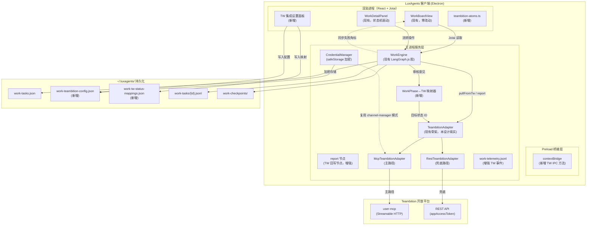
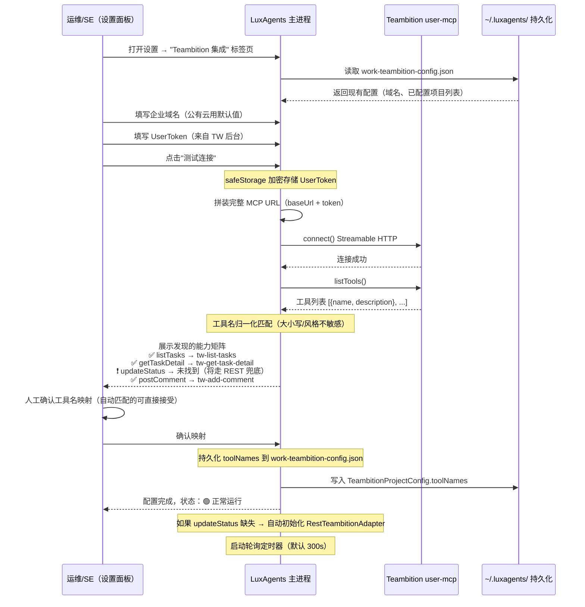
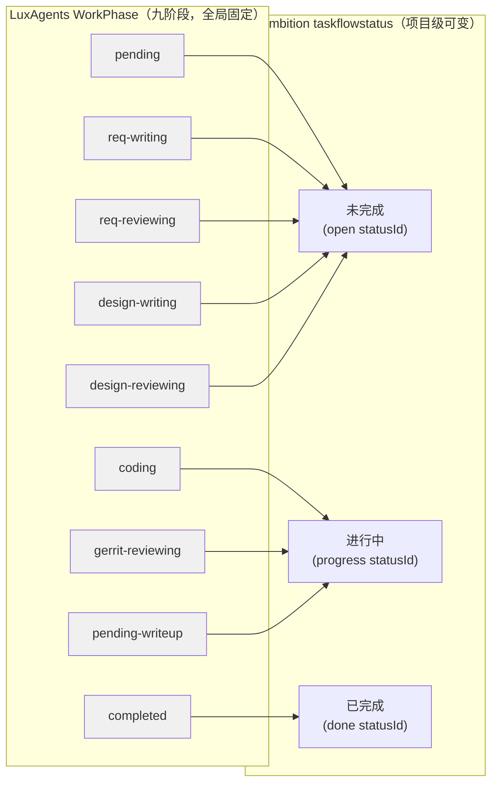

# Teambition 企业 MCP 集成 SDD（Spec-Driven Development 设计文档）

> **版本**: v1.0  
> **日期**: 2026-07-13  
> **状态**: 待评审（Draft for Review）  
> **项目**: LuxAgents（`@luxagents/*` monorepo）  
> **文档骨架**: SDD Design Spec §5.1（15 节）  
> **参照源**:  
> - craft-agents-max `docs/superpowers/specs/2026-07-12-teambition-craft-agent-integration-design.md`（Design Spec）  
> - craft-agents-max `.superpowers/sdd/` 7-Task 执行痕迹  
> - LuxAgents `docs/plans/2026-07-12-teambition-integration-spec.md`（已有集成设计草案）  
> - LuxAgents `docs/plans/2026-07-07-work-mode-design.md`（Work 模式方案 v1.0）  
> - LuxAgents `apps/electron/src/main/lib/teambition-adapter.ts`（现有骨架）  

---

## 1. 目标

### 1.1 用户故事

| ID | 角色 | 故事 | 验收标准 |
|---|---|---|---|
| US-1 | **SPM**（项目经理） | 我在 Teambition 创建的任务，应该能在 LuxAgents Work 看板里自动出现，不用手动搬运。每 5 分钟轮询自动同步，新任务进 pending 列，已有任务只刷新字段不覆盖本地 phase | 配置好 TW 项目 ID + 域名 + Token 后，任务列表通过 MCP `fetchTasks` 自动拉取，`origin:'tw'` 打标，落 `work-tasks.json`。轮询周期默认 5 分钟，设置面板可配置 |
| US-2 | **SE**（开发工程师） | 我在 LuxAgents 里把任务从 `coding` 推进到 `pending-writeup`，Teambition 那边的任务状态也要自动同步，不然团队其他人在 TW 看到的是假状态 | `updateStatus` 调用成功后 TW 任务 `taskflowstatus` 实际变更；调用失败时看板卡片显示"同步失败"角标，不静默吞错，不阻塞本地状态机流转 |
| US-3 | **SE**（开发工程师） | 审批驳回/通过的意见，应该能作为评论回写到 Teambition 任务，团队其他人不用切换到 LuxAgents 才能看到审批历史 | `postComment` 在 `SUBMIT_APPROVAL` 后自动调用（`req-review` 或 `design-review` gate 产生 verdict）；调用失败不阻塞状态机继续流转（评论是增强信息，不是关键路径） |
| US-4 | **模块带头人** / PM | 我想把不同产品线的 Teambition 项目用独立映射配置管理，因为每个 TW 项目的工作流状态 ID 不同，一个映射不能通用 | `WorkflowStatusMapping` 支持项目级持久化配置。设置面板列出用户关联的所有 TW 项目，每个项目独立配置 Phase↔Status 映射 |
| US-5 | **SE / 开发** | TW MCP 连不上、Token 过期、工具名对不上时，我要能立刻在 UI 上看清原因，而不是卡片静默卡住 | 三类失败态有明确视觉区分：①连接失败（红色 + 最近错误摘要）②写能力缺失走 REST 兜底但兜底也失败（橙色）③读写工具名未配置（灰色，提示"待完成 listTools 探测"） |
| US-6 | **运维/平台负责人** | 私有化部署的企业域名要在配置界面里直接填，不要硬编码在代码里 | 设置面板新增"Teambition 集成"表单：企业域名（默认空）、UserToken（安全存储）、项目 ID 列表；域名格式适配公有云/私有云两种模式 |

### 1.2 第一阶段明确不做（边界声明）

1. **不做拖拽看板列** — Work 模式列由九阶段状态机驱动，人只有预定义动作按钮，而非 `@dnd-kit` 拖拽
2. **不做 TW → LuxAgents 反向同步** — 本设计是单向回写模型，LuxAgents phase 为权威状态，TW 状态变更不会自动影响本地 phase
3. **不做 Webhook 接收** — 纯主动轮询/推送发起，Webhook 双向实时同步留待后续
4. **不做文件/图片上传下载的 TW 同步** — 官方 MCP 明确限制"暂不支持涉及图片或文件上传/下载的相关 API"
5. **不做 Gerrit/Jenkins/自动化测试节点的 TW 同步** — 属于 M2 范围
6. **不做工作时间登记（worktime）同步** — 属于阶段 3+ 范围
7. **不修改通用 Session 协议** — 不把 Teambition 字段加入所有 Session 类型，字段隔离在 `teambition-adapter.ts` 和存储层

---

## 2. 官方能力结论

### 2.1 Teambition 开放平台能力盘点

| 能力 | 验证状态 | 说明 | 官方文档 |
|---|---|---|---|
| User MCP 服务（Streamable HTTP + UserToken 鉴权） | ✅ 已确认 | UserToken 内嵌在 MCP Server URL query 参数中，有有效期 | [user-mcp-guide](https://open.teambition.com/docs/documents/user-mcp-guide) |
| 按项目查询任务列表 | ✅ 已确认 | 返回任务 ID、标题、备注、执行人、状态等 | [任务查询](https://open.teambition.com/docs/apis/6321c6d1912d20d3b5a49ec1) |
| 查询任务详情（含自定义字段） | ✅ 已确认 | 完整的任务对象 | [任务详情](https://open.teambition.com/docs/apis/6321c6d2912d20d3b5a4a7b8) |
| 查询工作流/工作流状态 | ✅ 已确认 | 需要查 `taskflowId` + `taskflowstatusId` | [工作流](https://open.teambition.com/docs/apis/63ee3ea3912d20d3b543f315) |
| 更新工作流状态（4 步链） | ✅ 已确认 | 查任务→查任务类型→查工作流状态→改状态 | [案例](https://open.teambition.com/docs/apis/6321c6cf912d20d3b5a48f2c) |
| 创建/查询任务评论 | ✅ 已确认 | 评论 API | [评论](https://open.teambition.com/docs/apis/640594b7b07df7002be69f92) |
| REST API appAccessToken 自签 JWT | ✅ 已确认 | AppId + AppSecret HMAC256 自签 | [鉴权](https://open.teambition.com/docs/apis/6643021f61edfc5cbf956250) |
| User MCP 具体工具名 | ❌ **未验证** | 需要登录 TW 后台创建 Token 才能查看实际工具集 | — |
| 企业私有云域名可用性 | ❌ **未验证** | 需要企业内部网络可达后才能验证 | — |
| REST 兜底是否需要企业审批注册 | ❌ **未验证** | 官方文档未提及企业内部审批流程 | — |
| 自定义工作流（非默认 3 状态）场景 | ❌ **未验证** | 默认新建项目只有"未完成/进行中/已完成"3 状态 | — |

### 2.2 关键架构事实

- **Teambition 无独立 Kanban API**：看板是"任务类型 + 工作流 + 工作流状态"的前端视图
- **状态流转是 4 步调用链**，不是单个"改状态"接口：`查任务(sfcId) → 查任务类型(taskflowId) → 查工作流状态列表 → PUT taskflowstatus`
- **MCP 走 UserToken 鉴权**（URL query 参数），**REST 兜底走 appAccessToken 自签 JWT**（`_appId/iat/exp`）
- **User MCP 使用 Streamable HTTP 传输协议**（非 stdio/非纯 SSE），`@modelcontextprotocol/sdk` v1.29.0+ 已支持

---

## 3. 总体架构

### 3.1 分层架构图



### 3.2 数据流说明

**MCP 主路径（默认）：**

```
TW 轮询（pullFromTw）→ MCP fetchTasks → TeambitionTaskRaw[] → mapRawTwTaskToWorkTask() → WorkTask[]
                                                                                              ↓
                                                                                     work-tasks.json 落盘
                                                                                              ↓
                                                                                    WORK_IPC_CHANNELS 推送变更

状态回写（report 节点）→ adapter.updateStatus() → MCP callTool → 成功 → 更新本地 phase
                                                                   ↓ 失败
                                                              → REST 兜底（4 步链）
```

**REST 兜底路径（MCP 写工具缺失时）：**

```
adapter.updateStatus() 感知 MCP 工具缺失
                        ↓
           生成 appAccessToken JWT（内存态缓存，exp=1h）
                        ↓
           4 步 REST 调用链：GET task → GET taskflowId → GET statuses → PUT taskflowstatus
                        ↓
           成功 → 更新本地 phase；失败 → 卡片"同步失败"角标
```

---

## 4. 集成边界

### 4.1 新增模块文件树

```
apps/electron/src/main/lib/
├── teambition-adapter.ts          # 修改（现有骨架，本设计填实）
├── teambition-adapter.test.ts     # 修改（现有测试）
├── rest-teambition-adapter.ts     # 新增（REST 兜底实现）
├── rest-teambition-adapter.test.ts # 新增
├── teambition-credential.ts       # 新增（safeStorage 加密/解密 + 日志脱敏工具）
├── teambition-credential.test.ts  # 新增
├── teambition-sync.ts             # 新增（轮询器 + 同步策略）
├── teambition-sync.test.ts        # 新增
├── work-engine.ts                 # 修改（增强 report 节点 + pullFromTw + 状态映射注入）

packages/shared/src/types/
├── work.ts                        # 修改（新增 WorkflowStatusMapping 类型、TeambitionConfig 类型）
├── teambition.ts                  # 新增（TW 专有类型：TeambitionToolNames、TeambitionTaskRaw 字段映射等）
├── teambition.test.ts             # 新增

packages/shared/src/ipc/
├── tw-channels.ts                 # 新增（Teambition IPC 通道常量）

apps/electron/src/main/
├── ipc.ts                         # 修改（注册 Teambition IPC handler）
├── preload/
│   └── index.ts                   # 修改（暴露 Teambition IPC 方法）

apps/electron/src/renderer/components/
├── work/
│   ├── WorkDetailPanel.tsx         # 修改（同步状态角标 + 手动触发 TW 刷新按钮）
│   └── WorkBoardView.tsx           # 修改（TW 同步失败态视觉区分）
├── settings/
│   └── TeambitionSettings.tsx      # 新增（TW 集成设置面板）
├── teambition/
│   ├── TeambitionStatusMapper.tsx   # 新增（Phase↔TW 状态映射配置 UI）
│   └── TeambitionSyncBadge.tsx     # 新增（同步状态小徽标）

docs/plans/
├── 2026-07-13-teambition-integration-sdd.md   # 本文档
```

### 4.2 宿主侧改动清单

| 宿主位置 | 改动类型 | 改动内容 |
|---|---|---|
| `work-engine.ts` WorkEngineDeps | **修改** | `adapter` 类型保持不变；新增 `configLoader: TeambitionConfigLoader` 依赖；`report` 节点实现增加 TW 回写逻辑 |
| `work-engine.ts` mapRawTwTaskToWorkTask | **修改** | 填实字段映射（当前为猜测候选字段，需基于真实探测结果定稿） |
| `work-graph.ts` | **无改动** | 图拓扑不变，仅 `report` 节点内部实现增强 |
| `ipc.ts` | **修改** | 新增 `teambition:config/status/mapping` 等 IPC handler |
| `preload/index.ts` | **修改** | 暴露 `listTeambitionTasks`、`claimTeambitionTask` 等 API |
| 设置面板路由 | **修改** | 新增"Teambition 集成"标签页 |

### 4.3 明确不做清单

1. 不新增独立 Kanban 组件（复用现有 WorkBoardView，只加过滤器）
2. 不修改通用 Session 协议（`AgentSessionMeta` 不加 TW 字段）
3. 不自研 Conductor/TaskRunner（复用现有 LangGraph.js + WorkEngine）
4. 不引入 `@dnd-kit` 拖拽依赖
5. 不引入数据库依赖（纯 JSON/JSONL + safeStorage）
6. 不实现 Open API Gateway（后续阶段评估）
7. 不实现 Webhook 接收（后续阶段评估）
8. 不实现 worktime 同步（后续阶段评估）

---

## 5. Gateway 接口

### 5.1 增强的 TeambitionAdapter 接口

基于现有 `teambition-adapter.ts` 骨架，填实并扩展：

```typescript
// === packages/shared/src/types/teambition.ts（新增）===

/** TW 任务原始负载（MCP 返回的未加工 JSON） */
export type TeambitionTaskRaw = Record<string, unknown>

/** 工具描述 */
export interface TeambitionToolDescriptor {
  name: string
  description?: string
}

/** 需探测后填值的工具名映射 */
export interface TeambitionToolNames {
  listTasks: string
  getTaskDetail: string
  updateStatus: string
  postComment: string
}

/** TeambitionAdapter 配置 */
export interface McpTeambitionAdapterConfig {
  /** user-mcp 连接配置 */
  server: {
    /** 企业域名，示例：https://open.teambition.com/user-mcp */
    baseUrl: string
    /** UserToken（不持久化，走 safeStorage） */
    userToken?: string
    /** 完整的 MCP URL（baseUrl + token query），运行时拼装 */
    url?: string
    headers?: Record<string, string>
  }
  /** 工具名映射（listTools 探测后持久化） */
  toolNames: TeambitionToolNames
}

/** REST 兜底配置 */
export interface RestTeambitionConfig {
  baseUrl: string
  appId: string
  appSecret: string
  orgId?: string
}

/** 任务字段映射函数签名 */
export type TwFieldMapper = (raw: TeambitionTaskRaw) => Partial<WorkTaskFields>
```

```typescript
// === apps/electron/src/main/lib/teambition-adapter.ts（修改后接口）===

export interface TeambitionAdapter {
  /** 枚举 user-mcp 实际暴露的工具列表 */
  listTools(): Promise<TeambitionToolDescriptor[]>

  /** 按项目拉取任务列表（原始负载，字段映射由调用方通过 mapRawTwTaskToWorkTask 完成） */
  fetchTasks(projectId: string): Promise<TeambitionTaskRaw[]>

  /** 获取单任务详情 */
  fetchTaskDetail(taskId: string): Promise<TeambitionTaskRaw>

  /**
   * 更新任务工作流状态
   * @param taskId - TW 任务 ID
   * @param targetStatusId - 目标 taskflowstatusId（由 WorkPhase↔TW 映射器解析产生）
   * @throws 如果 MCP 工具缺失 → 调用方应回退到 RestTeambitionAdapter
   */
  updateStatus(taskId: string, targetStatusId: string): Promise<void>

  /** 发表评论（审核意见等） */
  postComment(taskId: string, text: string): Promise<void>

  /** 关闭连接 */
  close(): Promise<void>
}

/** REST 兜底实现（appAccessToken JWT 自签） */
export interface RestTeambitionAdapter extends TeambitionAdapter {
  /** 显式生成 appAccessToken（exp=1h 内存缓存） */
  getAccessToken(): Promise<string>
}
```

### 5.2 字段映射函数

```typescript
/**
 * TW 原始负载 → WorkTask 部分字段映射
 *
 * ⚠️ 本函数基于官方文档的字段命名推断（sfcId/taskflowstatusId 等），
 * 实际字段名以 T1 listTools() 探测返回的真实结构为准。
 * 如果真实字段名与本函数不一致，只修改此函数一处即可适配。
 */
export function mapTwTaskToWorkTask(
  raw: TeambitionTaskRaw,
  existing?: WorkTask | null,
): Partial<WorkTask> {
  const id = String(raw.id ?? raw._id ?? raw.taskId ?? '')
  return {
    displayId: id,
    title: String(raw.title ?? raw.name ?? ''),
    description: String(raw.description ?? raw.note ?? raw.content ?? ''),
    type: inferWorkTaskType(raw),
    priority: inferWorkTaskPriority(raw),
    externalLinks: [
      {
        system: 'teambition',
        projectId: String(raw.projectId ?? raw._projectId ?? ''),
        taskId: id,
        url: raw.url ? String(raw.url) : undefined,
      },
    ],
    phase: existing?.phase ?? 'pending',
    origin: 'tw',
    assigneeName: String(raw.assignee?.name ?? raw.executor?.name ?? ''),
    // 保留其他已有字段
  } as Partial<WorkTask>
}

/** 任务类型推断（基于 TW 的 taskflowId 或自定义字段） */
function inferWorkTaskType(raw: TeambitionTaskRaw): WorkTaskType {
  // 逻辑待真实数据验证后补全
  // 临时默认：'task'
  return 'task'
}

/** 优先级推断 */
function inferWorkTaskPriority(raw: TeambitionTaskRaw): WorkTaskPriority {
  const p = String(raw.priority ?? raw.priorityLevel ?? '').toLowerCase()
  if (p.includes('urgent') || p === 'p0') return 'P1'
  if (p === 'p1' || p === 'high') return 'P1'
  if (p === 'p2' || p === 'medium') return 'P2'
  if (p === 'p3' || p === 'low') return 'P3'
  return 'P4'
}
```

---

## 6. 本地绑定与快照

### 6.1 新增数据模型

```typescript
// === packages/shared/src/types/teambition.ts ===

/** Teambition 集成全局配置（持久化到 work-teambition-config.json） */
export interface TeambitionConfig {
  version: 1
  /** 企业域名（私有云场景必填，公有云使用默认值） */
  enterpriseDomain?: string
  /** 已配置的项目列表 */
  projects: TeambitionProjectConfig[]
  updatedAt: number
}

/** 单个 TW 项目的集成配置 */
export interface TeambitionProjectConfig {
  /** TW 项目 ID */
  projectId: string
  /** 工具名映射（listTools 探测后自动填充） */
  toolNames?: TeambitionToolNames
  /** 最近一次能力探测结果快照 */
  lastCapabilitySnapshot?: {
    tools: TeambitionToolDescriptor[]
    detectedAt: string
  }
  /** 是否启用自动轮询 */
  pollingEnabled: boolean
  /** 轮询间隔（秒，默认 300） */
  pollingIntervalSec: number
  /** 关联的工作流状态映射 ID */
  statusMappingId?: string
}

/** WorkPhase ↔ TW taskflowstatus 映射表（持久化到 work-tw-status-mappings.json） */
export interface WorkflowStatusMapping {
  /** 映射表 ID */
  id: string
  /** 映射表名称，便于 UI 辨识 */
  name: string
  /** 适用的 TW 项目 ID 列表（一个映射可复用给多个项目） */
  twProjectIds: string[]
  /**
   * LuxAgents phase → TW taskflowstatusId 的多对一映射
   * 所有 9 个 phase 都必须有映射值
   */
  phaseToTwStatus: Record<WorkPhase, string>
  /** 创建/更新时间 */
  createdAt: number
  updatedAt: number
}

/** 同步日志条目 */
export interface TwSyncLogEntry {
  at: string
  operation: 'fetchTasks' | 'fetchTaskDetail' | 'updateStatus' | 'postComment'
  taskId: string
  displayId: string
  result: 'success' | 'failed' | 'conflict' | 'skipped'
  /** 回写目标（updateStatus 时记录目标 statusId） */
  target?: string
  error?: string
  /** 耗时（ms） */
  durationMs: number
}
```

### 6.2 目录结构

```
~/.luxagents/
├── work-teambition-config.json       # TeambitionConfig（新增）
├── work-tw-status-mappings.json      # WorkflowStatusMapping[]（新增）
├── work-teambiton-sync-log.jsonl     # TwSyncLogEntry[] 追加日志（新增）
├── work-tasks.json                   # 现有，零改动
├── work-tasks/{id}.jsonl             # 现有，零改动
├── work-checkpoints/{threadId}.json  # 现有，零改动
└── work-telemetry.jsonl             # 现有，增强 TW 事件类型
```

### 6.3 唯一键规则

- **绑定的唯一键**：`(work-tasks.json 中的 displayId)` — 同一 TW 任务不会重复创建本地记录
- **幂等处理**：`pullFromTw()` 遍历时通过 `existingByDisplayId` 检查，已存在的只刷新字段（version/updatedAt 等），不覆盖本地 phase
- **重复领取规则**：本地已有 `origin:'tw'` + `displayId` = 某 ID 的任务时，再次领取只是刷新字段。同一个 TW 任务不会在 `work-tasks.json` 中出现两条记录

---

## 7. MCP 能力探测流程（核心新增）

### 7.1 设置面板交互序列图



### 7.2 工具名配置持久化位置

```typescript
// work-teambition-config.json 中的项目级配置
{
  "version": 1,
  "enterpriseDomain": "https://rd.example.com",
  "projects": [
    {
      "projectId": "tw-project-123",
      "toolNames": {
        "listTasks": "tw-list-tasks",
        "getTaskDetail": "tw-get-task-detail",
        "updateStatus": "tw-update-status",
        "postComment": "tw-post-comment"
      },
      "lastCapabilitySnapshot": {
        "tools": [
          { "name": "tw-list-tasks", "description": "查询项目任务列表" },
          { "name": "tw-get-task-detail", "description": "查询任务详情" }
        ],
        "detectedAt": "2026-07-13T08:30:00.000Z"
      },
      "pollingEnabled": true,
      "pollingIntervalSec": 300,
      "statusMappingId": "mapping-1"
    }
  ]
}
```

**工具名归一化匹配策略**（参考 craft-agents-max Task 3 经验）：

| 域能力 | 匹配规则（大小写/风格不敏感） |
|---|---|
| `listTasks` | 含 `list` + `task` / `query` + `task` / 项目任务列表 |
| `getTaskDetail` | 含 `get` + `detail` / `query` + `detail` / 任务详情 |
| `updateStatus` | 含 `update` + `status` / `update` + `state` / `workflow` + `status` / 更新任务状态 |
| `postComment` | 含 `comment` / `add` + `comment` / `post` + `comment` / 任务评论 |

---

## 8. WorkPhase ↔ TW taskflowstatus 映射表

### 8.1 映射关系图



### 8.2 类型定义

```typescript
/** WorkPhase ↔ TW taskflowstatus 映射类型定义 */
export interface WorkflowStatusMapping {
  id: string
  name: string
  /** 适用的 TW 项目 ID 列表 */
  twProjectIds: string[]
  /**
   * LuxAgents phase → TW taskflowstatusId 的多对一映射
   * 所有 9 个 phase 都必须有映射值（包括 completed / cancelled）
   */
  phaseToTwStatus: Record<WorkPhase, string>
  createdAt: number
  updatedAt: number
}

/**
 * 默认 9→3 映射模板（适用于默认 3 状态工作流的 TW 项目）
 * 用户可基于此模板修改，以适应自定义工作流
 */
export const DEFAULT_THREE_STATE_MAPPING: Record<WorkPhase, string> = {
  pending:             '<未完成 statusId>',
  'req-writing':      '<未完成 statusId>',
  'req-reviewing':    '<未完成 statusId>',
  'design-writing':   '<未完成 statusId>',
  'design-reviewing': '<未完成 statusId>',
  coding:             '<进行中 statusId>',
  'gerrit-reviewing': '<进行中 statusId>',
  'pending-writeup':  '<进行中 statusId>',
  completed:          '<已完成 statusId>',
  cancelled:          '<已完成 statusId>',
}
```

### 8.3 项目级可配置

- 不同 TW 项目可能有**不同的工作流 ID 和状态 ID 集合**（自定义工作流场景）
- 一个 `WorkflowStatusMapping` 实例可以复用给多个项目（项目 A 和项目 B 如果使用同一套工作流模板）
- 设置面板提供映射配置 UI：列出所有 9 个 phase，每个 phase 下拉选择 TW 状态节点
- **启动时校验**：所有 9 个 phase 都有映射值，缺项时记录 error 日志并阻止该项目的 TW 写入操作

### 8.4 仅单向回写

- M1 范围**只做单向回写**（LuxAgents → TW）
- 不做 TW → LuxAgents 的状态反向同步
- `twStatusToPhase` 字段预留但不实现解析逻辑

---

## 9. 同步策略

### 9.1 显式同步规则枚举

| 规则 | 说明 |
|---|---|
| **轮询拉取** | 定时调用 `fetchTasks(projectId)` 获取 TW 项目最新任务列表，与本地 `work-tasks.json` 对比 |
| **增量合并** | 新任务（本地不存在）→ 创建 `origin:'tw'` 记录，入 pending 列。已存在任务→只更新 title/description/assignee 等字段，**不覆盖本地 phase** |
| **状态回写** | 仅图节点 `report` 执行时触发 TW 状态回写，不自动因 phase 迁移而回写 |
| **评论回写** | 仅在审批 gate 产生 verdict 后触发 |
| **不静默覆盖** | TW 回写失败不影响本地状态机流转，本地 phase 是权威状态 |
| **指纹去重** | 同一 phase 迁移不重复回写相同状态 ID（基于 `(taskId, targetStatusId)` 指纹） |

### 9.2 轮询周期

- **默认周期**：5 分钟（300 秒）
- **配置范围**：1 分钟（60 秒）— 60 分钟（3600 秒）
- **实现**：`TeambitionSyncScheduler` 类，使用 `setInterval` 管理定时器，支持动态修改周期
- **启动/停止**：配置面板"启用轮询"开关控制

### 9.3 回写失败不阻塞本地状态机

- `report` 节点调用 `adapter.updateStatus()` 失败时：
  - 记录错误到 `work-telemetry.jsonl`（新增 `sync-failed` 事件类型）
  - 任务 `failed` 字段标记为 `true`
  - 看板卡片显示"同步失败"角标
  - 本地 phase 迁移已完成，不因 TW 回写失败回滚

### 9.4 重试策略

| 场景 | 重试策略 |
|---|---|
| 网络超时 / DNS 解析失败 | 指数退避：1s → 2s → 4s → 8s，上限 3 次/轮询周期 |
| Token 过期（401） | 不重试，标记"需要重新认证" |
| MCP 工具缺失 | 不重试（自动切换到 REST 兜底路径） |
| REST 4 步链任一失败 | 不重试，记录失败步骤（查任务/查类型/查状态列表/改状态） |

---

## 10. 凭据安全

### 10.1 加密存储架构

| 凭据 | 存储方式 | 说明 |
|---|---|---|
| **UserToken**（MCP URL query param） | `safeStorage` AES-256-GCM 加密，复用 `channel-manager.ts` 模式 | 持久化在 `work-teambition-config.json` 但 token 值单独加密。运行时解密后拼装 MCP URL |
| **AppSecret**（REST 兜底用） | 同路径加密存储 | 与 UserToken 同一加密层 |
| **appAccessToken**（REST 调用用） | **内存态短期缓存**，exp=1h，不落盘 | 每次启动/过期后重新自签 JWT，JWT 含 `_appId/iat/exp` 字段 |

### 10.2 加密实现模式

复用已有 `channel-manager.ts` 的 `safeStorage` 加密模式：

```typescript
// channel-manager.ts 已有模式：
//   const encrypted = safeStorage.encryptString(plaintext)
//   const decrypted = safeStorage.decryptString(encrypted)
//   → 持久化 encrypted 到 JSON，运行时解密

// teambition-credential.ts（新增）：
export class TeambitionCredentialManager {
  /**
   * 存储 UserToken
   * work-teambition-config.json 中只存 encryptedToken（hex），不存明文
   */
  async storeUserToken(token: string): Promise<void>

  /** 读取并解密 UserToken */
  async retrieveUserToken(): Promise<string | null>

  /** 存储 AppSecret */
  async storeAppSecret(secret: string): Promise<void>

  /** 读取 AppSecret */
  async retrieveAppSecret(): Promise<string | null>

  /** 生成 appAccessToken JWT（内存缓存，exp=1h） */
  async getAccessToken(appId: string): Promise<string>
}
```

### 10.3 日志脱敏规则

```typescript
/**
 * 日志脱敏工具：替换所有敏感字段为 [REDACTED]
 *
 * 匹配规则（大小写不敏感）：
 * - 包含 "token" 的字段值
 * - 包含 "authorization" 的字段值
 * - 包含 "appsecret" / "app_secret" 的字段值
 * - 包含 "accesstoken" / "access_token" 的字段值
 */
export function redactSensitiveFields(obj: unknown): unknown
export function redactLogLine(line: string): string
```

**脱敏规则清单：**

- ❌ `console.log('UserToken:', token)` → ✅ `console.log('UserToken:', '[REDACTED]')`
- ❌ 完整 MCP URL 含 `?userToken=xxx` → ✅ 只输出 `MCP endpoint: open.teambition.com/user-mcp`
- ❌ `Authorization: Bearer <appAccessToken>` → ✅ `Authorization: [REDACTED]`
- ❌ 将 Token 值写入 `work-telemetry.jsonl` → ✅ 拦截并替换

---

## 11. 分阶段交付

| 阶段 | 内容 | 验收标准 | 依赖 |
|---|---|---|---|
| **0** | 设置面板 + listTools 探测 | 配置域名+Token 后能在设置面板看到工具列表；工具名缺失时明确提示；凭据不出现在日志 | 无（起点） |
| **1** | fetchTasks 字段映射 + 轮询 | TW 任务自动出现在 Work 看板（`origin:'tw'`）；已存在任务不重复创建；轮询间隔可配置 | 阶段 0 |
| **2** | updateStatus 回写（MCP 主路径 + REST 兜底） | `pending-writeup`→`completed` 时 TW 状态自动变更；MCP 缺失时自动切换 REST 兜底；失败显示"同步失败"角标 | 阶段 1 |
| **3** | postComment 评论回写 | 审批 gate 产生 verdict 后自动写入 TW 评论；调用失败不阻塞状态机 | 阶段 1 |
| **4** | 错误处理 + 降级 UI + 遥测增强 | 8 场景错误覆盖全部（§12 矩阵）；看板卡片区分连接失败/写缺失/映射错误；`work-telemetry.jsonl` 新增 TW 事件类型 | 阶段 2, 3 |
| **5** | 端到端验证 + 文档 | 契约测试通过（Mock/MCP 双实现共享契约）；映射表全覆盖测试；脱敏测试；降级测试；验收测试通过 | 阶段 0–4 |

---

## 12. 错误处理（8 场景矩阵）

| # | 场景 | 触发条件 | 处理方式 | 用户可见反馈 |
|---|---|---|---|---|
| E1 | **DNS 无法解析 / 网络不可达** | 企业私有云域名配置错误或网络隔离 | 主进程 catch 连接错误，标记该次操作为失败；指数退避（1s→2s→4s→8s），本周期上限 3 次 | 设置面板显示"连接失败：域名无法解析"；看板不受影响（保留上次成功缓存的数据） |
| E2 | **Token 过期** | MCP 连接返回 401 / `isError: true` 含认证错误 | 标记"需要重新认证"状态；不自动重试；不清除本地数据 | 设置面板红色提示"Token 已过期，请在 TW 后台重新创建"；看板保留最近一次成功快照 |
| E3 | **listTools 缺必需工具**（如无 `updateStatus` 等价物） | 探测结果中找不到匹配规则的工具 | 该能力标记为"MCP 不支持"，`toolNames.xxx` 保持空字符串；自动初始化 RestTeambitionAdapter 兜底 | 设置面板该工具项显示"🟡 MCP 缺失，将走 REST 兜底" |
| E4 | **REST 4 步链任一步失败** | 查任务→404 / 查类型→无权限 / 查状态列表→空 / 改状态→500 | 记录失败步骤索引（1-4），整体判定为回写失败 | 看板卡片"/!\ 同步失败"角标 + 详情面板显示失败步骤（"第 3 步：查询可用状态列表失败"） |
| E5 | **工具名映射错误** | 用户手动确认了错误的工具名（如把 `listTasks` 映射到 `getTaskDetail`） | 捕获 MCP `isError: true` 响应，通过 `extractToolPayload()` 提取原始错误文本 | 设置面板"测试连接"按钮旁显示具体错误："工具 'xxx' 调用返回：参数不匹配" |
| E6 | **TW 任务远端已删除/归档** | `fetchTaskDetail` 返回 404 / 任务不存在 | 本地任务标记 `failed: true`，`externalLinks` 保留但附加标记 | 看板卡片灰显 + 提示"TW 任务已不存在（可能已被删除或归档），建议手动归档本地记录" |
| E7 | **网络超时**（>10s 未响应） | MCP 或 REST 调用超过超时阈值 | 统一 10s 超时兜底；抛 TimeoutError；按 E1 重试策略处理 | 同上 E1 反馈 |
| E8 | **私有域名不可用** | 企业私有化域名配置指向不存在或 DNS 无法解析的服务 | 所有 TW 操作统一标记"不可用"；其他功能（本地任务、Chat 模式）完全不受影响 | 设置面板显示"🚫 企业域名不可用（DNS 解析失败），请检查网络或域名配置"；看板顶部不显示 TW 来源任务 |

---

## 13. 测试策略

| 类型 | 覆盖点 | 工具 |
|---|---|---|
| **Contract 测试** | `MockTeambitionAdapter` 与 `McpTeambitionAdapter` 共享同一套契约测试；`RestTeambitionAdapter` 同样需通过相同写操作契约 | `bun:test` + 共享的 contract test suite |
| **幂等性测试** | 同一 `updateStatus(taskId, targetStatusId)` 调用重复触发不应产生重复状态变更；`postComment` 重复调用应写入多条（评论天然可重复） | synchronize-policy |
| **映射表全覆盖测试** | `WorkflowStatusMapping` 的 9 个 phase → 3 个 status 全枚举覆盖；缺项时启动报错 | domain unit test |
| **脱敏测试** | 日志断言：任何包含 Token/Authorization/AppSecret 的字符串不出现在 `console.log`、`work-telemetry.jsonl`、`work-teambiton-sync-log.jsonl` 中 | `redactSensitiveFields` unit test |
| **降级测试** | 模拟 DNS 解析失败 → 看板 UI 不崩溃、本地数据不丢、其他功能正常；MCP 写缺失 → REST 兜底自动切换正确 | integration test with mock |
| **Golden file** | REST 4 步调用链的请求/响应结构固定样例（脱敏 fixture），防止未来 SDK/API 变更导致静默漂移 | fixture JSON files |
| **轮询测试** | 模拟 TW 新增/删除/更新任务 → 本地索引正确合并 | scheduled sync test |

### 13.1 映射表全覆盖测试矩阵

```typescript
const ALL_PHASES: WorkPhase[] = [
  'pending', 'req-writing', 'req-reviewing',
  'design-writing', 'design-reviewing',
  'coding', 'gerrit-reviewing', 'pending-writeup',
  'completed', 'cancelled',
]

test('每个 WorkPhase 都有映射值', () => {
  const mapping = createTestMapping()
  for (const phase of ALL_PHASES) {
    expect(mapping.phaseToTwStatus[phase]).toBeDefined()
    expect(mapping.phaseToTwStatus[phase]).not.toBe('')
  }
})

test('映射表覆盖全部 10 个 phase', () => {
  expect(Object.keys(mapping.phaseToTwStatus).length).toBe(10)
})

// 每个 phase 的预期 TW 状态域归属
test('pending/req-writing/req-reviewing/design-writing/design-reviewing → 未完成组', () => { ... })
test('coding/gerrit-reviewing/pending-writeup → 进行中组', () => { ... })
test('completed/cancelled → 已完成组', () => { ... })
```

---

## 14. 明确不做（本阶段）

1. **拖拽看板列** — 不引入 `@dnd-kit`；Work 模式看板列由九阶段状态机推导，人只有预定义动作按钮
2. **TW → LuxAgents 反向状态同步** — 不做从 TW 到本地的反向同步，本地 phase 是权威状态
3. **Webhook 接收** — 不实现 TW 事件的实时推送到 LuxAgents
4. **Gerrit/Jenkins 同步** — 不实现 TW 与 CI/CD 系统的同步
5. **文件/图片上传下载同步** — 官方 MCP 不支持，不做
6. **工作时间登记（worktime）同步** — 不实现 `recordWorktime`，留到后续阶段
7. **多 Agent 抢占同一 TW 任务** — M1 范围假设每个 TW 任务只有一个 LuxAgents 实例跟踪
8. **企业级中间服务** — 不搭建额外的代理/网关服务
9. **TW 字段污染通用 WorkTask 模型** — TW 自有字段不加入 `WorkTask` 基础类型，通过 `externalLinks` 关联

---

## 15. 假设与未决问题

| # | 事项 | 当前状态 | 风险等级 | 缓解措施 |
|---|---|---|---|---|
| A1 | TW user-mcp 真实工具名、参数 schema、返回体结构 | ❌ 未验证 | **高** — 整个字段映射阶段 T1 依赖此信息 | 阶段 0（设置面板 + listTools 探测）必须先执行；`mapTwTaskToWorkTask` 设计为单点适配，真实字段名与推断不一致时只改此函数 |
| A2 | 企业私有云域名 `rd.luxshare.com.cn` 当前是否真实可达 | ❌ 未验证 | **高** — 私有云场景无法验证 | 设置面板占位符 `<YOUR_ENTERPRISE_DOMAIN>`，不做任何硬编码；阶段 0 测试连接可验证 |
| A3 | appAccessToken REST 兜底是否需要企业内部审批/注册 | ❌ 未验证 | **中** — 影响兜底路径可用性 | 初期以 MCP 为主路径，REST 兜底为备选。如果 REST 注册审批长周期（数周），M1 阶段可暂时标记 REST 为"不可用" |
| A4 | 自定义工作流（非默认 3 状态）的 TW 项目有多少状态节点 | ❌ 未验证 | **中** — 影响 9→N 映射设计 | 当前 `phaseToTwStatus` 的 `Record<WorkPhase, string>` 结构已兼容任意 N 个状态值，但需要真实数据验证映射合理性 |
| A5 | TW 项目 ID 如何获取（从 URL 解析还是 API 查询） | ❌ 未验证 | **低** — 可通过调研确认 | 预计通过用户个人中心的"项目管理"获取，或从 TW 任务 URL 中提取 `projectId` path 参数 |
| A6 | UserToken 有效期是多长 | ❌ 未验证 | **低** — 已知有有效期 | UI 侧应提示预期到期时间；Token 过期按 E2 处理 |
| A7 | 是否所有企业 TW 项目都使用 Streamable HTTP 协议 | ✅ 已确认 | — | 官方文档明确 |
| A8 | 9→3 映射（pending/req 阶段→"未完成"组）的业务含义是否需要与产品确认 | **待决策** | **中** — 产品设计取舍 | 当前映射将需求/方案评审阶段映射为"未完成"。如果产品期望"需求评审中"映射到"进行中"，需调整映射表默认值 |

### 待用户确认的决策

1. **默认 9→3 映射策略是否接受** — pending 到 design-reviewing 全部映射为"未完成"，coding 到 pending-writeup 映射为"进行中"
2. **REST 兜底路径是否必须实现** — 如果企业环境只有 MCP 工具且不需要兜底，可砍掉阶段 2 的 REST 4 步链实现，降低复杂度
3. **是否支持 TW 自定义字段（如"模块"、"负责人"等）映射到 LuxAgents WorkTask** — 本设计暂不做，如果业务需要可在映射函数中扩展

---

## 附录 A：与 craft-agents-max 方案的主要差异

| 维度 | craft-agents-max | LuxAgents（本设计） | 理由 |
|---|---|---|---|
| 集成包位置 | 独立 `@craft-agent/teambition-integration` | 内嵌在 `apps/electron/src/main/lib/` | LuxAgents 已存在 `teambition-adapter.ts` 骨架和 `WorkEngine`，内嵌减少 IPC 层数 |
| Gateway 接口名 | `TeambitionGateway` | `TeambitionAdapter`（现有命名） | 保持与已有代码兼容，不引入第二套命名 |
| 看板集成 | 新增 `TeambitionTaskPicker` / `Badge` / `Actions` 组件 | 复用现有 `WorkBoardView` + 只加同步状态角标 | LuxAgents 已有 Work 模式看板，TW 是其中一个数据源 |
| 状态同步触发 | UI 显式操作（"同步 TW 进展"按钮） | 图节点 `report` 触发 + UI 角标反馈 | LuxAgents 状态由 LangGraph.js 驱动，不是"用户点击按钮"触发 |
| 绑定存储 | 工作区级 `integrations/teambition/` 目录 | `work-tasks.json` 中的 `externalLinks` | LuxAgents 已有 `WorkTask.origin` 和 `externalLinks` 字段，不需要重复造绑定层 |
| 7 个 Task | 从 domain contract 到 e2e 测试 | 6 个阶段（0-5）+ 契约测试收尾 | 合并 craft-agents-max 的 Task 1-4 为 LuxAgents 的阶段 0-1（因为很多基础结构已存在） |

---

## 附录 B：术语对照

| 术语 | 定义 |
|---|---|
| WorkPhase | LuxAgents 九阶段状态机（pending → req-writing → ... → completed） |
| taskflowstatusId | Teambition 工作流状态节点 ID（字符串） |
| UserToken | Teambition user-mcp 使用的个人鉴权令牌，内嵌在 MCP Server URL 中 |
| appAccessToken | Teambition REST API 使用的自签 JWT（AppId + AppSecret 签名） |
| MCP 主路径 | 通过 @modelcontextprotocol/sdk 调用 Teambition user-mcp |
| REST 兜底 | 通过 HTTP REST API + appAccessToken JWT 鉴权，仅当 MCP 写工具缺失时启用 |
| Streamable HTTP | MCP 传输协议的一种，Teambition user-mcp 使用的协议 |
